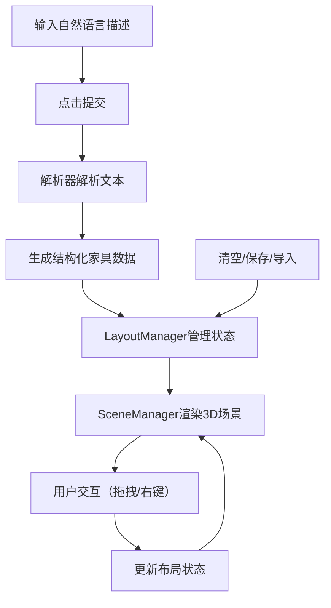

## 1. 产品概述
自然语言转3D场景布局工具，帮助非专业用户快速将空间规划想法转化为三维模型布局。用户通过自然语言描述即可生成室内家具3D布局，并支持交互式调整与布局保存。

## 2. 核心功能

### 2.1 用户角色
| 角色 | 注册方式 | 核心权限 |
|------|----------|----------|
| 普通用户 | 无需注册 | 使用所有功能，包括生成、编辑、保存、导入布局 |

### 2.2 功能模块
1. **文本解析模块**：将自然语言描述解析为结构化家具数据
2. **3D场景模块**：Three.js渲染3D场景，支持OrbitControls交互
3. **家具交互模块**：拖拽移动、选中高亮、右键菜单（删除/复制）
4. **布局管理模块**：清空、保存、导入布局功能
5. **UI控制模块**：文本输入、控制按钮、状态通知

### 2.3 页面详情
| 页面名称 | 模块名称 | 功能描述 |
|---------|---------|----------|
| 主页面 | 左侧文本输入区 | 文本框输入自然语言描述，提交按钮触发生成 |
| 主页面 | 右侧3D场景区 | 显示3D家具布局，支持鼠标交互 |
| 主页面 | 顶部控制栏 | 清空全部、保存布局、导入布局按钮 |
| 主页面 | 右键菜单 | 删除、复制家具选项 |

## 3. 核心流程
用户在左侧文本框输入自然语言描述，点击提交后系统解析文本并生成3D家具模型。用户可通过鼠标拖拽调整家具位置，右键进行删除或复制操作。顶部控制栏支持清空、保存和导入布局。

## 4. 用户界面设计

### 4.1 设计风格
- 主色调：天蓝色（#4a90d9），悬停深蓝色（#357abd）
- 左侧面板背景：深灰（#2d2d2d）
- 右侧3D场景背景：浅蓝灰（#e8edf2）
- 选中高亮：暖橙色外发光边框
- 按钮风格：扁平化设计，0.1秒缩放反馈
- 字体：现代无衬线字体

### 4.2 页面设计概览
| 页面名称 | 模块名称 | UI元素 |
|---------|---------|--------|
| 主页面 | 分栏布局 | 左右分栏（左30%/右70%），移动端上下布局 |
| 主页面 | 文本输入区 | 圆角文本框、提交按钮、深色背景 |
| 主页面 | 3D场景区 | 地面网格、透视相机、OrbitControls |
| 主页面 | 控制按钮栏 | 三个扁平化按钮，悬停/点击动效 |
| 主页面 | 家具模型 | 基本几何体组合，材质颜色区分 |
| 主页面 | 右键菜单 | 弹出动画，删除/复制选项 |

### 4.3 响应式
- 桌面端：左右分栏布局，左侧30%宽度，右侧70%宽度
- 移动端（<768px）：上下布局，文本区在上占40%高度，3D场景在下占60%高度
- 触控优化：支持触摸拖拽与双指缩放

### 4.4 3D场景指南
- 环境：浅蓝灰背景模拟室内空间，浅灰色地面网格（格距0.5单位）
- 光照：环境光+方向光，提供柔和阴影
- 相机：透视视角45度，默认视点(5, 5, 10)看向原点
- 控制：OrbitControls支持旋转、平移、缩放
- 动效：
  - 家具生成：渐入动画
  - 拖拽移动：底部半透明蓝色阴影指示
  - 放置吸附：0.2秒弹性过渡
  - 选中效果：暖橙色边框脉动（1秒频率）
  - 清空动画：0.5秒渐隐缩放消失
  - 右键菜单：0.1秒弹出动画
- 性能：20个家具模型时帧率不低于45fps
