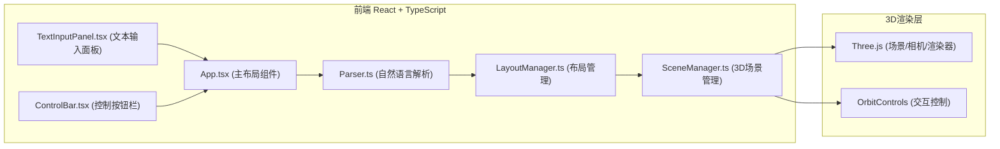

## 1. 架构设计



## 2. 技术说明
- 前端：React@18 + TypeScript + Vite
- 3D渲染：three + @types/three
- 状态管理：React useState/useRef 管理组件状态，LayoutManager类管理业务状态
- 构建工具：Vite + @vitejs/plugin-react
- 唯一ID生成：uuid

## 3. 项目结构

```
src/
├── main.tsx              # React应用入口
├── App.tsx               # 主布局组件
├── Parser.ts             # 自然语言解析模块
├── LayoutManager.ts      # 布局管理模块
├── SceneManager.ts       # Three.js场景管理
└── components/
    ├── TextInputPanel.tsx  # 左侧文本输入面板
    └── ControlBar.tsx      # 顶部控制按钮栏
```

## 4. 核心数据模型

### 4.1 家具数据结构
```typescript
interface Furniture {
  id: string;
  type: 'sofa' | 'table' | 'bookshelf' | 'lamp';
  position: { x: number; y: number; z: number };
  size: { x: number; y: number; z: number };
  rotation?: number;
}
```

### 4.2 布局数据结构
```typescript
interface LayoutData {
  version: string;
  createdAt: string;
  furniture: Furniture[];
}
```

## 5. 模块职责

### 5.1 Parser.ts
- 接收用户自然语言文本
- 通过关键词匹配和规则解析出家具列表
- 支持识别家具类型、位置关系、尺寸描述
- 返回结构化Furniture数组

### 5.2 LayoutManager.ts
- 管理当前场景所有家具的数据状态
- 提供addFurniture、removeFurniture、moveFurniture方法
- 提供saveLayout（导出JSON）、loadLayout（导入JSON）方法
- 调用SceneManager执行实际3D操作
- 事件通知机制更新React状态

### 5.3 SceneManager.ts
- Three.js场景初始化（渲染器、场景、相机、灯光、地面网格）
- OrbitControls交互控制
- 家具模型创建（基本几何体组合+材质）
- 家具添加/删除/移动的3D操作
- 拖拽拾取与移动交互
- 选中高亮效果
- 右键菜单触发
- 动画效果管理

### 5.4 App.tsx
- 主布局组件，左右分栏
- 管理核心状态（家具列表、选中状态）
- 协调Parser、LayoutManager、SceneManager
- 响应式布局处理

## 6. 家具模型规格

| 家具类型 | 几何体组成 | 尺寸（单位） | 颜色/材质 |
|---------|-----------|-------------|----------|
| 沙发(sofa) | L型两个长方体拼接 | 每个1.5×0.8×0.4 | 深灰色 |
| 茶几(table) | 单个长方体 | 1.2×0.6×0.3 | 半透明浅蓝色 |
| 书架(bookshelf) | 长方体+内部格栅 | 1.0×0.3×1.8 | 棕色 |
| 台灯(lamp) | 圆柱体灯柱+球体灯罩 | 灯柱0.05粗×0.4高，灯罩0.2半径 | 灯柱黄色，灯罩白色 |
