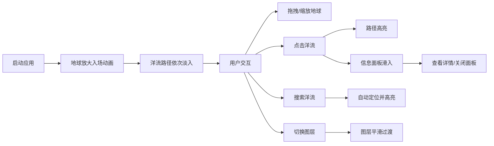

## 1. 产品概述

全球洋流可视化器是一款交互式3D教育工具，专为地理教师和学生设计，通过直观的三维地球模型展示全球主要洋流的流向、温度和盐度变化，帮助用户理解海洋环流对全球气候的影响。

- 核心价值：将抽象的海洋学概念转化为可视化的3D交互体验，降低学习门槛，提升教学效果
- 目标用户：地理教师、中学生、大学生及海洋科学爱好者
- 市场定位：专业教育领域的科学可视化工具

## 2. 核心功能

### 2.1 用户角色

| 角色 | 注册方式 | 核心权限 |
|------|----------|----------|
| 教师/学生 | 无需注册 | 浏览3D地球、查看洋流详情、切换温度/盐度图层、搜索定位洋流 |

### 2.2 功能模块

1. **3D地球场景**：高分辨率地球纹理、自转效果、拖拽旋转、滚轮缩放
2. **洋流路径渲染**：10+主要洋流的贝塞尔曲线路径、温度渐变色彩、流动箭头动画
3. **信息面板**：点击洋流显示详细数据（名称、温度、盐度、流量、影响区域）
4. **温度/盐度图层**：可切换的半透明颜色图层，可视化海洋表面数据
5. **搜索定位**：输入洋流名称快速定位并高亮对应洋流
6. **图例说明**：渐变条显示温度或盐度的数值范围

### 2.3 页面详情

| 页面名称 | 模块名称 | 功能描述 |
|---------|----------|----------|
| 主页面 | 3D地球场景 | 加载地球纹理，支持拖拽旋转、滚轮缩放（2-10倍），Y轴60秒周期自转 |
| 主页面 | 洋流路径 | 绘制10+条主要洋流，贝塞尔曲线沿球面分布，宽度随流量变化（1-4单位），温度渐变色彩 |
| 主页面 | 信息面板 | 点击洋流弹出详情，包含名称、温度、盐度、流量、影响区域，支持关闭 |
| 主页面 | 图层切换 | 温度/盐度图层切换按钮，1秒平滑过渡动画 |
| 主页面 | 搜索框 | 输入洋流名称自动定位并高亮，右下角固定位置 |
| 主页面 | 图例 | 左下角渐变图例，随图层切换同步更新 |

## 3. 核心流程

用户打开应用 → 地球从中心放大入场 → 洋流路径依次淡入 → 用户拖拽旋转地球/滚轮缩放 → 点击洋流路径 → 路径高亮 + 信息面板滑入 → 用户可切换温度/盐度图层 → 可搜索定位特定洋流 → 关闭信息面板恢复常态

## 4. 用户界面设计

### 4.1 设计风格

- **主色调**：深蓝色太空背景 (#0a1628)，地球蓝 (#1e88e5)，暖流橙红渐变，寒流蓝紫渐变
- **辅助色**：白色文字，半透明毛玻璃面板 (rgba(15, 23, 42, 0.85))，浅色边框 (rgba(255, 255, 255, 0.15))
- **按钮样式**：圆角设计 (border-radius: 12px)，半透明深色背景，悬停时亮度提升15%，带平滑过渡
- **字体**：标题使用 'Playfair Display' 或 'Noto Serif SC' 等衬线字体，正文使用 'Inter' 或系统无衬线字体，数值使用等宽字体 'JetBrains Mono'
- **布局**：全屏3D场景为背景，UI控件悬浮叠加，采用圆角卡片式设计

### 4.2 页面设计概述

| 页面名称 | 模块名称 | UI元素 |
|---------|----------|--------|
| 主页面 | 标题栏 | 左上角固定，应用名称 + 图层切换图标按钮，半透明背景 |
| 主页面 | 3D场景 | 全屏渲染，深蓝色星空背景，地球居中 |
| 主页面 | 洋流路径 | 贝塞尔曲线，温度渐变，流动箭头粒子，点击高亮 |
| 主页面 | 信息面板 | 右下角300px宽，毛玻璃效果，弹性滑入动画，可滚动 |
| 主页面 | 搜索框 | 右下角固定，圆角设计，半透明背景 |
| 主页面 | 图例 | 左下角固定，垂直渐变条，数值标签 |

### 4.3 响应式设计

- **桌面端**（≥768px）：信息面板右下角弹出（300px宽），UI控件水平排列
- **移动端**（<768px）：信息面板底部弹出（100%宽，自适应高度），UI控件垂直排列
- **触摸优化**：增加触摸目标尺寸，支持双指缩放，优化拖拽体验

### 4.4 3D场景设计

- **环境**：深蓝色太空背景，添加微弱星空粒子效果
- **光照**：环境光 (0.3) + 方向光 (1.0) 模拟太阳光，地球表面带轻微高光
- **相机**：初始距离3.5倍地球半径，视角60度，近裁剪面0.1，远裁剪面1000
- **动画**：
  - 地球入场：2秒缓出放大动画
  - 洋流淡入：每条间隔0.3秒，透明度0→0.7
  - 地球自转：Y轴60秒周期匀速旋转
  - 箭头粒子：沿曲线移动，速度2单位/秒，总数量≤100
  - 信息面板：0.4秒弹性滑入动画
  - 图层切换：1秒渐隐渐现过渡
- **后处理**：轻微抗锯齿，地球边缘柔和辉光
- **资源**：使用公共CDN加载地球纹理贴图，性能预算：纹理≤10MB，粒子≤100个，目标帧率60fps
