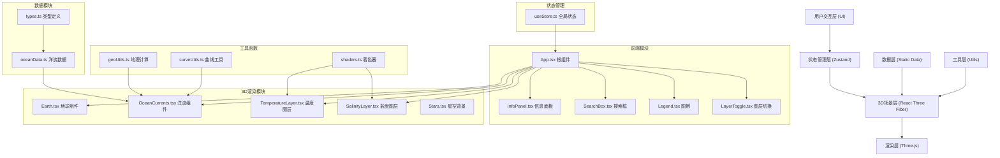
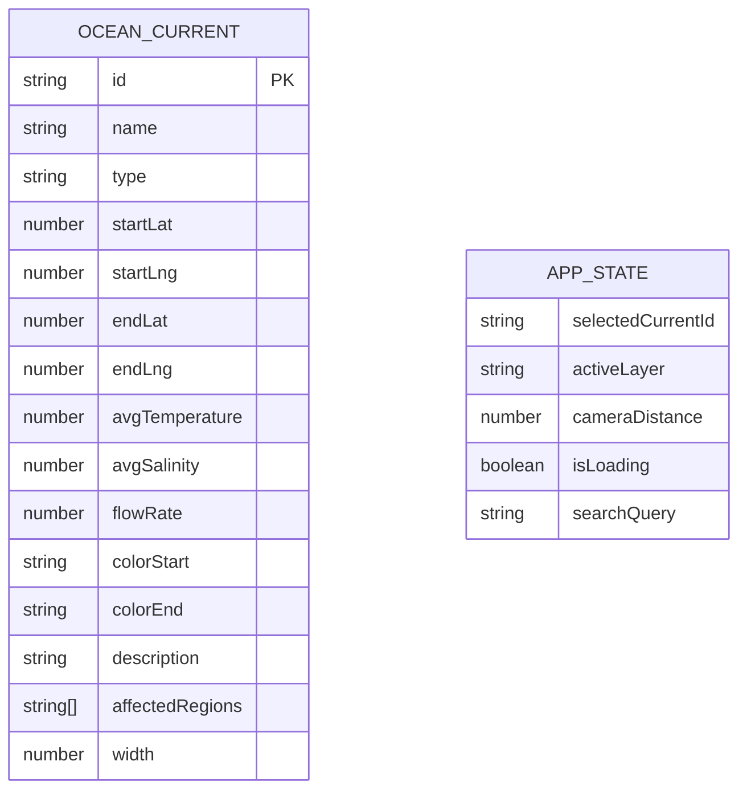

## 1. 架构设计



**模块调用关系与数据流向：**
1. `App.tsx` → 组合所有子组件，接收用户交互事件并分发给各模块
2. `oceanData.ts` → 导出洋流静态数据 → `OceanCurrents.tsx` 读取并渲染
3. `Earth.tsx` → 接收鼠标交互事件 → 通过状态管理通知洋流组件更新
4. `OceanCurrents.tsx` → 点击洋流 → 更新状态中选中洋流数据 → `InfoPanel.tsx` 接收并显示
5. 图层切换按钮 → 更新状态中图层类型 → 地球表面图层组件响应切换

## 2. 技术描述

- **前端框架**：React@18 + TypeScript@5
- **构建工具**：Vite@5
- **3D渲染**：Three.js@0.160 + @react-three/fiber@8 + @react-three/drei@9
- **状态管理**：Zustand@4
- **样式方案**：TailwindCSS@3 + CSS Modules
- **图标库**：lucide-react@0.294
- **动画库**：framer-motion@10
- **开发工具**：@types/three, @vitejs/plugin-react

## 3. 路由定义

| 路由 | 用途 |
|------|------|
| / | 主页面，3D地球与洋流可视化 |

## 4. 数据模型

### 4.1 数据模型定义



### 4.2 类型定义 (types.ts)

```typescript
export interface OceanCurrent {
  id: string;
  name: string;
  type: 'warm' | 'cold';
  startLat: number;
  startLng: number;
  endLat: number;
  endLng: number;
  avgTemperature: number;
  avgSalinity: number;
  flowRate: number;
  colorStart: string;
  colorEnd: string;
  description: string;
  affectedRegions: string[];
  width: number;
}

export type LayerType = 'temperature' | 'salinity';

export interface AppState {
  selectedCurrent: OceanCurrent | null;
  activeLayer: LayerType;
  isLoading: boolean;
  searchQuery: string;
  setSelectedCurrent: (current: OceanCurrent | null) => void;
  setActiveLayer: (layer: LayerType) => void;
  setSearchQuery: (query: string) => void;
}
```

### 4.3 项目结构

```
auto177/
├── index.html
├── package.json
├── tsconfig.json
├── vite.config.js
├── tailwind.config.js
├── postcss.config.js
└── src/
    ├── main.tsx
    ├── App.tsx
    ├── index.css
    ├── types/
    │   └── index.ts
    ├── data/
    │   └── oceanData.ts
    ├── store/
    │   └── useStore.ts
    ├── components/
    │   ├── Earth.tsx
    │   ├── OceanCurrents.tsx
    │   ├── InfoPanel.tsx
    │   ├── SearchBox.tsx
    │   ├── Legend.tsx
    │   ├── LayerToggle.tsx
    │   ├── Stars.tsx
    │   └── TemperatureLayer.tsx
    ├── utils/
    │   ├── geoUtils.ts
    │   ├── curveUtils.ts
    │   └── shaders.ts
    └── shaders/
        ├── temperatureVertex.glsl
        ├── temperatureFragment.glsl
        ├── salinityVertex.glsl
        └── salinityFragment.glsl
```

### 4.4 核心技术点

1. **球面贝塞尔曲线**：使用 `geoUtils.ts` 将经纬度转换为3D坐标，通过三次贝塞尔曲线在球面上生成洋流路径
2. **着色器图层**：使用自定义GLSL着色器实现温度/盐度的可视化，通过 `shaders.ts` 管理着色器代码，避免网格更新性能损耗
3. **流动物体动画**：使用 `useFrame` hook 实现箭头粒子沿曲线移动，通过 `curve.getPointAt(t)` 获取位置
4. **交互检测**：使用 Three.js 的 Raycaster 检测鼠标点击与洋流路径的碰撞
5. **状态管理**：使用 Zustand 管理全局状态，包括选中洋流、当前图层、搜索关键词等
6. **动画过渡**：使用 framer-motion 实现UI组件的平滑过渡动画，Three.js 内部使用线性插值实现3D动画
