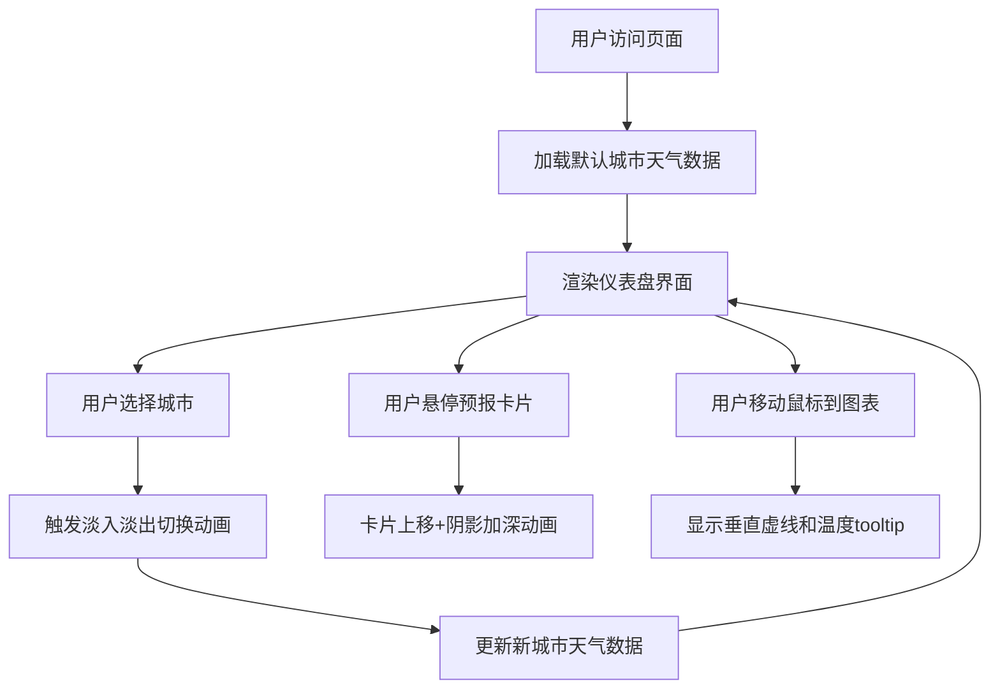

## 1. 产品概述

交互式天气可视化仪表盘应用，用户可以选择城市查看当前天气、未来7天预报和过去24小时气温趋势。通过精美的卡片式布局和流畅的动画效果，提供沉浸式的天气数据浏览体验。

- 主要目的：提供直观、美观的天气数据可视化展示
- 目标用户：需要快速了解天气信息的普通用户
- 产品价值：通过精心设计的UI和流畅的动画，提升天气数据查看的愉悦感

## 2. 核心功能

### 2.1 功能模块

1. **城市选择模块**：搜索式下拉框，支持模糊匹配城市名称
2. **当前天气卡片**：展示当前温度、天气图标、体感温度、湿度
3. **7天预报模块**：横向卡片排列，展示每日天气概况
4. **24小时趋势图**：Canvas折线图，展示过去24小时气温变化
5. **额外数据面板**：风速、湿度、紫外线指数圆形进度条

### 2.2 页面详情

| 页面名称 | 模块名称 | 功能描述 |
|---------|---------|---------|
| 主页面 | 城市选择下拉框 | 搜索式下拉，支持模糊匹配，10+国内城市，切换动画 |
| 主页面 | 当前天气卡片 | 动态背景渐变，大号温度显示，刷新按钮，天气emoji图标 |
| 主页面 | 7天预报卡片组 | 横向排列，悬停上移动画，点击高亮图表数据点 |
| 主页面 | 24小时气温趋势图 | Canvas绘制折线图，网格线，鼠标跟随tooltip，渐变填充 |
| 主页面 | 额外指标面板 | 风速、湿度、紫外线圆形进度条，渐变色 |

## 3. 核心流程

用户打开页面 → 默认展示第一个城市天气 → 选择/搜索城市 → 数据淡入淡出切换 → 交互探索（悬停预报卡片、查看趋势图tooltip）

## 4. 用户界面设计

### 4.1 设计风格

- **主色调**：蓝白主色调（#4A90D9和#FFFFFF）
- **辅助色**：橙色高亮、晴天淡黄渐变、阴天灰白、雨天浅蓝
- **卡片风格**：圆角卡片，白色背景，轻微阴影，卡片式布局
- **动画风格**：0.2-0.3秒过渡动画，CSS transform实现，60fps流畅度
- **字体**：现代无衬线字体，清晰的层级关系

### 4.2 页面设计概览

| 模块名称 | UI元素 | 样式描述 |
|---------|--------|---------|
| 城市选择器 | 下拉框、搜索输入、城市列表 | 圆角、悬停高亮、搜索过滤 |
| 当前天气卡片 | 城市名、温度、图标、体感、湿度、刷新按钮 | 动态渐变背景、大号字体、圆角 |
| 7天预报卡片 | 日期、图标、最高/低温 | 横向排列、等宽间隙、悬停上移8px |
| 24小时趋势图 | Canvas画布、折线、数据点、网格、tooltip | 蓝色渐变填充、白色圆点、垂直虚线 |
| 额外指标面板 | 圆形进度条、数值、标签 | 三色渐变（蓝/绿/橙）、居中数值 |

### 4.3 响应式设计

- **桌面端（768px以上）**：三栏布局，预报卡片一行7张
- **移动端（768px以下）**：单行滚动布局，自定义滚动条样式
- **触控优化**：确保点击区域足够大

### 4.4 动画与交互

- **城市切换**：0.4秒淡入淡出动画
- **卡片悬停**：0.3秒弹性过渡，垂直上移8px，阴影加深
- **按钮交互**：0.2秒缩放和颜色变化
- **图表tooltip**：鼠标跟随，平滑过渡
- **刷新按钮**：旋转动画
