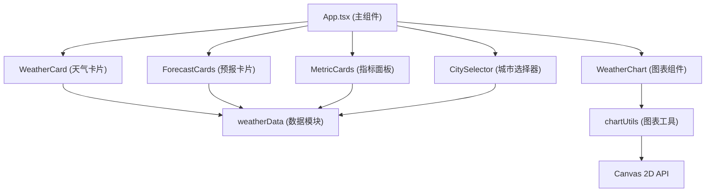

## 1. 架构设计



## 2. 技术选型

- **前端框架**：React 18 + TypeScript
- **构建工具**：Vite 5 + @vitejs/plugin-react
- **样式方案**：纯CSS + CSS Modules（内联样式处理动态样式）
- **图表方案**：Canvas 2D API 原生绘制
- **状态管理**：React useState/useEffect（轻量级，无需额外库）
- **数据来源**：本地模拟数据（weatherData.ts）

## 3. 项目结构

```
src/
├── App.tsx                 # 主应用组件，布局和状态协调
├── components/
│   ├── WeatherCard.tsx     # 当前天气卡片组件
│   ├── WeatherChart.tsx    # Canvas图表组件
│   ├── ForecastCard.tsx    # 单日预报卡片
│   ├── MetricCard.tsx      # 指标卡片（圆形进度条）
│   └── CitySelector.tsx    # 城市选择下拉框
├── data/
│   └── weatherData.ts      # 模拟天气数据生成和城市列表
├── utils/
│   └── chartUtils.ts       # Canvas图表绘制工具函数
└── types/
    └── weather.ts          # TypeScript类型定义
```

## 4. 数据模型

### 4.1 类型定义

```typescript
// 天气类型
type WeatherType = 'sunny' | 'cloudy' | 'rainy' | 'windy' | 'snowy';

// 当前天气数据
interface CurrentWeather {
  city: string;
  temperature: number;
  feelsLike: number;
  humidity: number;
  windSpeed: number;
  uvIndex: number;
  weatherType: WeatherType;
  icon: string;
  description: string;
}

// 每日预报数据
interface DayForecast {
  date: string;
  dayOfWeek: string;
  high: number;
  low: number;
  weatherType: WeatherType;
  icon: string;
}

// 小时气温数据
interface HourlyTemp {
  hour: number;
  temperature: number;
}

// 完整天气数据
interface WeatherData {
  current: CurrentWeather;
  forecast: DayForecast[];
  hourly: HourlyTemp[];
}

// 城市信息
interface City {
  id: string;
  name: string;
  province: string;
}
```

## 5. 核心模块说明

### 5.1 数据模块 (weatherData.ts)
- 城市列表：10个以上国内城市
- 模拟数据生成：基于城市和随机种子生成真实感天气数据
- 数据过滤：支持城市名称模糊匹配搜索
- 性能要求：数据生成和过滤 < 10ms

### 5.2 图表工具 (chartUtils.ts)
- 折线图绘制：Canvas 2D路径绘制
- 渐变填充：线性渐变区域填充
- 网格线绘制：X/Y轴网格
- 数据点标记：白色圆点
- Tooltip绘制：垂直虚线 + 温度标签
- 性能要求：重绘帧率 ≥ 30fps

### 5.3 组件模块
- **WeatherCard**：动态渐变背景、刷新动画、温度显示
- **WeatherChart**：Canvas绑定、鼠标交互、响应式尺寸
- **ForecastCard**：悬停动画、点击高亮、弹性过渡
- **MetricCard**：圆形进度条（SVG或Canvas）、渐变色
- **CitySelector**：搜索输入、下拉列表、模糊匹配

## 6. 性能优化策略

1. **Canvas优化**：使用requestAnimationFrame，避免不必要的重绘
2. **动画优化**：使用transform和opacity属性，触发GPU加速
3. **数据优化**：模拟数据缓存，避免重复计算
4. **渲染优化**：React memo包装纯展示组件
5. **响应式**：使用ResizeObserver监听容器尺寸变化

## 7. 配置文件

### tsconfig.json
- 严格模式 (strict: true)
- 路径别名：@/ 指向 src/
- JSX: react-jsx
- 目标：ES2020

### vite.config.ts
- React插件
- 路径别名配置
- 开发服务器配置

### package.json
- 依赖：react, react-dom, typescript, vite, @vitejs/plugin-react
- 脚本：dev, build, preview
