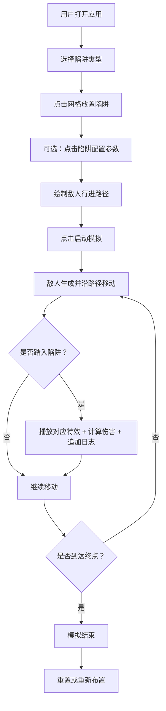

## 1. 产品概述

赛博陷阱（CyberTrap）是一款赛博朋克主题的2D网格地图陷阱编辑与触发模拟器应用。用户可在16x16的网格地图上布置不同类型的陷阱，设置陷阱参数，并模拟敌人沿路径移动触发陷阱的完整过程，用于游戏策略设计与效果预览。

- 目标用户：回合制策略游戏开发者、关卡设计师、战术模拟爱好者
- 产品价值：提供可视化的陷阱布置与触发模拟工具，快速验证战术布局和伤害计算模型

## 2. 核心功能

### 2.1 用户角色

| 角色 | 注册方式 | 核心权限 |
|------|---------|----------|
| 设计师用户 | 无需注册，直接使用 | 布置/删除陷阱、设置参数、编辑路径、启动/停止模拟、查看日志 |

### 2.2 功能模块

1. **地图编辑器模块**：16x16网格渲染、陷阱放置与删除、路径绘制、陷阱参数配置面板
2. **敌人AI模块**：敌人生成、路径规划、自动移动动画、生命值管理
3. **效果管理模块**：陷阱触发检测、粒子特效播放、伤害计算、实时日志输出
4. **状态管理模块**：Zustand全局状态、网格数据、陷阱列表、敌人列表、日志记录

### 2.3 页面详情

| 页面名称 | 模块名称 | 功能描述 |
|---------|---------|----------|
| 主界面 | 左侧工具面板 | 四种陷阱选择按钮（电击/毒雾/火焰/冰冻）、路径编辑切换、实时日志面板 |
| 主界面 | 中央地图区域 | 16x16网格渲染、陷阱可视化显示、路径显示、敌人移动动画、特效播放 |
| 主界面 | 陷阱参数面板 | 点击已放置陷阱弹出浮层，含触发延迟滑块、持续时间滑块、确认按钮 |
| 主界面 | 底部控制栏 | 启动模拟按钮、重置按钮、当前回合显示 |

## 3. 核心流程

用户打开应用 → 选择陷阱类型 → 在网格上点击放置陷阱 → 点击陷阱配置参数（可选）→ 绘制敌人行进路径 → 点击启动模拟 → 敌人自动沿路径移动 → 触发陷阱时播放特效并更新日志 → 模拟结束或手动重置

## 4. 用户界面设计

### 4.1 设计风格

- **主色调**：深蓝黑背景 `#0a0a1a`，霓虹紫主按钮 `#8b5cf6`，悬停亮青 `#22d3ee`
- **辅助色**：陷阱色（电击黄 `#facc15`、毒雾绿 `#22c55e`、火焰红 `#ef4444`、冰冻蓝 `#3b82f6`），路径绿 `#00ff00`，网格线暗青 `#1e3a5f`
- **按钮风格**：毛玻璃效果（背景 `rgba(255,255,255,0.05)`，边框 `1px solid #4a4a8a`），霓虹渐变光晕，0.2秒平滑过渡
- **字体**：等宽数字字体用于回合倒计时，现代无衬线字体用于UI文本
- **布局风格**：三栏式布局（左工具面板 + 中地图 + 右留白），整体水平居中，最大宽度1200px
- **动画风格**：陷阱脉冲扩散动画、特效粒子动画、日志淡入效果、敌人血条渐变

### 4.2 页面设计概览

| 页面名称 | 模块名称 | UI元素 |
|---------|---------|--------|
| 主界面 | 工具面板 | 陷阱按钮（彩色图标+选中高亮）、路径编辑开关、日志区域（200px高，可滚动） |
| 主界面 | 地图网格 | 16x16方格（40px每格）、半透明陷阱填充、倒计时数字、绿色路径线、红色敌人圆形 |
| 主界面 | 参数浮层 | 深灰半透明背景 `#1a1a2ecc`、两个滑块（延迟0-3/持续1-5）、确认按钮 |
| 主界面 | 血条系统 | 多彩弧形血条（色相绿→红渐变），显示生命值百分比 |

### 4.3 响应式

- 桌面优先设计，最小适配1366px宽度屏幕
- 水平居中布局，两侧自动留白
- 不支持移动端触控操作，面向桌面鼠标交互

### 4.4 动效设计

- 陷阱区域：放射性脉冲动画（每2秒循环）
- 电击特效：白色闪光 + 敌人闪烁眩晕0.3秒
- 毒雾特效：绿色烟雾粒子扩散，持续1秒
- 火焰特效：橙色火焰向上燃烧动画
- 冰冻特效：蓝色冰晶围绕敌人旋转
- 日志条目：新增时从上往下插入，淡入效果
- 所有交互元素：悬停/操作时0.2秒平滑过渡
