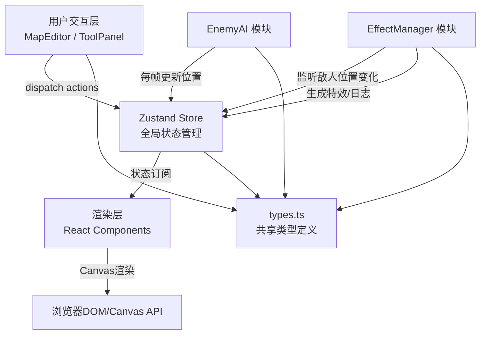
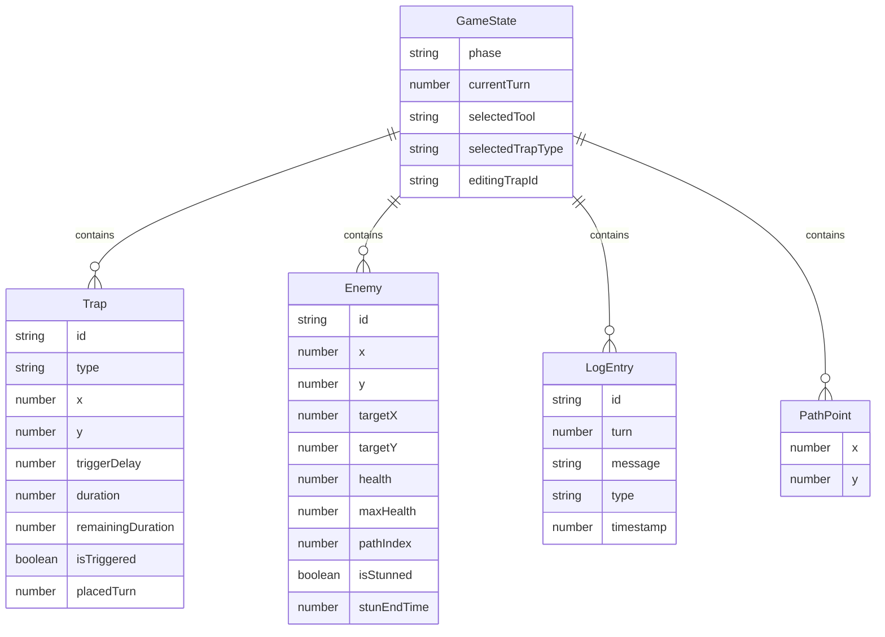

## 1. 架构设计



## 2. 技术说明

- **前端框架**：React@18 + TypeScript@5
- **构建工具**：Vite@5 + @vitejs/plugin-react
- **状态管理**：Zustand@4（轻量级状态管理，支持订阅选择器优化渲染）
- **唯一ID生成**：uuid@9
- **初始化方式**：使用 vite-init react-ts 模板脚手架

## 3. 路由定义

| 路由 | 用途 |
|------|------|
| / | 主应用页面（单页应用，无多路由） |

## 4. 数据模型

### 4.1 数据模型定义



### 4.2 文件结构与数据流

```
src/
├── types.ts          # 所有模块共享的类型定义（GameState/Trap/Enemy等）
│                     # ↓ 被所有模块引用
├── store.ts          # Zustand Store：管理grid/traps/enemies/logs
│                     # ↑ MapEditor/EnemyAI dispatch → store → 订阅者重绘
│                     # ↑ EffectManager 监听敌人位置变更
├── MapEditor.tsx     # 网格渲染 + 陷阱放置/删除 + 参数面板
│                     # 数据流：用户鼠标事件 → dispatch → store → 重绘UI
├── EnemyAI.tsx       # 敌人列表管理 + 自动寻路 + 移动动画
│                     # 数据流：store读取路径 → 每帧更新位置 → dispatch → store
├── EffectManager.ts  # 陷阱触发检测 + 特效播放 + 伤害计算 + 日志生成
│                     # 数据流：订阅store中enemies变化 → 检查重叠 → 触发+日志
├── App.tsx           # 主布局组件，整合所有子模块
├── main.tsx          # React入口
└── index.css         # 全局样式（赛博朋克主题变量）
```

## 5. 核心性能优化方案

1. **帧率控制**：使用 `requestAnimationFrame` 统一驱动敌人移动、特效、UI重绘，目标30FPS
2. **渲染节流**：网格重绘频率不超过每60ms一次，通过时间戳判断跳过冗余帧
3. **状态订阅优化**：Zustand使用选择器（selector）订阅，避免无关状态变更触发重渲染
4. **动画隔离**：粒子特效使用离屏Canvas或CSS transform，不阻塞主线程UI
5. **虚拟列表**：日志面板新增条目采用淡入动画，旧条目自动回收（最多保留100条）

## 6. 陷阱类型配置

| 类型 | 颜色 | 伤害 | 特效 | 图标 |
|------|------|------|------|------|
| electric（电击） | #facc15（黄） | 25 | 白色闪光+眩晕0.3s | ⚡ |
| poison（毒雾） | #22c55e（绿） | 15 | 绿色烟雾扩散1s | ☠ |
| fire（火焰） | #ef4444（红） | 30 | 橙色火焰向上燃烧 | 🔥 |
| ice（冰冻） | #3b82f6（蓝） | 20 | 蓝色冰晶旋转 | ❄ |
