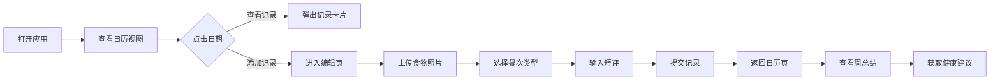

## 1. 产品概述

美食日志簿是一款帮助用户记录日常饮食、分析营养摄入、培养健康饮食习惯的Web应用。用户可以每天记录吃的食物，上传照片、写点评，系统自动生成营养小贴士和每周饮食趋势图表。

- 主要目的：帮助用户追踪饮食习惯，提供健康饮食建议，提升健康意识
- 目标用户：关注健康饮食、需要管理饮食的普通用户
- 产品价值：通过可视化的数据记录和智能分析，帮助用户建立科学的饮食习惯

## 2. 核心功能

### 2.1 用户角色

| 角色 | 注册方式 | 核心权限 |
|------|----------|----------|
| 普通用户 | 无需注册，本地数据存储 | 记录饮食、查看分析、获取建议 |

### 2.2 功能模块

1. **日历视图页面**：日历概览、记录卡片展示、饮食均衡度颜色标记
2. **记录编辑页面**：图片上传、餐次选择、点评输入
3. **周总结面板**：热量趋势图表、健康建议展示

### 2.3 页面详情

| 页面名称 | 模块名称 | 功能描述 |
|---------|----------|----------|
| 日历视图页 | 日历网格 | 展示每月日期，有记录的日期显示彩色圆点（红到绿渐变表示均衡度），点击弹出当天记录卡片 |
| 日历视图页 | 记录卡片 | 包含食物照片缩略图（可拖拽排序）、用户短评、营养分析摘要，上浮淡入动画（0.3秒） |
| 记录编辑页 | 图片上传 | 支持上传食物照片，上传时显示圆形进度环动画，缩略图生成200ms内完成 |
| 记录编辑页 | 餐次选择 | 早餐/午餐/晚餐/加餐，色块标签，选中时从左到右扫过动画 |
| 记录编辑页 | 点评输入 | 带字数计数器，超过200字输入框底边变红闪烁 |
| 周总结面板 | 热量趋势图 | 折线图展示每日热量摄入，平滑曲线+填充渐变，鼠标悬停显示精确数值 |
| 周总结面板 | 健康小建议 | 三条建议，左滑渐入动画，绿色/橙色区分建议类型 |

## 3. 核心流程

用户打开应用 → 查看日历视图 → 点击日期查看记录 → 点击添加记录 → 上传食物照片 → 选择餐次类型 → 输入点评 → 提交记录 → 返回日历页查看新记录 → 查看周总结面板获取健康建议

## 4. 用户界面设计

### 4.1 设计风格

- 主色调：暖色调（米白 #FFF8F0、浅橙 #FFB380、淡绿 #B8E6B8）
- 辅助色：红色 #FF6B6B（不均衡饮食标记）、橙色 #FFA94D（警告）、绿色 #51CF66（健康）
- 按钮风格：圆角12px，悬停0.2秒上浮+阴影加深
- 字体：标题使用 "Noto Serif SC"，正文使用 "Noto Sans SC"
- 布局：卡片式布局，大量留白，视觉层次清晰
- 图标：使用 lucide-react 图标库，线条风格图标

### 4.2 页面设计概述

| 页面名称 | 模块名称 | UI元素 |
|---------|----------|--------|
| 日历视图页 | 日历网格 | 7列网格布局，日期格子悬停效果，彩色圆点标记，卡片弹出动画 |
| 记录编辑页 | 表单区域 | 图片上传区域拖拽样式，餐次标签扫过动画，字数计数器实时更新 |
| 周总结面板 | 图表区域 | Recharts折线图，渐变色填充，悬停提示框，建议卡片左滑入动画 |

### 4.3 响应式设计

- 桌面端（>1024px）：三栏布局：左侧日历+右侧总结面板
- 平板端（768-1024px）：日历占70%，总结面板占30%
- 移动端（<768px）：上下布局，日历在上，总结面板在下，可滚动

### 4.4 动画与交互

- 日历格子悬停：0.2秒上浮+阴影加深
- 卡片弹出：0.3秒上浮淡入
- 餐次标签选中：背景色从左到右扫过
- 建议显示：左滑渐入（animation-delay 递增）
- 图片上传：圆形进度环动画
- 字数超限：输入框底边红色闪烁

## 5. 性能要求

- 日历页加载时间：< 1.5秒
- 图片缩略图生成：< 200毫秒
- 动画流畅度：60fps
