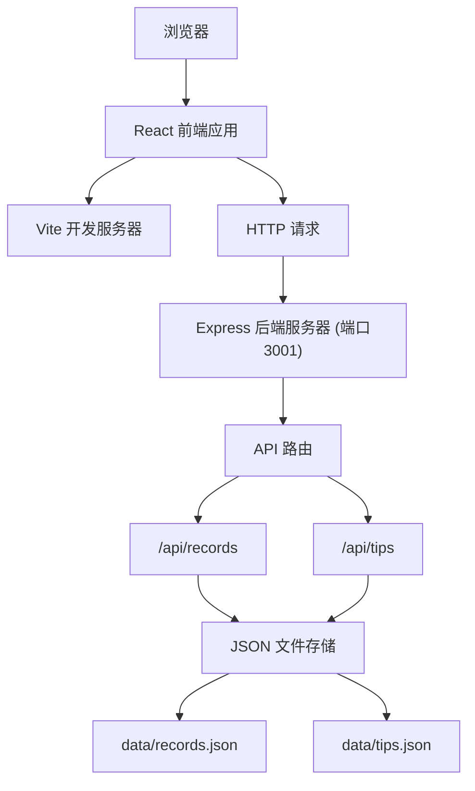
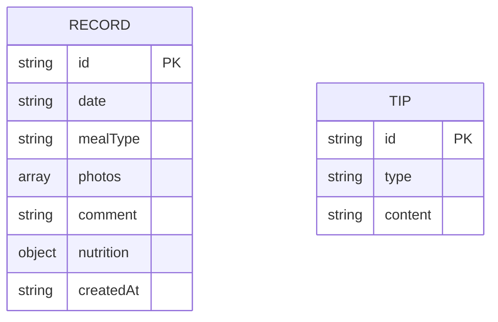

## 1. 架构设计



## 2. 技术描述

- **前端框架**：React 18 + TypeScript 5
- **构建工具**：Vite 5
- **后端框架**：Express 4
- **UI 样式**：Tailwind CSS 3
- **图表库**：Recharts 2
- **状态管理**：React Hooks (useState, useEffect)
- **路由**：React Router DOM 6
- **HTTP 客户端**：Fetch API
- **数据库**：本地 JSON 文件模拟
- **唯一 ID**：uuid
- **图标**：lucide-react

## 3. 项目结构

```
美食日志簿/
├── .trae/documents/
│   ├── PRD_美食日志簿.md
│   └── 技术架构_美食日志簿.md
├── src/
│   ├── components/
│   │   ├── CalendarView.tsx
│   │   ├── RecordEditor.tsx
│   │   └── SummaryPanel.tsx
│   ├── data/
│   │   ├── records.json
│   │   └── tips.json
│   ├── App.tsx
│   └── main.tsx
├── index.html
├── package.json
├── tsconfig.json
├── vite.config.ts
├── tailwind.config.js
├── postcss.config.js
└── server.js
```

## 4. 路由定义

| 路由 | 页面 | 说明 |
|------|------|------|
| / | 日历视图页 | 主页面，展示日历和周总结 |
| /edit/:date | 记录编辑页 | 添加/编辑指定日期的饮食记录 |

## 5. API 定义

### 5.1 获取所有记录
- **GET** `/api/records`
- **响应**：`Record[]`
```typescript
interface Record {
  id: string;
  date: string; // YYYY-MM-DD
  mealType: 'breakfast' | 'lunch' | 'dinner' | 'snack';
  photos: { id: string; url: string; order: number }[];
  comment: string;
  nutrition: {
    calories: number;
    protein: number;
    carbs: number;
    fat: number;
    balanceScore: number; // 0-100, 越高越均衡
  };
  createdAt: string;
}
```

### 5.2 添加记录
- **POST** `/api/records`
- **请求体**：`Omit<Record, 'id' | 'createdAt'>`
- **响应**：`Record`

### 5.3 更新记录
- **PUT** `/api/records/:id`
- **请求体**：`Partial<Record>`
- **响应**：`Record`

### 5.4 获取健康建议
- **GET** `/api/tips?date=YYYY-MM-DD`
- **响应**：`Tip[]`
```typescript
interface Tip {
  id: string;
  type: 'positive' | 'warning';
  content: string;
}
```

### 5.5 获取周总结
- **GET** `/api/weekly-summary?date=YYYY-MM-DD`
- **响应**：
```typescript
interface WeeklySummary {
  dailyCalories: { date: string; calories: number }[];
  tips: Tip[];
  averageBalance: number;
}
```

## 6. 数据模型



## 7. 配置说明

### 7.1 Vite 配置
- 开发端口：5173
- 代理配置：`/api` -> `http://localhost:3001`
- 路径别名：`@` -> `src/`

### 7.2 TypeScript 配置
- 严格模式
- JSX: preserve
- 模块：ESNext
- 目标：ES2020

### 7.3 Tailwind 配置
- 自定义颜色：暖色调主题
- 圆角：12px 基础圆角
- 动画：自定义动画配置

## 8. 性能优化

- 图片懒加载
- 组件按需渲染
- 使用 React.memo 优化重渲染
- 图片缩略图客户端生成（Canvas）
- API 请求防抖和缓存
