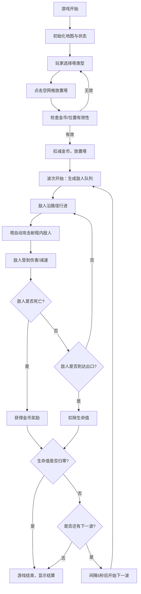

## 1. 产品概述

塔防编年史是一款基于塔防玩法的策略游戏原型，玩家在10x15网格地图上部署防御单位抵御敌人进攻，通过合成升级防御单位应对增强的敌人波次。

- 目标用户：游戏设计师、塔防游戏爱好者
- 产品价值：提供可快速迭代的塔防游戏原型框架，验证核心玩法机制

## 2. 核心功能

### 2.1 功能模块

1. **游戏画布**：Canvas 2D渲染网格地图、防御塔、敌人、弹道与粒子效果
2. **HUD界面**：金币、生命值、波次信息展示，塔选择栏与合成面板
3. **塔防系统**：箭塔、炮塔、魔法塔三种基础塔，支持升级与三合一合成高级塔
4. **敌人系统**：10波敌人，含普通敌人与Boss敌人，沿S形路径行进
5. **战斗系统**：自动攻击、弹道飞行、伤害计算、减速效果、死亡奖励

### 2.2 页面详情

| 页面名称 | 模块名称 | 功能描述 |
|---------|---------|---------|
| 主游戏界面 | 游戏画布 | 10x15网格地图渲染，塔放置/选择/升级，敌人与弹道动画 |
| 主游戏界面 | 顶部HUD | 金币/生命/波次显示，塔选择栏，合成面板入口 |
| 主游戏界面 | 结算面板 | 游戏结束时显示总消灭数与波次 |
| 主游戏界面 | 波次提示 | 每波开始时大字动画提示 |

## 3. 核心流程

## 4. 用户界面设计

### 4.1 设计风格
- **主色调**：暗色背景 #1a1a2e，搭配金色 #ffd700、红色 #ff4444、绿色 #4CAF50、橙色 #FF5722、蓝色 #2196F3
- **设计风格**：深色科幻/魔法风格，毛玻璃效果（backdrop-filter: blur），渐变与光晕
- **字体**：使用现代无衬线字体，数字使用等宽字体增强可读性
- **布局**：全屏布局，游戏画布居中四周留160px边距，顶部HUD悬浮覆盖

### 4.2 页面设计详情

| 页面名称 | 模块名称 | UI元素 |
|---------|---------|---------|
| 主游戏界面 | 游戏画布 | 10x15浅灰网格(#444)，深灰路径(#333)带0.5px白边，塔放置弹性动画，弹道拖尾效果，粒子爆炸 |
| 主游戏界面 | 顶部HUD | 半透明黑色(#00000088)+毛玻璃，金币旋转动画，生命值脉冲缩放，塔图标选中放大+底部指示条 |
| 主游戏界面 | 合成面板 | 半透明模态框+毛玻璃，合成按钮渐变背景+悬停光晕 |
| 主游戏界面 | 波次提示 | 白色36px大字，中心扩散进入动画(0.5s) |
| 主游戏界面 | 结算面板 | 半透明黑背景，中央白色卡片上浮动画(0.5s) |

### 4.3 响应式
- 桌面优先设计，支持1366x768以上分辨率
- 游戏画布按16:9比例自动缩放
- HUD字体与图标随画布等比调整

### 4.4 性能约束
- 游戏循环稳定60FPS，单帧渲染≤16ms
- 同时存在塔≤30、敌人≤80时帧率≥55FPS
- 弹道数量每帧≤50条，超出按优先级裁剪
