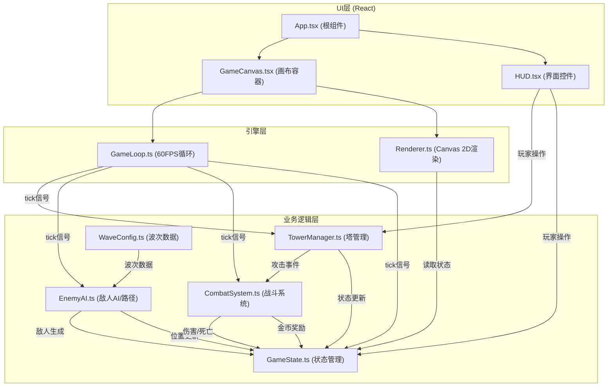

## 1. 架构设计



**数据流向**：
1. 用户通过HUD组件操作 → TowerManager/GameState
2. GameLoop每帧分发tick → 各业务模块更新数据 → GameState
3. Renderer从GameState读取最新状态 → Canvas渲染
4. CombatSystem处理战斗事件 → 更新GameState

## 2. 技术栈描述

- **前端框架**：React 18 + TypeScript
- **构建工具**：Vite + @vitejs/plugin-react
- **渲染引擎**：Canvas 2D API（独立封装）
- **状态管理**：自研集中式GameState模块（非Redux/Zustand，游戏循环内使用）
- **样式方案**：CSS Modules + 内联样式（动画效果）

## 3. 模块文件结构

```
src/
├── modules/
│   ├── engine/
│   │   ├── Renderer.ts       # Canvas渲染引擎
│   │   └── GameLoop.ts       # 游戏循环控制
│   ├── ai/
│   │   └── EnemyAI.ts        # 敌人AI、路径寻路(BFS)、波次生成
│   ├── tower/
│   │   └── TowerManager.ts   # 塔创建/升级/合成/攻击逻辑
│   ├── battle/
│   │   └── CombatSystem.ts   # 弹道、伤害计算、死亡逻辑
│   └── data/
│       ├── GameState.ts      # 核心状态管理
│       └── WaveConfig.ts     # 波次数据(JSON)
├── ui/
│   ├── App.tsx               # React根组件
│   ├── GameCanvas.tsx        # Canvas容器组件
│   └── HUD.tsx               # 界面控件组件
└── main.tsx                  # React入口
```

## 4. 数据模型

### 4.1 核心类型定义

```typescript
// 位置坐标
interface Position {
  x: number;  // 网格X坐标 (0-14)
  y: number;  // 网格Y坐标 (0-9)
}

// 塔类型
type TowerType = 'arrow' | 'cannon' | 'magic' | 'rapid' | 'rocket' | 'freeze';

// 塔实例
interface Tower {
  id: string;
  type: TowerType;
  level: number;        // 1-3
  position: Position;
  damage: number;
  range: number;        // 单位：格
  attackSpeed: number;  // 攻击间隔（秒）
  lastAttackTime: number;
  slowEffect?: number;  // 减速百分比 0-1
  slowDuration?: number; // 减速持续时间
  aoeRadius?: number;   // 范围伤害半径
  placementAnim: number; // 放置动画进度 0-1
}

// 敌人类型
type EnemyType = 'normal' | 'fast' | 'tank' | 'boss';

// 敌人实例
interface Enemy {
  id: string;
  type: EnemyType;
  hp: number;
  maxHp: number;
  speed: number;        // 格/秒
  pathIndex: number;    // 当前路径点索引
  position: { x: number; y: number }; // 像素坐标(连续)
  reward: number;       // 击杀金币奖励
  slowTimer: number;    // 减速剩余时间
  slowAmount: number;   // 当前减速百分比
  size: number;         // 体型倍数
}

// 弹道
interface Projectile {
  id: string;
  fromX: number;
  fromY: number;
  toX: number;
  toY: number;
  currentX: number;
  currentY: number;
  speed: number;
  damage: number;
  type: TowerType;
  targetId: string;
  aoeRadius?: number;
  slowEffect?: number;
  slowDuration?: number;
  trail: Array<{ x: number; y: number; alpha: number }>;
}

// 粒子效果
interface Particle {
  x: number;
  y: number;
  vx: number;
  vy: number;
  life: number;
  maxLife: number;
  color: string;
  size: number;
}

// 游戏状态
interface GameStateData {
  gold: number;
  lives: number;
  currentWave: number;
  totalWaves: number;
  towers: Tower[];
  enemies: Enemy[];
  projectiles: Projectile[];
  particles: Particle[];
  isGameOver: boolean;
  isWaveActive: boolean;
  waveTimer: number;       // 波次间隔倒计时
  waveAnnounceTimer: number; // 波次提示显示计时
  totalKills: number;
  exitFlashTimer: number;  // 出口闪烁计时
  bossFlashTimer: number;  // Boss死亡全屏闪光
  livesPulseTimer: number; // 生命值脉冲动画
  selectedTowerId: string | null;
  placingTowerType: TowerType | null;
}
```

## 5. 地图与路径

- **网格尺寸**：10行 × 15列，每格50×50像素
- **总画布尺寸**：750px × 500px
- **路径**：S形固定路线，从左侧中间(0,5)入口到右侧中间(14,5)出口
  - 路径点序列：(0,5) → (3,5) → (3,2) → (7,2) → (7,7) → (11,7) → (11,5) → (14,5)

## 6. 塔配置

| 塔类型 | 伤害 | 射程(格) | 攻击间隔(s) | 特殊效果 | 合成源 |
|--------|------|----------|------------|----------|--------|
| 箭塔 arrow | 10 | 4 | 0.5 | 单体 | 基础 |
| 炮塔 cannon | 25 | 3 | 1.5 | 范围伤害(1格) | 基础 |
| 魔法塔 magic | 15 | 4 | 0.8 | 减速30% 1秒 | 基础 |
| 连射塔 rapid | 20 | 5 | 0.25 | 单体攻速翻倍 | 3×箭塔 |
| 火箭塔 rocket | 40 | 4 | 1.5 | 范围伤害(1.5格) | 3×炮塔 |
| 冰冻塔 freeze | 25 | 5 | 0.8 | 减速60% 1秒 | 3×魔法塔 |

- 升级费用：Lv1→Lv2: 50金币，Lv2→Lv3: 100金币，Lv3→合成
- 每级提升：伤害+10，射程+0.5格
