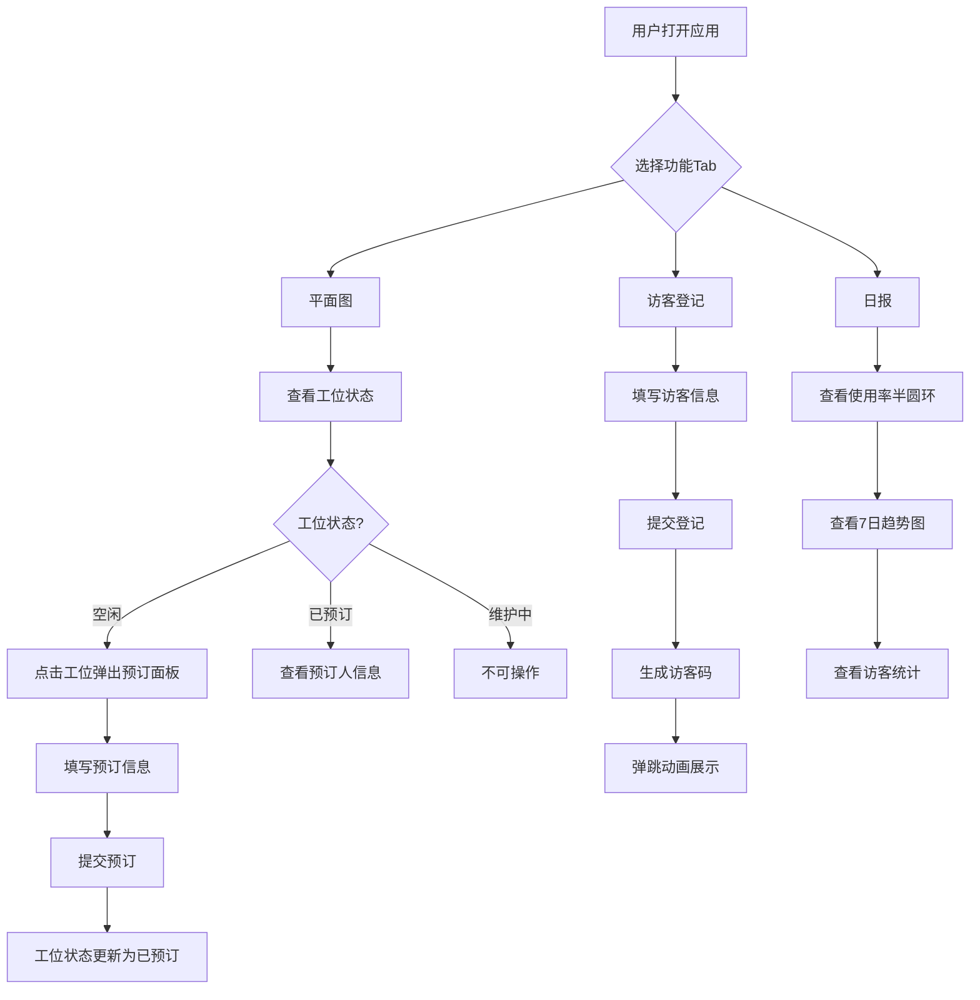

## 1. 产品概述

工位管家是一款面向共享办公空间运营团队的工作区预订与访客管理应用。通过可视化楼层平面图实现工位一键预订，自助访客登记终端替代纸质表格，自动生成每日使用报告，显著提升空间管理效率。

- 目标用户：共享办公空间管理员、入驻员工、访客
- 核心价值：消除纸质流程、实时可视化工位状态、数据驱动空间运营决策

## 2. 核心功能

### 2.1 用户角色

| 角色 | 注册方式 | 核心权限 |
|------|----------|----------|
| 管理员 | 系统预设 | 查看平面图、预订工位、访客登记、查看日报、工位维护 |
| 员工 | 系统预设 | 查看平面图、预订工位、访客登记、查看日报 |
| 访客 | 自助登记 | 无需账号，仅通过自助终端登记 |

### 2.2 功能模块

1. **楼层平面图页面**：10x6工位网格可视化、状态颜色区分、点击预订、右键维护切换
2. **访客登记页面**：自助登记表单、6位访客码生成、弹跳动画
3. **日报仪表盘页面**：工位使用率半圆环、7日趋势柱状图、访客流量统计

### 2.3 页面详情

| 页面名称 | 模块名称 | 功能描述 |
|----------|----------|----------|
| 楼层平面图 | 工位网格 | 10x6网格渲染，绿色空闲/红色已预订/黄色维护中，悬停放大投影，点击空闲工位弹出预订面板，已预订显示预订人缩略标签 |
| 楼层平面图 | 预订面板 | 弹出式表单，选择日期（默认当天）、时间段（09:00-18:00, 30分钟间隔）、姓名（≤20字符），同一时段不可重复预订 |
| 楼层平面图 | 维护操作 | 右键/长按工位切换为维护中状态，次日自动恢复空闲 |
| 访客登记 | 登记表单 | 姓名、公司名文本输入，受访者下拉选择，停留时长1-8小时步长0.5，提交生成6位访客码 |
| 访客登记 | 访客码展示 | 6位随机码显示，0.5秒弹跳动画 |
| 日报仪表盘 | 使用率指标 | 今日工位使用率百分比大号显示，半圆环形进度条 |
| 日报仪表盘 | 趋势图表 | 过去7天工位使用趋势柱状图，11px坐标轴，虚线网格 |
| 日报仪表盘 | 访客统计 | 今日访客总人数和峰值时段 |

## 3. 核心流程

### 工位预订流程
用户打开应用 → 查看楼层平面图 → 找到空闲工位（绿色）→ 点击工位 → 弹出预订面板 → 填写日期、时间、姓名 → 提交 → 工位变为红色显示预订人缩略标签 → 预订完成

### 访客登记流程
访客到达 → 在自助终端选择"访客登记"Tab → 填写姓名、公司、受访者、时长 → 提交 → 系统生成6位访客码 → 弹跳动画展示访客码 → 登记完成

### 日报查看流程
管理员切换到"日报"Tab → 查看今日使用率（半圆环）→ 查看7日趋势柱状图 → 查看访客统计

## 4. 用户界面设计

### 4.1 设计风格

- 主色：#2C3E50（蓝灰），点缀色：#3498DB（亮蓝），背景色：#ECF0F1（浅灰白）
- 按钮风格：圆角4px，主按钮使用点缀色填充，次按钮边框样式
- 字体：system-ui，标题18px加粗，正文14px常规，辅助信息12px
- 布局风格：顶部固定导航56px，内容区域居中，卡片式模块
- 图标风格：使用 lucide-react 线性图标

### 4.2 页面设计概览

| 页面名称 | 模块名称 | UI元素 |
|----------|----------|--------|
| 通用 | 顶部导航栏 | 56px固定高度，蓝灰背景(#2C3E50)，白色应用名"工位管家"，3个Tab按钮，当前Tab 3px宽动画下划线从左滑入 |
| 平面图 | 工位网格 | 10x6网格，每格80x80px，2px圆角，1px边框(#BDC3C7)，悬停1.05倍放大+投影，状态切换300ms渐变动画 |
| 平面图 | 预订面板 | 居中弹出面板，日期选择器、时间下拉、姓名输入，提交按钮 |
| 访客登记 | 登记表单 | 居中卡片式表单，输入框聚焦时边框#3498DB + padding-left从12px到20px的0.2秒动画，受访者下拉选择器 |
| 访客登记 | 访客码展示 | 大号6位码显示，0.5秒弹跳动画 |
| 日报 | 使用率指标 | 大号百分比数字，下方半圆环形进度条 |
| 日报 | 趋势图表 | 7日柱状图，11px坐标轴，虚线网格线(#E5E7EB) |
| 日报 | 访客统计 | 卡片式展示总人数和峰值时段 |

### 4.3 响应式适配

- 桌面优先设计，视口宽度 < 768px 时：
  - 工位网格变为两列布局
  - Tab导航变为汉堡菜单
  - 表单全宽显示

### 4.4 3D场景指引

不适用
