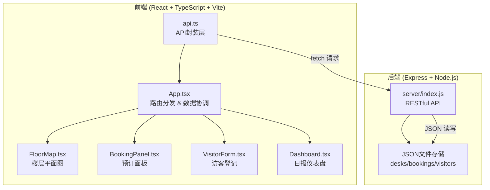
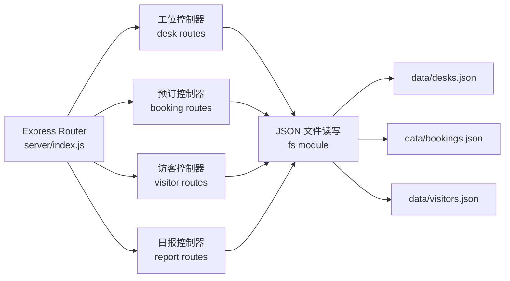
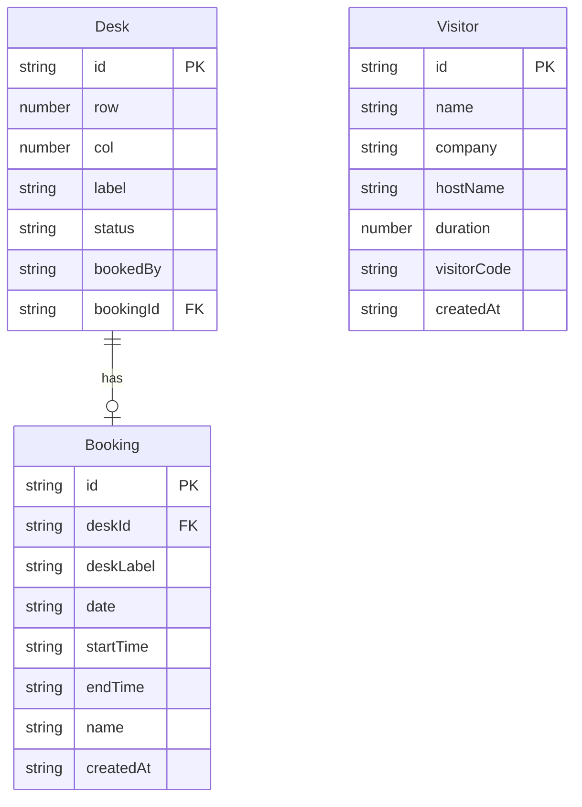

## 1. 架构设计



数据流向：
- 前端组件 → api.ts → Express API → JSON文件 → 返回响应 → 组件更新状态

## 2. 技术说明

- 前端：React@18 + TypeScript + Vite + Tailwind CSS
- 初始化工具：vite-init（react-express-ts 模板）
- 后端：Express@4（ESM + TypeScript）
- 数据库：本地JSON文件模拟（desks.json, bookings.json, visitors.json）
- 状态管理：Zustand
- 图表绘制：Canvas API（无需D3依赖，减小体积）
- 路由：React Router DOM

## 3. 路由定义

| 路由 | 用途 |
|------|------|
| / | 楼层平面图（默认页面） |
| /visitor | 访客登记页面 |
| /dashboard | 日报仪表盘页面 |

## 4. API 定义

### 4.1 工位相关

```
GET    /api/desks           → 获取所有工位列表及状态
PUT    /api/desks/:id/status → 更新工位状态（维护中/空闲）
```

### 4.2 预订相关

```
GET    /api/bookings         → 获取预订列表（支持日期过滤）
POST   /api/bookings         → 创建预订
DELETE /api/bookings/:id     → 取消预订
```

### 4.3 访客相关

```
POST   /api/visitors         → 访客登记
GET    /api/visitors          → 获取访客列表（支持日期过滤）
```

### 4.4 日报相关

```
GET    /api/daily-report     → 获取日报数据（使用率、趋势、访客统计）
```

### 4.5 TypeScript 类型定义

```typescript
interface Desk {
  id: string;
  row: number;
  col: number;
  label: string;
  status: "available" | "booked" | "maintenance";
  bookedBy?: string;
  bookingId?: string;
}

interface Booking {
  id: string;
  deskId: string;
  deskLabel: string;
  date: string;
  startTime: string;
  endTime: string;
  name: string;
  createdAt: string;
}

interface Visitor {
  id: string;
  name: string;
  company: string;
  hostName: string;
  duration: number;
  visitorCode: string;
  createdAt: string;
}

interface DailyReport {
  date: string;
  totalDesks: number;
  bookedDesks: number;
  usageRate: number;
  weeklyTrend: { date: string; rate: number }[];
  visitorCount: number;
  peakHour: string;
}
```

## 5. 服务端架构图



## 6. 数据模型

### 6.1 数据模型定义



### 6.2 数据初始化

- desks.json：初始化60个工位（10列x6行），全部状态为 available
- bookings.json：空数组
- visitors.json：空数组
- 维护中的工位在次日自动恢复：后端在 GET /api/desks 时检查维护日期，超过当天的自动重置为 available
