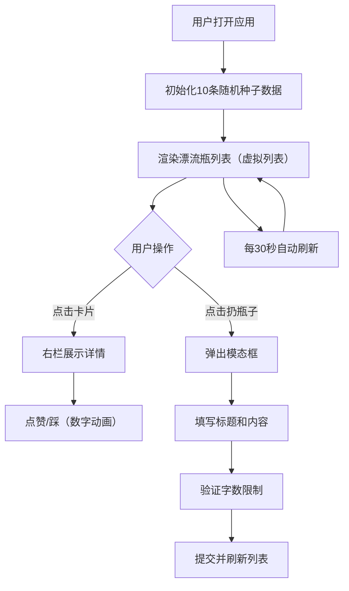

## 1. 产品概述
灵感漂流瓶是一个团队创意灵感收集与投票工具，帮助团队成员快速记录一闪而过的创意点子，通过匿名投票机制筛选出最具潜力的想法。
- 主要用途：团队头脑风暴、创意收集、民主投票筛选
- 目标用户：产品团队、设计团队、研发团队等需要集体创意的组织
- 产品价值：降低创意记录门槛，通过游戏化的投票机制提高参与度，自动排序帮助团队聚焦优质想法

## 2. 核心功能

### 2.1 用户角色
本应用为匿名协作模式，无需登录注册。

| 角色 | 登录方式 | 核心权限 |
|------|----------|----------|
| 普通用户 | 无需登录 | 提交点子、查看所有点子、匿名点赞/踩 |

### 2.2 功能模块
1. **漂流瓶列表页（左栏）**：虚拟列表展示所有点子卡片，按时间倒序排列，支持点击查看详情
2. **点子详情页（右栏）**：展示完整内容、点赞踩按钮、点赞者列表
3. **扔瓶子模态框**：提交新点子的表单，包含标题和内容输入
4. **导航栏**：应用图标、扔瓶子按钮
5. **自动刷新机制**：每30秒轮询本地数据，模拟实时更新
6. **本地存储**：使用localStorage持久化数据，初始化时生成10条随机种子数据

### 2.3 页面详情

| 页面名称 | 模块名称 | 功能描述 |
|----------|----------|----------|
| 主页面 | 导航栏 | 60px高度，左侧玻璃漂流瓶图标（CSS clip-path绘制），右侧霓虹绿"扔瓶子"按钮 |
| 主页面 | 漂流瓶列表 | 280px宽度左栏，虚拟列表，卡片包含潮汐emoji、标题、相对时间、点赞/踩计数动画 |
| 主页面 | 点子详情 | 右栏，展示完整标题内容、点赞踩按钮（脉冲动画）、点赞者昵称标签列表 |
| 模态框 | 扔瓶子表单 | 标题输入（25字限制+红色提示）、内容文本域（200字限制+实时字数统计）、投入大海按钮 |

## 3. 核心流程

用户打开应用 → 系统初始化10条随机种子数据 → 用户浏览漂流瓶列表 → 点击卡片查看详情 → 点赞或踩（数字递增动画）→ 点击"扔瓶子" → 填写标题和内容 → 提交后刷新列表 → 每30秒自动刷新数据

## 4. 用户界面设计

### 4.1 设计风格
- **主题配色**：深蓝到浅蓝的海洋主题，页面背景线性渐变从#0f172a到#1e3a5f
- **主色调**：#60a5fa（亮蓝）→ #a78bfa（紫蓝）渐变用于图标
- **强调色**：#10b981（霓虹绿）用于"扔瓶子"按钮，#3b82f6（蓝色）用于点赞，#6b7280（灰色）用于踩
- **文字颜色**：主色白色和浅灰色，标题#1f2937（深灰），内容#4b5563（中灰）
- **毛玻璃效果**：所有卡片和面板使用半透明背景rgba(255,255,255,0.05)，backdrop-filter: blur(8px)，圆角12px，边框1px solid rgba(255,255,255,0.1)
- **按钮风格**：圆角12px，悬停时阴影扩散3px+发光效果，点击时脉冲放大缩小动画
- **字体**：使用系统无衬线字体，标题24px，内容行高1.8
- **动画效果**：数字递增动画、脉冲动画、抽屉滑入动画、悬停发光效果

### 4.2 页面设计概述

| 页面名称 | 模块名称 | UI元素 |
|----------|----------|--------|
| 主页面 | 导航栏 | 60px高度，渐变漂流瓶图标（clip-path绘制），霓虹绿按钮（悬停发光） |
| 主页面 | 左栏列表 | 280px宽度，虚拟列表，卡片包含：潮汐emoji（贝壳🐚/海星⭐/海螺🐚等）、标题（25字省略+tooltip）、相对时间、点赞/踩计数（跳动+递增动画） |
| 主页面 | 右栏详情 | 完整标题（24px，#1f2937）、内容（行高1.8，#4b5563）、点赞/踩按钮（脉冲动画）、点赞者标签（长尾分布昵称，蓝色背景#eff6ff，悬停变深#bfdbfe） |
| 模态框 | 表单 | 半透明黑色遮罩rgba(0,0,0,0.5)，标题输入（25字红色提示），内容文本域（200字+右下角字数统计） |

### 4.3 响应式设计
- **桌面端**：左右两栏布局，左栏280px固定宽度，右栏自适应
- **移动端**（<768px）：左栏占满全屏，右栏隐藏，点击卡片后以抽屉形式从右侧滑入覆盖左栏
- **触摸优化**：按钮最小点击区域44px，滑动手势支持

### 4.4 性能要求
- 输入防抖延迟≤16ms
- 虚拟列表仅渲染可见区域卡片
- 重渲染控制在16ms以内
- 动画使用CSS transform和opacity确保60fps

## 5. 技术约束
- 技术栈：React 18 + TypeScript + Vite
- 状态管理：Zustand
- 数据存储：localStorage
- ID生成：uuid
- 构建工具：Vite
