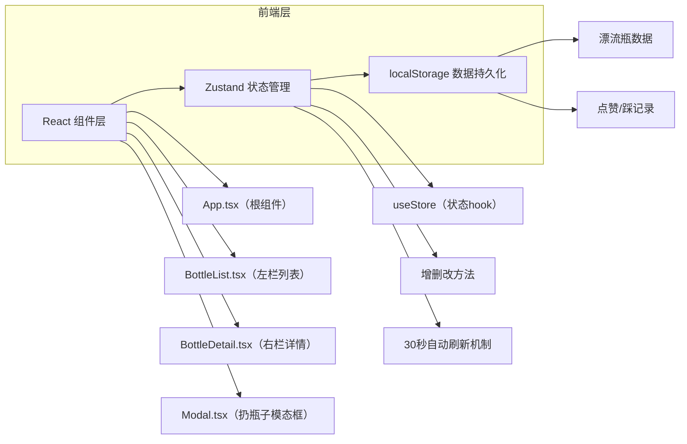
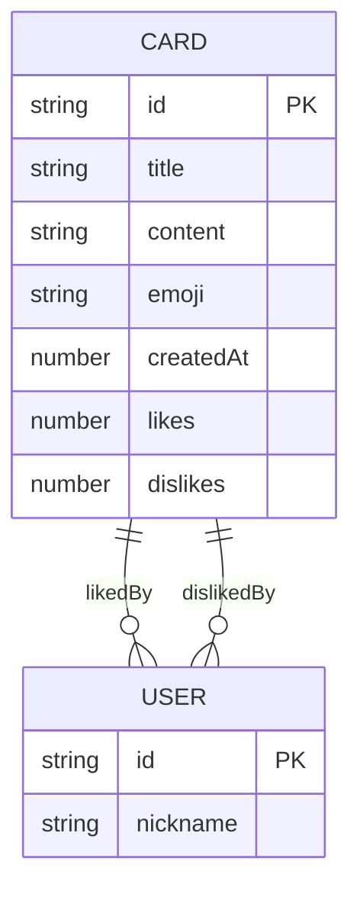

## 1. 架构设计

本项目为纯前端单页应用，使用localStorage模拟后端数据存储。



## 2. 技术描述
- **前端框架**：React 18 + TypeScript
- **构建工具**：Vite 5
- **状态管理**：Zustand 4
- **ID生成**：uuid 9
- **数据存储**：浏览器localStorage
- **样式方案**：原生CSS（CSS变量 + 毛玻璃效果 + 动画）
- **性能优化**：虚拟列表、React.memo、useCallback、useMemo

## 3. 项目结构

```
/
├── index.html              # 入口HTML
├── package.json            # 项目依赖和脚本
├── tsconfig.json           # TypeScript配置（严格模式）
├── vite.config.js          # Vite配置
└── src/
    ├── main.tsx            # React入口渲染
    ├── App.tsx             # 根组件
    ├── types.ts            # 类型定义（Card, Detail, User）
    ├── store.ts            # Zustand状态管理
    └── components/
        ├── BottleList.tsx  # 左栏列表（虚拟列表）
        ├── BottleDetail.tsx # 右栏详情
        └── Modal.tsx       # 扔瓶子模态框
```

## 4. 数据模型

### 4.1 类型定义

```typescript
// 潮汐emoji类型
type TideEmoji = '🐚' | '⭐' | '🐙' | '🦀' | '🐠' | '🌊' | '⚓' | '🪸';

// 用户类型
interface User {
  id: string;
  nickname: string; // 长尾分布风格，如"深海探险家627"
}

// 漂流瓶卡片类型
interface Card {
  id: string;
  title: string;       // 最多25字
  content: string;     // 最多200字
  emoji: TideEmoji;    // 随机潮汐emoji
  createdAt: number;   // 时间戳
  likes: number;       // 点赞数
  dislikes: number;    // 踩数
  likedBy: User[];     // 点赞者列表
  dislikedBy: User[];  // 踩者列表
}

// 应用状态
interface BottleStore {
  cards: Card[];
  selectedCardId: string | null;
  isModalOpen: boolean;
  isMobile: boolean;
  showDetail: boolean; // 移动端控制抽屉显示
  
  // 方法
  initializeData: () => void;
  addCard: (title: string, content: string) => void;
  selectCard: (id: string | null) => void;
  likeCard: (id: string) => void;
  dislikeCard: (id: string) => void;
  toggleModal: (open: boolean) => void;
  setIsMobile: (isMobile: boolean) => void;
  setShowDetail: (show: boolean) => void;
  refreshData: () => void;
}
```

### 4.2 数据模型关系



### 4.3 localStorage存储格式

```typescript
// Key: 'bottle-cards'
// Value: Card[] 数组的JSON字符串
```

## 5. 核心算法与工具函数

### 5.1 相对时间格式化
```typescript
function formatRelativeTime(timestamp: number): string {
  const diff = Date.now() - timestamp;
  const minutes = Math.floor(diff / 60000);
  if (minutes < 1) return '刚刚';
  if (minutes < 60) return `${minutes}分钟前`;
  const hours = Math.floor(minutes / 60);
  if (hours < 24) return `${hours}小时前`;
  const days = Math.floor(hours / 24);
  return `${days}天前`;
}
```

### 5.2 随机长尾昵称生成
```typescript
function generateRandomNickname(): string {
  const prefixes = ['深海探险家', '珊瑚守护者', '海浪诗人', '星辰捕手', '月光潜水员', '潮汐观察者', '贝壳收藏家', '水母漫步者'];
  const suffix = Math.floor(Math.random() * 1000);
  return `${prefixes[Math.floor(Math.random() * prefixes.length)]}${suffix}`;
}
```

### 5.3 虚拟列表计算
```typescript
function useVirtualList(totalItems: number, itemHeight: number, containerHeight: number) {
  const [scrollTop, setScrollTop] = useState(0);
  const startIndex = Math.max(0, Math.floor(scrollTop / itemHeight));
  const endIndex = Math.min(totalItems, startIndex + Math.ceil(containerHeight / itemHeight) + 2);
  const visibleItems = useMemo(() => 
    Array.from({ length: endIndex - startIndex }, (_, i) => startIndex + i),
    [startIndex, endIndex]
  );
  return { visibleItems, startIndex, endIndex, scrollTop, setScrollTop };
}
```

### 5.4 防抖hook（≤16ms）
```typescript
function useDebounce<T>(value: T, delay: number = 16): T {
  const [debouncedValue, setDebouncedValue] = useState(value);
  useEffect(() => {
    const timer = setTimeout(() => setDebouncedValue(value), delay);
    return () => clearTimeout(timer);
  }, [value, delay]);
  return debouncedValue;
}
```

## 6. 性能优化策略

1. **虚拟列表**：仅渲染可见区域的卡片，减少DOM节点
2. **React.memo**：对卡片组件进行记忆化，避免不必要重渲染
3. **useCallback/useMemo**：缓存回调函数和计算结果
4. **CSS动画优化**：使用transform和opacity属性，避免触发布局
5. **输入防抖**：所有输入使用16ms防抖，确保60fps
6. **localStorage读写优化**：批量写入，避免频繁IO

## 7. 动画实现

### 7.1 数字递增动画
```css
@keyframes numberBounce {
  0%, 100% { transform: scale(1); }
  50% { transform: scale(1.2); }
}

.number-animate {
  animation: numberBounce 0.3s ease-in-out;
}
```

### 7.2 脉冲按钮动画
```css
@keyframes pulse {
  0% { transform: scale(1); }
  50% { transform: scale(1.1); }
  100% { transform: scale(1); }
}

.btn-pulse:active {
  animation: pulse 0.2s ease-in-out;
}
```

### 7.3 抽屉滑入动画
```css
@keyframes slideInRight {
  from { transform: translateX(100%); }
  to { transform: translateX(0); }
}

.drawer-enter {
  animation: slideInRight 0.3s ease-out forwards;
}
```

## 8. 响应式断点

| 断点 | 宽度 | 布局 |
|------|------|------|
| 桌面端 | ≥768px | 左右两栏，左栏280px固定 |
| 移动端 | <768px | 单栏，详情抽屉覆盖 |
