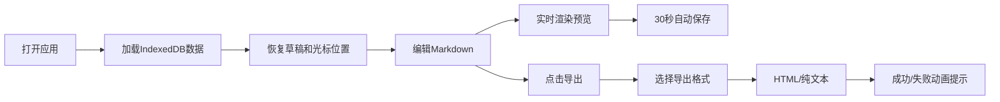

## 1. 产品概述

行文笺是一款面向写作者的个人博客编辑与排版预览工具，提供干净无干扰的Markdown写作环境，实时渲染出类似纸质书籍的排版效果，并支持导出为包含字体嵌入式样式的HTML文件。

- 核心目标：解决写作者在排版预览方面的痛点，提供沉浸式写作体验和书籍级排版效果
- 目标用户：博客作者、内容创作者、技术写作者
- 产品价值：让写作专注于内容，排版自动呈现出版级质感

## 2. 核心功能

### 2.1 用户角色
| 角色 | 注册方式 | 核心权限 |
|------|---------|----------|
| 普通用户 | 无需注册，本地存储 | 草稿管理、Markdown编辑、实时预览、HTML导出 |

### 2.2 功能模块
1. **主界面**：左右两栏布局，草稿列表 + 编辑预览区
2. **草稿管理**：草稿列表展示、搜索过滤、自动保存到IndexedDB
3. **Markdown编辑器**：支持完整Markdown语法，行号显示，等宽字体
4. **实时预览**：纸质书籍风格排版，纸张质感，衬线字体，优雅过渡动画
5. **导出功能**：导出带内联CSS的HTML、复制纯文本
6. **响应式布局**：桌面端左右分栏，移动端Tab切换

### 2.3 页面详情
| 页面名称 | 模块名称 | 功能描述 |
|---------|---------|----------|
| 主界面 | 草稿列表区 | 显示所有草稿标题（截断20字）和修改时间，搜索框过滤，点击切换草稿 |
| 主界面 | 标题栏 | 显示"行文笺"标题，右上角导出按钮 |
| 主界面 | 编辑区 | Markdown编辑器，行号显示，等宽字体，自动换行，可拖拽分隔条 |
| 主界面 | 预览区 | 实时渲染Markdown，纸质背景，衬线字体，优雅排版，图片懒加载 |
| 导出模态框 | 导出选项 | 选择导出HTML（内联CSS+字体）或复制纯文本，成功/失败动画提示 |

## 3. 核心流程

用户打开应用 → 从IndexedDB加载草稿列表和上次编辑内容 → 在编辑区输入Markdown → 预览区实时渲染排版效果 → 每30秒自动保存 → 点击导出按钮 → 选择导出格式 → 生成文件/复制到剪贴板 → 显示成功提示

## 4. 用户界面设计

### 4.1 设计风格
- 主色调：#4a90d9（蓝色）
- 辅助色：#2c3e50（深灰蓝）
- 强调色：#e74c3c（红色）
- 纸张背景：#faf3e3（米黄色）
- 编辑区背景：#ffffff（纯白）
- 草稿列表背景：#f8f9fa（浅灰）
- 字体：标题使用思源宋体/Noto Sans SC，正文使用Noto Serif SC，代码使用Fira Code
- 交互过渡：所有按钮0.2秒ease-out平滑过渡
- 卡片动画：草稿切换200ms淡入，预览区300ms opacity过渡

### 4.2 页面设计概述

| 页面名称 | 模块名称 | UI元素 |
|---------|---------|--------|
| 主界面 | 草稿列表区 | 宽度320px，背景#f8f9fa，搜索框圆角8px聚焦边框#4a90d9，卡片显示标题和相对时间 |
| 主界面 | 标题栏 | "行文笺" 思源宋体 1.6rem #2c3e50，右上角圆形导出按钮 |
| 主界面 | 分隔条 | 4px宽 #e0e0e0，悬停变#4a90d9，可拖拽调整比例 |
| 主界面 | 编辑区 | Fira Code 0.95rem，行号#999宽度40px，自动换行，纯白背景 |
| 主界面 | 预览区 | 背景#faf3e3，内边距32px，内阴影，行高1.75，段落间距1.5em |
| 主界面 | 预览排版 | H1/H2/H3缩放2/1.5/1.2rem，底部2px实线，无序列表#4a90d9圆点，引用块左侧#4a90d9边框 |
| 导出模态框 | 对话框 | 半透明遮罩rgba(0,0,0,0.4)，圆角12px，宽度500px |
| 移动端 | Tab切换 | 屏幕<768px时上下堆叠，底部Tab切换编辑/预览 |

### 4.3 响应式
- 桌面端（≥768px）：左右两栏布局，编辑区与预览区并排，可拖拽分隔条
- 移动端（<768px）：编辑区与预览区上下堆叠，分隔条隐藏，底部Tab切换编辑/预览模式
- 触摸优化：按钮最小44px点击区域，滑动手势支持

### 4.4 性能要求
- 预览渲染延迟：≤150ms/每次按键
- 本地存储写入：≤50ms
- 动画帧率：60fps流畅过渡
