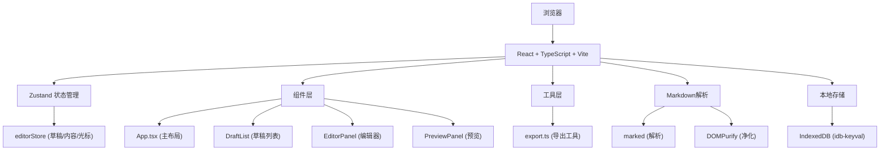

## 1. 架构设计



## 2. 技术描述

- **前端框架**：React 18 + TypeScript + Vite 5
- **状态管理**：Zustand 4
- **Markdown解析**：marked + DOMPurify
- **本地存储**：idb-keyval（IndexedDB封装）
- **唯一标识**：uuid
- **构建工具**：Vite 5 + @vitejs/plugin-react
- **代码规范**：TypeScript 严格模式

## 3. 项目结构

```
├── package.json
├── index.html
├── vite.config.ts
├── tsconfig.json
└── src/
    ├── App.tsx              # 主布局组件
    ├── main.tsx             # 入口文件
    ├── index.css            # 全局样式
    ├── stores/
    │   └── editorStore.ts   # Zustand状态管理
    ├── components/
    │   ├── DraftList.tsx    # 草稿列表组件
    │   ├── EditorPanel.tsx  # 编辑区组件
    │   └── PreviewPanel.tsx # 预览区组件
    └── utils/
        └── export.ts        # 导出工具函数
```

## 4. 核心数据模型

### 4.1 草稿数据结构

```typescript
interface Draft {
  id: string;           // UUID
  title: string;        // 标题（从内容提取）
  content: string;      // Markdown内容
  cursorPosition: number; // 光标位置
  createdAt: number;    // 创建时间戳
  updatedAt: number;    // 更新时间戳
}

interface EditorState {
  drafts: Draft[];
  currentDraftId: string | null;
  searchQuery: string;
  splitRatio: number;   // 编辑/预览分隔比例 (0-1)
  isMobile: boolean;
  activeTab: 'editor' | 'preview';
  // 操作方法
  createDraft: () => void;
  deleteDraft: (id: string) => void;
  loadDraft: (id: string) => void;
  updateContent: (content: string, cursorPosition: number) => void;
  setSearchQuery: (query: string) => void;
  setSplitRatio: (ratio: number) => void;
  setActiveTab: (tab: 'editor' | 'preview') => void;
  saveToStorage: () => Promise<void>;
  loadFromStorage: () => Promise<void>;
}
```

## 5. 路由定义

| 路由 | 用途 |
|------|------|
| / | 主应用页面（单页应用，无多路由） |

## 6. 性能优化方案

### 6.1 渲染性能
- 使用 `React.memo` 包装子组件，避免不必要重渲染
- 使用 `useDeferredValue` 延迟预览区渲染，确保输入流畅
- 使用 `requestAnimationFrame` 优化动画性能
- Markdown解析结果使用 `useMemo` 缓存

### 6.2 存储性能
- 自动保存使用防抖（debounce）30秒触发
- IndexedDB操作异步执行，不阻塞主线程
- 仅在内容真正变化时才执行保存

### 6.3 动画性能
- 使用CSS transform和opacity属性实现动画
- 避免布局抖动（layout thrashing）
- 使用 `will-change` 提示浏览器优化

## 7. 关键实现要点

### 7.1 可拖拽分隔条
- 使用 `useRef` 跟踪鼠标位置
- 监听 `mousedown` / `mousemove` / `mouseup` 事件
- 限制比例范围在 0.2 - 0.8 之间

### 7.2 Markdown渲染
- marked 配置：启用GFM、换行、表格等
- DOMPurify 配置：允许的标签和属性白名单
- 代码块行号：自定义 renderer 生成带行号的代码块

### 7.3 图片懒加载
- 使用 `IntersectionObserver` API
- 占位符：淡灰色圆角矩形
- 加载完成后淡入效果（opacity 0→1，300ms）

### 7.4 光标位置恢复
- 监听textarea的 `selectionStart`
- 保存时记录光标位置
- 加载时通过 `setSelectionRange` 恢复

### 7.5 导出功能
- HTML导出：内联所有CSS样式，包含字体CDN链接，添加@media print规则
- 纯文本导出：移除所有Markdown格式标记
- 使用Blob + URL.createObjectURL 实现下载
