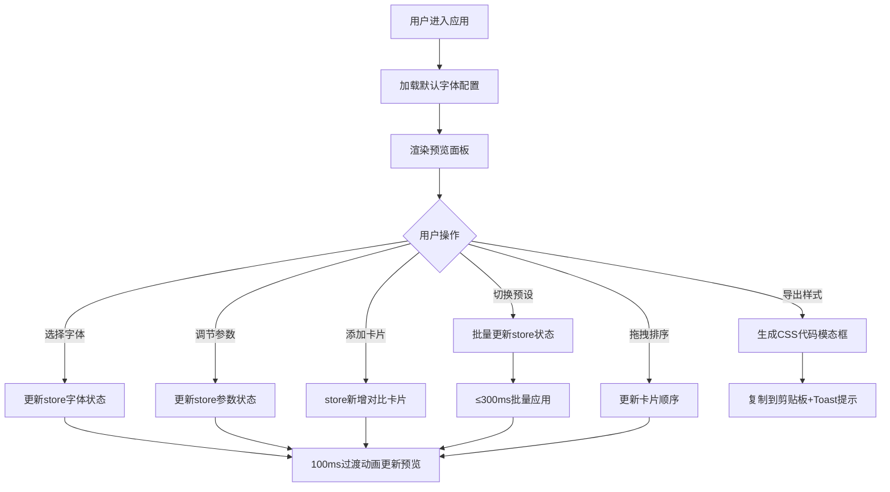

## 1. 产品概述
字体配对实验室是一款面向前端开发者和设计师的字体搭配预览工具，帮助用户在选择正文字体和标题字体时，通过直观可交互的实时预览面板对比字形、字号、行距和字间距组合带来的可读性与美学差异。

- 目标用户：前端开发者、UI/UX设计师、排版设计师
- 核心价值：快速预览和对比不同字体配对方案对页面视觉层次的影响，解决字体选择时缺乏直观对比工具的问题

## 2. 核心功能

### 2.1 用户角色
无需区分用户角色，所有访客均可使用全部功能。

### 2.2 功能模块
1. **主预览面板**：字体效果实时渲染、字体比例尺对比卡片展示与拖拽排序
2. **控制面板**：字体选择下拉框、参数调节滑块、预设标签页、导出按钮
3. **字体数据管理**：20种常见Web字体元数据管理、Google Fonts动态加载
4. **预设管理**：10组预置字体配对方案、一键应用预设
5. **样式导出**：CSS字体比例尺代码生成、复制到剪贴板

### 2.3 页面详情
| 页面名称 | 模块名称 | 功能描述 |
|-----------|-------------|---------------------|
| 主页面 | 预览面板 | 居中显示示例文本，支持多比例尺卡片对比与拖拽排序，100ms过渡动画 |
| 主页面 | 控制面板-字体选择 | 正文/标题字体下拉选择，支持搜索筛选，含20+常见Web字体 |
| 主页面 | 控制面板-参数调节 | 字号(12-48px)、行高(1.2-2.0)、字间距(-2~8px)、粗细(100-900)独立调节 |
| 主页面 | 控制面板-对比卡片 | 添加/删除/拖拽对比卡片，每张卡片独立显示字体配对效果 |
| 主页面 | 控制面板-预设 | 10组预设缩略预览，悬停上浮效果，点击一键应用 |
| 主页面 | 样式导出模态框 | 半透明背景，深色代码主题，复制按钮+2秒toast提示 |

## 3. 核心流程

### 主要用户流程
用户进入应用 → 默认字体配对渲染预览 → 选择正文字体/标题字体 → 调整各项参数 → 实时查看预览变化 → 添加对比卡片 → 切换预设方案 → 导出CSS样式代码

## 4. 用户界面设计

### 4.1 设计风格
- **主色调**：蓝色系(#3b82f6 填充色, #2563eb 手柄色)，极浅灰背景(#f8f9fa)，白色控制面板
- **卡片样式**：圆角12px、浅阴影(0 1px 3px rgba(0,0,0,0.1))、卡片间距16px
- **滑块自定义**：轨道高6px圆角3px，圆形手柄20px悬停24px加深阴影
- **字体配对标签色板**：#fde68a、#a7f3d0、#bfdbfe等8种柔和色板随机分配
- **动画**：参数调节100ms过渡+缩放高亮，卡片删除缩放淡出，拖拽释放200ms归位

### 4.2 页面设计概述
| 页面名称 | 模块名称 | UI元素 |
|-----------|-------------|-------------|
| 主页面 | 整体布局 | 两栏布局(65%/35%)，桌面横向，移动端上下排列，控制区50vh滚动 |
| 主页面 | 预览面板 | 极浅灰背景，内容居中，多卡片纵向排列，拖拽时半透明0.7跟随鼠标 |
| 主页面 | 控制面板 | 白色背景，浅色滚动条，顶部应用名称"字体配对实验室"(Inter 1.5rem #1e293b) |
| 主页面 | 预设标签 | 缩略卡片悬停上浮4px加深阴影 |
| 主页面 | 导出模态框 | rgba(0,0,0,0.5)半透明遮罩，深色代码展示区 |

### 4.3 响应式
- Desktop-first 设计，≥768px 为左右两栏布局(65%/35%)
- ＜768px 切换为上下排列，预览区在上，控制区在下，控制区高度限制50vh并支持内部滚动
- 触摸设备优化：拖拽区域增加触摸热区，滑块手柄直径增大便于操作

## 5. 性能指标
| 指标 | 阈值 |
|------|------|
| 字体切换渲染响应 | ≤100ms |
| 参数调节渲染响应 | ≤100ms |
| 拖拽排序动画帧率 | 稳定60FPS |
| 预设批量样式应用卡顿 | ≤300ms |
