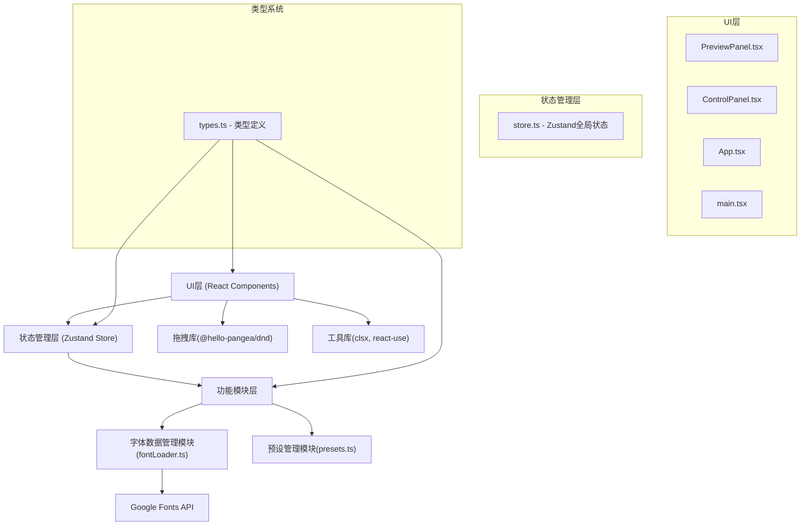

## 1. 架构设计



## 2. 技术描述

- **前端框架**：React 18 + TypeScript
- **构建工具**：Vite 5 + @vitejs/plugin-react
- **状态管理**：Zustand（全局状态：字体配置、对比卡片、预设数据）
- **拖拽排序**：@hello-pangea/dnd（react-beautiful-dnd维护分支）
- **工具库**：clsx（类名合并）、react-use（常用hooks）
- **字体加载**：Google Fonts CSS API，动态注入link标签
- **初始化方式**：使用vite-init react-ts模板创建项目
- **样式方案**：CSS Modules + 内联样式（动态字体样式）+ TailwindCSS基础样式

## 3. 文件结构
```
e:\solo\SoloAutoDemo\tasks\auto21\
├── package.json
├── index.html（引入Google Fonts）
├── vite.config.ts（React插件+路径别名）
├── tsconfig.json（strict模式，target ES2020）
├── src/
│   ├── types.ts（FontPair, FontConfig, Preset接口）
│   ├── store.ts（Zustand状态管理）
│   ├── modules/
│   │   ├── fontLoader.ts（字体元数据+动态加载）
│   │   └── presets.ts（10组预设配对方案）
│   ├── components/
│   │   ├── PreviewPanel.tsx（预览面板+拖拽）
│   │   └── ControlPanel.tsx（控制面板+导出）
│   ├── App.tsx（主布局+响应式）
│   └── main.tsx（React入口）
```

## 4. 核心数据模型定义

### 4.1 类型定义（types.ts）
```typescript
// 字体配置接口
interface FontConfig {
  family: string;
  size: number;      // 12-48px
  lineHeight: number; // 1.2-2.0
  letterSpacing: number; // -2 to 8px
  weight: 100 | 200 | 300 | 400 | 500 | 600 | 700 | 800 | 900;
}

// 字体配对接口
interface FontPair {
  id: string;
  label: string;      // "比例尺A"
  labelColor: string; // 随机柔和色板
  heading: FontConfig;
  body: FontConfig;
}

// 预设接口
interface Preset {
  id: string;
  name: string;
  heading: FontConfig;
  body: FontConfig;
}

// 全局状态接口
interface FontLabState {
  currentHeading: FontConfig;
  currentBody: FontConfig;
  cards: FontPair[];
  presets: Preset[];
  fonts: FontMeta[];
  // actions
  updateHeading: (config: Partial<FontConfig>) => void;
  updateBody: (config: Partial<FontConfig>) => void;
  addCard: () => void;
  removeCard: (id: string) => void;
  reorderCards: (startIndex: number, endIndex: number) => void;
  applyPreset: (presetId: string) => void;
}

// 字体元数据
interface FontMeta {
  family: string;
  category: 'sans-serif' | 'serif' | 'display' | 'monospace';
  weights: number[];
  googleFontsUrl?: string;
}
```

## 5. Zustand Store 设计（store.ts）
- **状态切片**：当前正文/标题字体配置、对比卡片列表、预设列表、字体元数据
- **Action方法**：
  - `updateHeading(config)` / `updateBody(config)`：局部更新字体参数
  - `addCard()`：基于当前配置创建新对比卡片，自动分配标签和颜色
  - `removeCard(id)`：删除指定卡片
  - `reorderCards(start, end)`：拖拽排序后更新顺序
  - `applyPreset(id)`：批量应用预设到当前配置

## 6. 模块职责

### 6.1 fontLoader.ts（字体数据管理）
- 导出20种字体元数据数组（Inter、Roboto、Noto Sans、Playfair Display、Merriweather等）
- `loadGoogleFont(family: string)`：动态创建并注入link标签加载Google Fonts CSS
- 分类：sans-serif(8种)、serif(6种)、display(4种)、monospace(2种)

### 6.2 presets.ts（预设管理）
- 导出10组预置字体配对数组
- 每组预设：经典编辑排版、现代极简、复古优雅、科技商务等不同风格
- 提供缩略预览所需的配置信息

### 6.3 PreviewPanel.tsx（预览组件）
- 渲染当前正文/标题配置的主示例文本
- 渲染对比卡片列表，使用DragDropContext+Droppable+Draggable
- 拖拽时opacity:0.7跟随鼠标，释放后200ms ease-out归位动画
- 参数变化时100ms过渡动画+微弱缩放高亮效果

### 6.4 ControlPanel.tsx（控制组件）
- 两个可搜索字体下拉框（正文/标题），使用datalist或自定义搜索
- 四个调节控件：字号滑块、行高滑块、字间距滑块、粗细下拉
- Tabs切换：调节区 / 预设区
- 浮动"+"按钮添加对比卡片
- "导出样式"按钮打开模态框，生成CSS代码片段
- 模态框内：深色代码块、"复制到剪贴板"按钮、2秒Toast提示

### 6.5 App.tsx（布局组件）
- 监听窗口宽度，768px断点切换横/纵向布局
- 横向：65%预览 + 35%控制
- 纵向：预览全屏 + 控制区50vh固定高度+overflow-auto

## 7. 性能优化策略
- **字体加载**：预加载常用字体，使用font-display:swap避免FOIT
- **状态更新**：Zustand天然支持细粒度订阅，避免不必要重渲染
- **动画**：transform+opacity硬件加速，滑块使用requestAnimationFrame节流
- **拖拽**：@hello-pangea/dnd采用transform位移方案，稳定60FPS
- **批量预设应用**：合并为单次setState，避免多次渲染
- **CSS过渡**：仅对需要的属性加transition，避免layout thrashing
