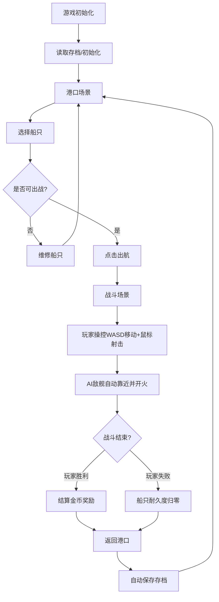

## 1. 产品概述

浪涌之战是一款2D海战模拟与港口经营游戏，玩家在港口管理舰队（建造、升级、维修船只），并驾驶战舰在实时海战中与AI敌舰作战，获取金币奖励扩大舰队。

- 目标用户：休闲游戏玩家，喜欢策略与动作结合的海战题材
- 产品价值：兼具经营策略与实时操作的双重游戏体验

## 2. 核心功能

### 2.1 功能模块

1. **港口管理**：船只列表、建造新船、升级船只、维修船只、舰队状态展示
2. **实时战斗**：Canvas渲染、玩家操控、AI敌舰、炮弹弹道、碰撞检测、爆炸特效
3. **数据持久化**：自动存档、读档、重置存档
4. **战斗结算**：金币奖励计算、船只耐久度损耗、战绩统计

### 2.2 页面详情

| 页面名称 | 模块名称 | 功能描述 |
|---------|---------|---------|
| 港口场景 | 船只卡片列表 | 展示玩家拥有的所有船只，显示名称、等级、耐久度、火炮等级 |
| 港口场景 | 操作面板 | 建造、升级、维修三个操作按钮，选中船只后可执行对应操作 |
| 港口场景 | 金币展示 | 顶部显示当前金币数，金色高亮 |
| 港口场景 | 设置弹窗 | 齿轮图标点击打开，含重置存档选项 |
| 战斗场景 | Canvas渲染 | 800x600像素画布，海洋波浪动画、船只、炮弹、爆炸特效 |
| 战斗场景 | HUD面板 | 左上角敌我状态，左下方玩家耐久度条，右下方金币获得数 |
| 战斗场景 | 玩家操控 | WASD移动、鼠标瞄准点击发射炮弹 |

## 3. 核心流程

玩家从港口场景出发，选择一艘可出战的船只（耐久度>0），点击出航进入战斗。战斗中操控船只移动和射击，击败所有AI敌舰后结算奖励，返回港口更新金币和船只状态。

## 4. 用户界面设计

### 4.1 设计风格

- **主色调（港口）**：暖木色背景 #d2b48c，白色卡片 #ffffff，深棕色标题 #5c3a21
- **主色调（战斗）**：深蓝色海洋 #0a3d6b，白色虚线瞄准，橙红色炮弹 #ff6347
- **按钮颜色**：建造-绿色 #4CAF50，升级-蓝色 #2196F3，维修-橙色 #FF9800
- **字体**：标题使用衬线字体 Georgia，正文使用系统无衬线字体
- **卡片风格**：圆角12px，浅阴影 #00000033
- **动效**：按钮悬停亮度+20%并放大1.05倍（0.2s过渡），点击内缩0.95倍，进度条0.3s过渡动画

### 4.2 页面设计概览

| 页面名称 | 模块名称 | UI元素 |
|---------|---------|--------|
| 港口场景 | 顶栏 | 金币数（金色粗体1.5rem）、设置齿轮图标 |
| 港口场景 | 船只列表 | 卡片式网格布局，最多5艘船卡片 |
| 港口场景 | 详情面板 | 右侧/下方显示选中船只详情和操作按钮 |
| 港口场景 | 设置弹窗 | 半透明遮罩+白色圆角弹窗，重置存档按钮 |
| 战斗场景 | Canvas | 800x600，深蓝色背景，波浪动画 |
| 战斗场景 | HUD | 左上角半透明黑底白字面板，左下耐久度条，右下金币数 |

### 4.3 响应式

- 桌面端：卡片横向排列，左侧船只列表，右侧详情面板
- 移动端（<768px）：单列布局，卡片竖直排列，调整内边距
- 战斗场景Canvas固定800x600像素

### 4.4 性能约束

- 战斗场景保持至少60FPS渲染帧率
- 使用requestAnimationFrame驱动渲染循环
- 炮弹和粒子对象不超过200个时不低于30FPS
- Canvas绘制使用双缓冲技术减少闪烁
