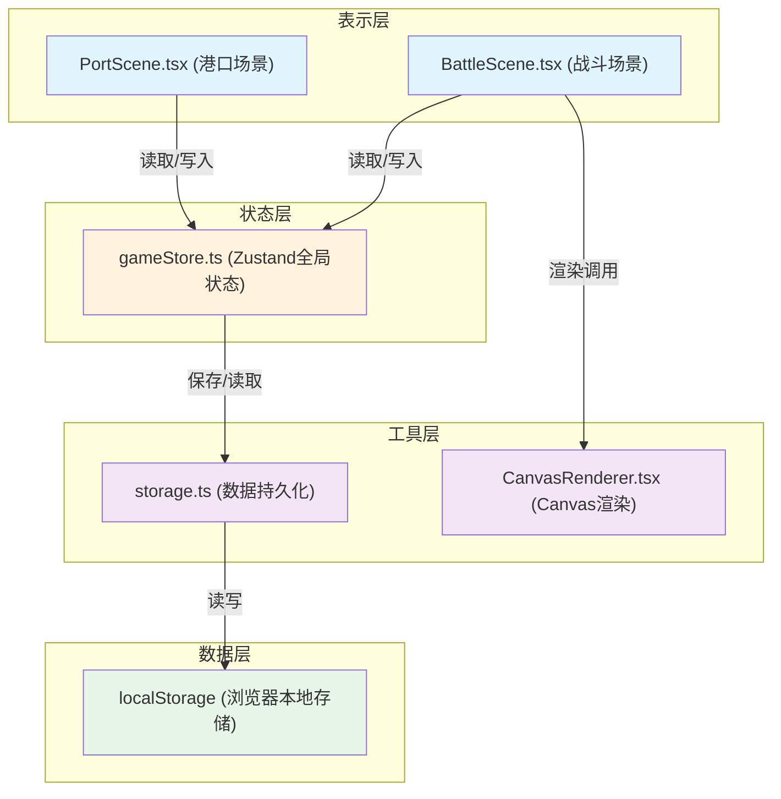
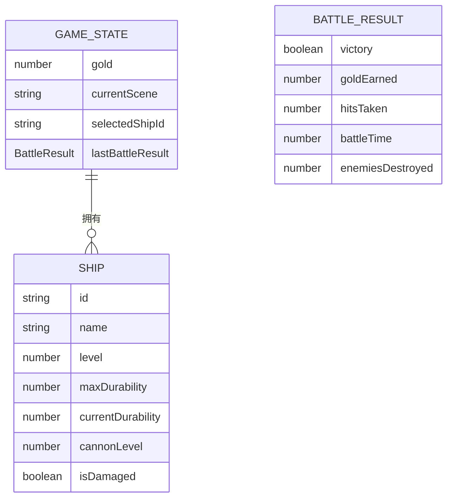

## 1. 架构设计



**数据流向说明：**
- 港口模块 → 写入船只数据 → store → 战斗模块读取
- 战斗模块 → 写入战斗结果 → store → 港口模块读取更新
- 港口场景 → 自动存档 → storage.ts → localStorage

## 2. 技术描述

- **前端框架**：React 18 + TypeScript 5
- **构建工具**：Vite 5 + @vitejs/plugin-react
- **状态管理**：Zustand 4（轻量级全局状态管理器）
- **唯一ID生成**：uuid
- **渲染技术**：HTML5 Canvas 2D API
- **数据存储**：浏览器 localStorage
- **无后端**：纯前端应用，数据本地持久化

## 3. 文件结构

```
src/
├── store/
│   └── gameStore.ts          # Zustand全局状态管理
├── port/
│   ├── PortScene.tsx          # 港口管理主组件
│   └── ShipCard.tsx           # 船只卡片子组件
├── battle/
│   ├── BattleScene.tsx        # 战斗场景主组件
│   └── CanvasRenderer.tsx    # Canvas渲染组件
├── utils/
│   └── storage.ts              # 数据持久化工具
├── App.tsx                   # 应用根组件
├── main.tsx                   # 入口文件
└── index.css                  # 全局样式
```

## 4. 数据模型

### 4.1 数据模型定义



### 4.2 TypeScript类型定义

```typescript
interface Ship {
  id: string;
  name: string;
  level: number;          // 1-5级
  maxDurability: number;
  currentDurability: number;
  cannonLevel: number;  // 1-3级
  isDamaged: boolean;
}

interface BattleResult {
  victory: boolean;
  goldEarned: number;
  hitsTaken: number;
  battleTime: number;
  enemiesDestroyed: number;
}

interface GameState {
  gold: number;
  ships: Ship[];
  currentScene: 'port' | 'battle';
  selectedShipId: string | null;
  lastBattleResult: BattleResult | null;
  activeShipId: string | null;  // 当前出战船只ID
}
```

## 5. 模块职责与调用关系

### 5.1 gameStore.ts
- **职责**：全局状态管理，金币、船只列表、场景切换
- **Actions**：
  - `buildShip()` - 建造新船
  - `upgradeShip(shipId)` - 升级船只
  - `repairShip(shipId)` - 维修船只
  - `selectShip(shipId)` - 选中船只
  - `startBattle(shipId)` - 开始战斗
  - `endBattle(result)` - 结束战斗，结算
  - `resetGame()` - 重置游戏

### 5.2 storage.ts
- **职责**：本地存储封装
- **函数**：
  - `saveGame(state)` - 保存游戏进度
  - `loadGame()` - 读取游戏进度
  - `clearSave()` - 清除存档

### 5.3 PortScene.tsx
- **依赖**：gameStore, storage, ShipCard
- **输入**：从store读取金币、船只列表
- **输出**：调用store的actions修改状态，触发自动存档

### 5.4 ShipCard.tsx
- **依赖**：无（纯展示组件
- **输入**：从PortScene传入ship数据
- **输出**：点击回调给PortScene

### 5.5 BattleScene.tsx
- **依赖**：gameStore, CanvasRenderer
- **输入**：从store读取出战船只数据
- **输出**：战斗结束后写入战斗结果到store

### 5.6 CanvasRenderer.tsx
- **依赖**：无（纯渲染组件）
- **输入**：从BattleScene接收渲染数据
- **输出**：绘制到Canvas

## 6. 战斗引擎设计

### 6.1 实体类型
- **玩家船只**：WASD控制，速度3px/帧
- **AI敌舰**：自动靠近，速度1.5px/帧，150px内开火
- **炮弹**：半径8px，颜色#ff6347
- **粒子**：爆炸碎片，20个/次，1秒淡出

### 6.2 物理计算
- 碰撞检测：圆形碰撞检测
- 弹道计算：匀速直线运动
- 波浪动画：5个正弦波叠加，振幅5px，周期2s

### 6.3 性能优化
- requestAnimationFrame驱动
- 对象池管理炮弹和粒子
- 离屏Canvas双缓冲
- 最大200个活动对象限制
