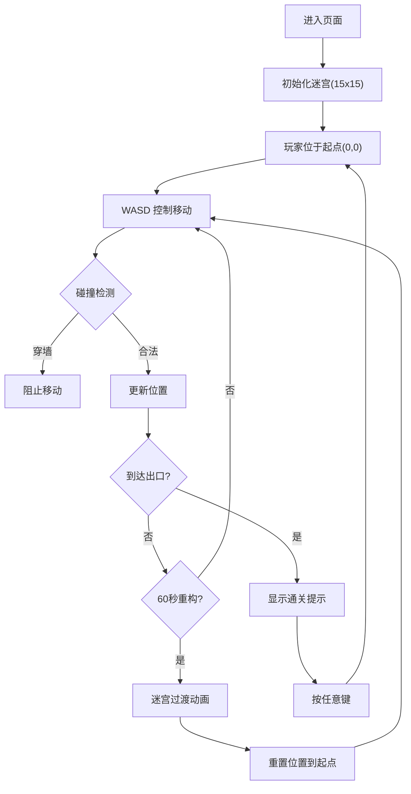

## 1. 产品概述
光流迷宫是一款沉浸式 3D 视觉探索游戏，用户在由动态彩色光束构成的迷宫中穿行，体验光影变幻的视觉效果。
- 目标用户：对 3D 视觉效果和迷宫探索感兴趣的玩家
- 产品价值：通过动态光影效果和迷宫探索，创造独特的沉浸式体验

## 2. 核心功能

### 2.1 功能模块
1. **3D 迷宫场景**：由彩色光束构成的 15x15 网格迷宫
2. **第一人称控制**：WASD 键控制移动和转向，碰撞检测防止穿墙
3. **动态光束效果**：颜色随时间变化，亮度呼吸效果，玩家附近光束高亮
4. **迷宫周期性重构**：每 60 秒重新生成迷宫，带过渡动画
5. **导航 UI**：2D 小地图、房间坐标指示器
6. **通关系统**：出口金色球体、通关提示

### 2.2 页面详情
| 页面名称 | 模块名称 | 功能描述 |
|-----------|-------------|---------------------|
| 主场景 | 3D 迷宫渲染 | 渲染光束墙壁、地面、天花板、光源 |
| 主场景 | 玩家控制器 | WASD 移动、碰撞检测、位置更新 |
| 主场景 | 光束动画 | 颜色波动、亮度呼吸、邻近高亮 |
| 主场景 | 迷宫生成器 | 递归回溯法生成连通迷宫 |
| 主场景 | UI 层 | 小地图、房间坐标、通关提示 |

## 3. 核心流程
用户进入页面后，从迷宫左上角起点开始，通过 WASD 控制在迷宫中移动，寻找右下角出口。光束颜色每 10 秒变化，迷宫每 60 秒重构。找到出口即通关，按任意键返回起点。

## 4. 用户界面设计

### 4.1 设计风格
- **主色调**：深空蓝黑背景 (#0a0a1a)，光束使用红-橙、蓝-紫、绿-青渐变
- **材质风格**：半透明物理材质，roughness=0.3，metalness=0.1
- **字体**：白色带黑色描边，简洁现代风格

### 4.2 页面设计概述
| 页面名称 | 模块名称 | UI 元素 |
|-----------|-------------|-------------|
| 主场景 | 3D 环境 | 深空背景、半透明地面/天花板、双点光源 |
| 主场景 | 光束 | 圆柱几何体、彩色渐变、透明度/亮度动画 |
| UI 层 | 小地图 | 180x180px，半透明黑底，圆角 8px，蓝色玩家点 |
| UI 层 | 坐标指示 | 左上角 "Room (x, y)"，14px，白色带黑描边 |
| UI 层 | 出口指示 | 金色脉动球体，半径 0.5 |
| UI 层 | 通关提示 | 中央 "恭喜通关"，2rem，白色带黑描边 |

### 4.3 3D 场景指引
- **环境**：深空蓝黑背景 (#0a0a1a)，雾效可选
- **光照**：环境光 (intensity=0.3) + 中心蓝色点光源 (intensity=0.8) + 跟随玩家橙色点光源 (intensity=0.5)
- **相机**：透视相机，fov=60，固定高度 2 单位，禁用滚轮缩放
- **光束几何体**：圆柱体，高度 8 单位，直径 0.3 单位，使用 MeshPhysicalMaterial
- **动画**：使用 requestAnimationFrame 和 lerp 插值，避免每帧创建几何体
- **性能**：光束总数 ≤ 300，每帧顶点数 ≤ 5000，帧率 ≥ 50FPS

### 4.4 响应式
桌面端优先，自适应窗口大小，全屏 3D 场景。
