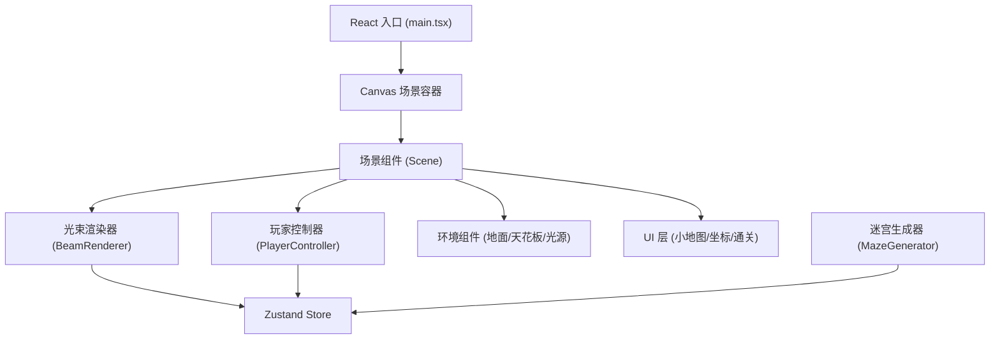

## 1. 架构设计



## 2. 技术描述
- **前端框架**：React 18 + TypeScript
- **构建工具**：Vite 5
- **3D 渲染**：Three.js + @react-three/fiber + @react-three/drei
- **状态管理**：Zustand
- **样式**：内联 CSS + Tailwind CSS (UI 层)

## 3. 文件结构
```
package.json
index.html
vite.config.ts
tsconfig.json
src/
  main.tsx           # React 入口
  MazeGenerator.ts   # 迷宫生成算法
  BeamRenderer.tsx   # 光束渲染组件
  PlayerController.tsx  # 第一人称控制器
  store.ts           # Zustand 状态管理
```

## 4. 核心数据结构

### 4.1 迷宫数据
```typescript
// 迷宫单元格类型
type CellType = 'wall' | 'path';

// 迷宫布局 15x15
type MazeLayout = CellType[][];

// 光束节点坐标
interface BeamNode {
  x: number;
  z: number;
  colorPool: 'red-orange' | 'blue-purple' | 'green-cyan';
  colorOffset: number; // HSL 色相偏移
}

// 玩家状态
interface PlayerState {
  position: { x: number; y: number; z: number };
  yaw: number; // 水平旋转角度
  roomX: number;
  roomZ: number;
}

// 光束动画状态
interface BeamAnimation {
  globalHueShift: number; // 全局色相偏移量 (0-360)
  brightnessPhase: number; // 亮度呼吸相位
  isTransitioning: boolean; // 是否在迷宫过渡中
  transitionProgress: number; // 过渡进度 0-1
}
```

### 4.2 Store 定义
```typescript
interface MazeStore {
  maze: MazeLayout;
  beams: BeamNode[];
  player: PlayerState;
  animation: BeamAnimation;
  isComplete: boolean;
  
  // Actions
  generateMaze: () => void;
  updatePlayerPosition: (x: number, z: number, yaw: number) => void;
  updateAnimation: (time: number) => void;
  triggerColorWave: () => void;
  setComplete: (complete: boolean) => void;
  resetPlayer: () => void;
}
```

## 5. 关键算法

### 5.1 迷宫生成 - 递归回溯法
1. 初始化 15x15 网格，全部设为墙
2. 从起点 (0, 0) 开始，随机选择方向
3. 打通墙壁直到所有单元格访问
4. 确保入口 (左上角) 和出口 (右下角) 连通

### 5.2 碰撞检测
- 玩家半径 0.4 单位，光束半径 0.15 单位
- 检测玩家位置与所有光束的距离
- 距离 < 0.55 时判定为碰撞，阻止移动

### 5.3 颜色动画
- HSL 色相环每 10 秒旋转 30 度，过渡 2 秒
- 亮度使用正弦波：`0.6 + 0.4 * sin(2π * t / 3)`
- 玩家 3 单位内光束亮度 × 1.2，叠加脉动效果

## 6. 性能优化策略
1. **几何体复用**：所有光束共享 CylinderGeometry 实例
2. **材质更新**：只更新 material.color 和 opacity，不重建材质
3. **对象池**：提前创建最大数量光束 (300)，按需显示/隐藏
4. **帧更新优化**：使用 useFrame 的 delta 时间，lerp 平滑插值
5. **碰撞优化**：只检测相邻 3x3 格子内的光束
