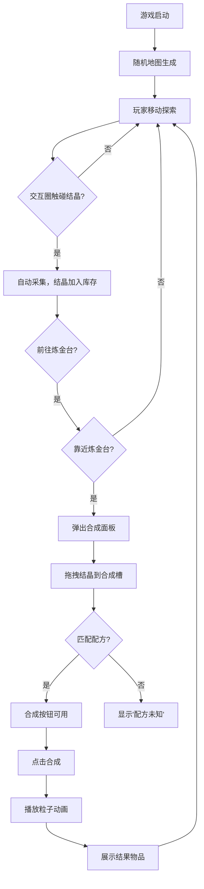

## 1. 产品概述
炼金术士采集与合成模拟器是一款2D像素风格的收集与合成游戏。玩家操控炼金术士角色在随机生成的资源地图上移动、采集四种元素结晶（火、水、土、风），并返回炼金台通过拖拽方式将结晶放入合成槽，根据配方自动合成魔法药水或高级材料。

- 目标用户：休闲游戏玩家、炼金术主题爱好者
- 核心价值：采集探索 + 配方合成的双重玩法循环，复古像素风格视觉体验

## 2. 核心功能

### 2.1 用户角色
| 角色 | 进入方式 | 核心权限 |
|------|----------|----------|
| 玩家 | 直接进入 | 控制角色移动、采集、合成 |

### 2.2 功能模块
1. **游戏主界面**：地图渲染、角色控制、结晶采集、炼金台交互
2. **合成面板**：合成槽管理、拖拽交互、合成动画、结果展示
3. **库存面板**：结晶库存网格、属性颜色区分、悬停信息提示
4. **状态栏**：结晶数量统计、合成历史记录

### 2.3 页面详情
| 页面名称 | 模块名称 | 功能描述 |
|----------|----------|----------|
| 游戏主界面 | 地图渲染 | Tile-based裁剪渲染，800x600视口，32x32像素tile |
| 游戏主界面 | 角色控制 | WASD键移动，4px/帧速度，水域减速、岩石阻挡 |
| 游戏主界面 | 交互采集 | 椭圆形绿色交互圈(半径40px)，触碰结晶自动采集 |
| 游戏主界面 | 炼金台 | 中央圆形石板(半径60px)，靠近弹出合成面板 |
| 合成面板 | 合成槽 | 四个60x60px空槽位，虚线边框，支持拖拽放入 |
| 合成面板 | 配方按钮 | 六个固定配方显示区，橙色合成按钮 |
| 合成面板 | 合成动画 | 2秒粒子特效(30粒子)，结果物品展示(星级1-3) |
| 库存面板 | 结晶网格 | 属性颜色区分，悬停显示名称和描述 |
| 状态栏 | 结晶计数 | 各类结晶数量图标+数字 |
| 状态栏 | 合成历史 | 最近10次合成结果和配方列表 |

## 3. 核心流程

玩家进入游戏 → 随机地图生成（含20个结晶） → WASD移动探索 → 交互圈触碰采集结晶 → 结晶加入库存 → 前往中央炼金台 → 靠近触发合成面板 → 拖拽结晶到合成槽 → 匹配配方 → 点击合成 → 播放粒子动画 → 展示结果 → 继续采集/合成

## 4. 用户界面设计

### 4.1 设计风格
- 主色调：暗绿色 #2d4a22（背景），配合火红 #ff4444、水蓝 #4488ff、土棕 #8B4513、风绿 #44cc44 四元素色
- 按钮风格：明亮橙色 #ff8c00，圆角8px，点击缩放动画 transform: scale(0.95)
- 字体：'Press Start 2P' 像素字体
- 布局：单屏Canvas游戏画面，覆盖式UI面板
- 图标风格：8x8像素几何形状（三角形火焰、圆形水滴等）
- 合成面板：深蓝色半透明 #1a1a2e（透明度0.9），木纹纹理叠加

### 4.2 页面设计概览
| 页面名称 | 模块名称 | UI元素 |
|----------|----------|--------|
| 游戏主界面 | 地图画布 | 暗绿色背景，草地#4caf50/岩石#5d4037/水域#2196F3 tile渲染 |
| 游戏主界面 | 角色 | 16x16像素小人，蓝色帽子+棕色大衣，绿色半透明交互圈(呼吸动画) |
| 游戏主界面 | 炼金台 | 中央圆形石板(半径60px) |
| 合成面板 | 面板背景 | 深蓝半透明#1a1a2e(0.9)，木纹纹理 |
| 合成面板 | 合成槽 | 4个60x60px虚线框#e0e0e0 |
| 合成面板 | 配方按钮 | 6个固定配方区域 |
| 合成面板 | 合成按钮 | 橙色#ff8c00，圆角8px，不可用时灰色 |
| 状态栏 | 顶部栏 | 各结晶数量图标+数字，合成历史按钮 |

### 4.3 响应式
- 最小分辨率适配800x600，不出现滚动条
- 字体和图标等比缩放
- 桌面端优先，键盘控制(WASD+I)

### 4.4 性能要求
- 游戏循环帧率稳定30FPS以上
- Tile预生成缓存为静态数组
- 视口裁剪只渲染可见tile
- 粒子总数不超过50个
- 结晶实例不超过100个
- Canvas 2D requestAnimationFrame驱动
