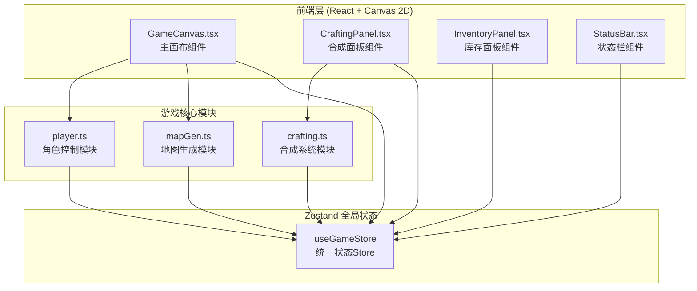
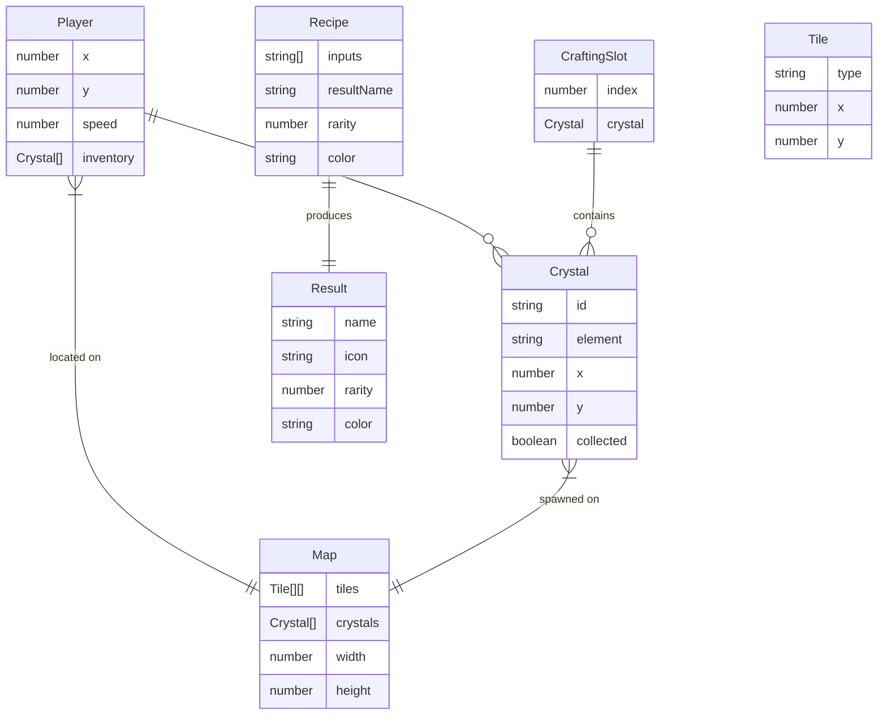

## 1. 架构设计



## 2. 技术说明
- 前端框架：React 18 + TypeScript
- 构建工具：Vite（使用 @vitejs/plugin-react 插件）
- 状态管理：Zustand（全局状态管理，三个核心模块通过store通信）
- 渲染引擎：Canvas 2D（游戏画面渲染，requestAnimationFrame驱动）
- 样式方案：内联样式 + CSS-in-JS（像素风格复古主题）
- 初始化工具：vite-init（react-ts模板）

## 3. 路由定义
| 路由 | 用途 |
|------|------|
| / | 游戏主页面（单页应用，所有功能在一个页面内） |

## 4. 数据模型

### 4.1 数据模型定义



### 4.2 核心数据类型定义

```typescript
type ElementType = 'fire' | 'water' | 'earth' | 'wind';
type TileType = 'grass' | 'rock' | 'water';

interface Crystal {
  id: string;
  element: ElementType;
  x: number;
  y: number;
  collected: boolean;
}

interface Recipe {
  inputs: ElementType[];
  resultName: string;
  rarity: number;
  color: string;
}

interface CraftResult {
  name: string;
  rarity: number;
  color: string;
  recipe: ElementType[];
}

interface GameState {
  playerX: number;
  playerY: number;
  playerSpeed: number;
  inventory: Crystal[];
  mapTiles: TileType[][];
  crystals: Crystal[];
  craftingSlots: (Crystal | null)[];
  craftHistory: CraftResult[];
  isNearAlchemistTable: boolean;
  showInventory: boolean;
  showCraftingPanel: boolean;
  particles: Particle[];
}
```

## 5. 文件结构与调用关系

```
project/
├── package.json              # 依赖配置
├── vite.config.ts            # Vite构建配置
├── tsconfig.json             # TypeScript配置
├── index.html                # 入口HTML
├── src/
│   ├── main.tsx              # React入口，渲染App
│   ├── App.tsx               # 主组件，组合UI组件
│   ├── store/
│   │   └── useGameStore.ts   # Zustand全局状态
│   ├── game/
│   │   ├── player.ts         # 角色控制模块 → 调用store更新位置/库存
│   │   ├── mapGen.ts         # 地图生成模块 → 生成tile网格和结晶点
│   │   └── crafting.ts       # 合成系统模块 → 配方映射+craft函数
│   ├── ui/
│   │   ├── GameCanvas.tsx    # 主画布组件 → 调用player.ts/mapGen.ts
│   │   ├── CraftingPanel.tsx # 合成面板 → 调用crafting.ts
│   │   ├── InventoryPanel.tsx# 库存面板 → 读取store库存
│   │   └── StatusBar.tsx     # 状态栏 → 读取store状态
│   └── types.ts              # 共享类型定义
```

### 数据流向
1. **玩家移动**：键盘事件 → GameCanvas分发 → player.ts处理移动/碰撞 → Zustand store更新位置
2. **结晶采集**：player.ts检测交互圈碰撞 → 结晶标记collected → store更新库存
3. **地图渲染**：mapGen.ts生成地图数据 → 存入store → GameCanvas读取渲染
4. **合成操作**：CraftingPanel拖拽结晶到槽位 → store更新槽位 → craft函数检查配方 → 返回结果 → store更新历史/清空槽位
5. **结晶重生**：定时器检查 → 在远离玩家位置生成新结晶 → store更新crystals数组

## 6. 配方库设计

| 配方输入 | 产出名称 | 稀有度 | 颜色 |
|----------|----------|--------|------|
| 火+火+水+风 | 爆炸药水 | 1星 | #ff6600 |
| 水+水+火+土 | 沸腾药剂 | 1星 | #ff4444 |
| 土+土+风+风 | 风之护符 | 2星 | #88cc44 |
| 火+火+土+土 | 熔岩核心 | 2星 | #cc3300 |
| 水+水+风+风 | 暴风药水 | 2星 | #4488ff |
| 水+火+土+风 | 贤者之石 | 3星 | #ffd700 |
