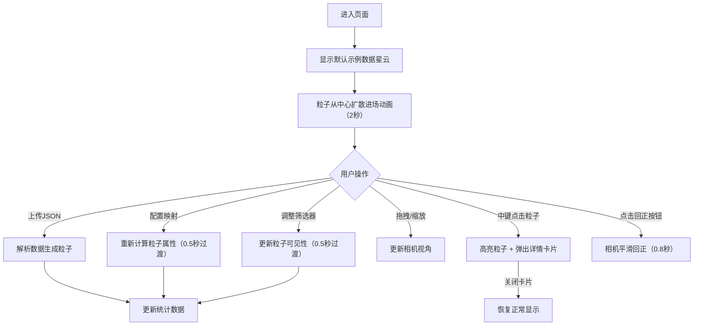

## 1. 产品概述

数据星云是一个沉浸式三维多维数据可视化工具，将JSON数据集以发光粒子星云的形式呈现，让用户在太空般的环境中自由探索数据。每个数据点以悬浮粒子形式展现，大小、颜色、位置均映射自数据字段，通过交互式筛选和框选实现多维数据的深度洞察。

- 核心价值：将抽象的多维数据转化为直观的沉浸式空间体验，降低数据分析门槛
- 目标用户：数据分析师、科研人员、产品经理、数据可视化爱好者

## 2. 核心功能

### 2.1 用户角色
| 角色 | 注册方式 | 核心权限 |
|------|----------|----------|
| 访客用户 | 无需注册 | 上传数据、配置映射、筛选浏览、选中查看详情 |

### 2.2 功能模块
1. **3D星云场景**：粒子系统渲染、背景星点、相机交互、进场动画、高亮效果
2. **左侧控制面板**：数据加载、维度映射配置、筛选器、粒子统计、面板折叠
3. **粒子详情卡片**：选中粒子高亮、底部详情弹出、字段值展示、关闭恢复

### 2.3 页面详情
| 页面名称 | 模块名称 | 功能描述 |
|----------|----------|----------|
| 主页面 | 3D星云场景 | 透视相机渲染，星云渐变背景，鼠标拖拽旋转（0.3度/帧），滚轮缩放（10-80单位），随机呼吸星点，圆形辉光粒子Sprite |
| 主页面 | 控制面板（320px） | 毛玻璃半透明背景，应用标题，JSON上传（点击+拖拽），XYZ轴/颜色/大小映射下拉，数值双端滑块筛选器，可见粒子统计 |
| 主页面 | 详情卡片 | 中键点击粒子高亮（1.5倍+白色光晕，其他粒子0.3透明度），底部圆角卡片展示所有字段，圆形关闭按钮 |
| 主页面 | 相机回正按钮 | 右下角圆形按钮，0.8秒EaseOut曲线回到初始视角 |

## 3. 核心流程

## 4. 用户界面设计

### 4.1 设计风格
- **主色调**：深邃星云紫蓝系（#0a0a2e → #1a1a4e → #2a1a3e 渐变背景）
- **强调色**：粒子辉光蓝（#7cb3ff）、滑块手柄蓝（#7cb3ff → #9ac8ff悬停）、高亮白
- **文字色**：标题#e0e0ff，统计#aabbcc，辅助#8899aa
- **UI元素**：圆角12px卡片、圆形按钮、毛玻璃backdrop-filter: blur(12px)
- **字体**：Space Grotesk（无衬线，现代科技感）
- **动效**：进场扩散动画、筛选平滑过渡、呼吸闪烁星点、相机EaseOut缓动

### 4.2 页面设计概述
| 页面名称 | 模块名称 | UI元素 |
|----------|----------|----------|
| 主页面 | 3D场景 | Canvas全屏覆盖，径向渐变粒子纹理（Canvas生成），精灵材质，AdditiveBlending辉光 |
| 主页面 | 控制面板 | 左侧固定定位，默认展开，可折叠收起按钮，分区间距24px，下拉/滑块统一样式 |
| 主页面 | 详情卡片 | 底部居中flex，字段网格布局，间距8px，关闭按钮右上角绝对定位 |
| 主页面 | 回正按钮 | 右下角fixed定位，margin 24px，圆形尺寸48px |

### 4.3 响应性
- 桌面端优先设计
- 控制面板在小屏幕下默认折叠
- 详情卡片最大宽度500px，移动端自适应100%-32px
- 触摸设备支持单指旋转、双指缩放

### 4.4 3D场景指导
- **环境**：深空星云背景（顶点色渐变Shader），环境氛围为冷色调神秘太空感
- **光照**：AmbientLight(0x404080, 0.5) 基础环境光 + PointLight跟随粒子群中心
- **相机**：PerspectiveCamera，fov=60，初始位置(0, 0, 40)，目标(0, 0, 0)
- **粒子系统**：THREE.Points + BufferGeometry，使用自定义ShaderMaterial或精灵材质
- **动画处理**：
  - 进场：TWEEN或自定义lerp，2秒从(0,0,0)弧形扩散到最终位置
  - 筛选/映射变更：0.5秒位置/颜色/大小插值过渡
  - 星点呼吸：sin(time*0.5 + seed) 控制透明度0.2~0.6
  - 选中高亮：scale = 1.5 + pulse*0.2，additive白色光晕
- **性能优化**：
  - 3000+粒子单BufferGeometry批量渲染
  - 可见性通过shader discard或alpha=0处理而非移除
  - 纹理复用，所有粒子共用同一张Canvas生成的渐变纹理
  - 使用frustumCulled=true减少不可见绘制
