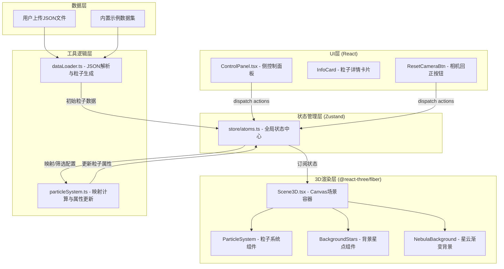
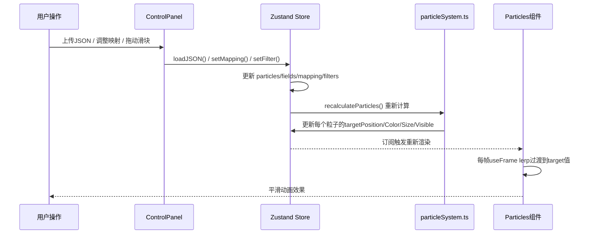

## 1. 架构设计



## 2. 技术说明

- **前端框架**：React@18 + TypeScript@5（严格模式）
- **构建工具**：Vite@5 + @vitejs/plugin-react（支持GLSL文件导入）
- **3D渲染**：three@0.160 + @react-three/fiber@8 + @react-three/drei@9
- **状态管理**：zustand@4（create方法，集中式store）
- **颜色映射**：d3-color@3 + d3-scale（插值Viridis/Plasma色阶）
- **无需后端**：纯前端单页应用，数据本地化处理

## 3. 目录结构定义

| 路径 | 用途 |
|------|------|
| `/src/main.tsx` | React应用入口，挂载DOM，全局样式入口 |
| `/src/App.tsx` | 顶层组件，组合3D场景+控制面板+浮层组件 |
| `/src/scene/Scene3D.tsx` | 3D场景Canvas组件，OrbitControls、灯光、背景、粒子子组件 |
| `/src/scene/BackgroundStars.tsx` | 随机背景星点（Points + Shader呼吸动画） |
| `/src/scene/NebulaBackground.tsx` | 全屏渐变四边形背景（Shader顶点色过渡） |
| `/src/scene/Particles.tsx` | 粒子系统核心组件，BufferGeometry + PointsMaterial/ShaderMaterial |
| `/src/controls/ControlPanel.tsx` | 左侧面板：折叠切换、数据加载、映射配置、筛选器、统计 |
| `/src/controls/InfoCard.tsx` | 底部粒子详情弹出卡片，字段展示与关闭按钮 |
| `/src/controls/ResetButton.tsx` | 右下角相机回正圆形按钮 |
| `/src/store/atoms.ts` | Zustand Store：粒子、字段、选中、筛选、映射、面板状态 |
| `/src/utils/dataLoader.ts` | JSON解析、字段类型推断、默认示例数据生成、初始粒子创建 |
| `/src/utils/particleSystem.ts` | 字段映射计算、筛选逻辑、归一化、颜色/大小插值 |
| `/src/utils/textures.ts` | Canvas动态生成径向渐变粒子纹理 |
| `/src/types/index.ts` | 全局类型定义：Particle、FieldInfo、MappingConfig、Filters等 |
| `/src/styles/global.css` | 全局CSS：字体引入、毛玻璃、滑块样式、滚动条 |

## 4. 核心数据模型

### 4.1 TypeScript类型定义

```typescript
// 单个粒子数据模型
interface Particle {
  id: string;
  rawData: Record<string, any>;  // 原始JSON数据行
  // 渲染属性（目标值）
  targetPosition: [number, number, number];
  targetColor: string;  // hex
  targetSize: number;
  targetVisible: boolean;
  // 渲染属性（当前插值值，用于动画）
  currentPosition: [number, number, number];
  currentColor: string;
  currentSize: number;
  currentAlpha: number;
  // 进场动画
  startPosition: [number, number, number];  // 进场起点
  entryProgress: number;  // 0~1
  entryDelay: number;  // 每个粒子错开的延迟
  // 选中状态
  isSelected: boolean;
}

// 字段元信息
interface FieldInfo {
  name: string;
  type: 'numeric' | 'categorical' | 'string';
  min?: number;  // numeric only
  max?: number;  // numeric only
  categories?: string[];  // categorical only
}

// 映射配置
interface MappingConfig {
  xAxis: string;      // 字段名
  yAxis: string;
  zAxis: string;
  colorField: string;
  sizeField: string;
  colorScheme: 'viridis' | 'plasma' | 'cool' | 'warm';
  sizeRange: [number, number];  // [min, max] 像素
  positionRange: [number, number];  // [-range, range] 世界坐标
}

// 筛选条件（数值字段的双端范围）
interface FilterRange {
  min: number;
  max: number;
}
interface Filters {
  [fieldName: string]: FilterRange;
}

// UI状态
interface UIState {
  panelCollapsed: boolean;
  selectedParticleId: string | null;
  isEntryAnimating: boolean;
  cameraResetTrigger: number;  // 变更即触发回正
}

// 全局Store
interface DataNebulaStore {
  // 数据
  particles: Particle[];
  fields: FieldInfo[];
  datasetName: string;
  
  // 配置
  mapping: MappingConfig;
  filters: Filters;
  
  // UI
  ui: UIState;
  
  // Actions
  loadJSON: (json: any[], name?: string) => void;
  loadSampleData: () => void;
  setMapping: (partial: Partial<MappingConfig>) => void;
  setFilter: (field: string, range: FilterRange) => void;
  resetFilters: () => void;
  selectParticle: (id: string | null) => void;
  togglePanel: () => void;
  triggerCameraReset: () => void;
  updateParticleAnimations: (delta: number) => void;  // 每帧调用
  recalculateParticles: () => void;  // 映射/筛选变更后触发
}
```

### 4.2 数据流



## 5. 性能保障策略

### 5.1 粒子渲染性能
- **BufferGeometry批量绘制**：3000+粒子共用1个THREE.Points，Draw Call=1
- **位置/颜色属性分离**：position(3) + color(3) + size(1) + alpha(1) 单BufferAttribute数组，TypedArray操作性能最优
- **Sprite纹理共享**：所有粒子复用1张Canvas生成的径向渐变纹理（128x128），内存占用极低
- **frustumCulled=true**：Three.js默认视锥剔除，相机外粒子不绘制
- **AdditiveBlending**：使用加法混合模拟辉光，无需后期处理Pass

### 5.2 状态更新性能
- **Zustand选择器订阅**：Particles组件只订阅`particles`数组切片，UI组件只订阅相关字段，避免无关重渲染
- **不可变更新策略**：recalculateParticles时创建新数组引用，触发R3F正确更新
- **动画在useFrame内完成**：位置/颜色/大小插值在GPU友好的useFrame钩子中直接写入BufferAttribute数组，set需要时标记needsUpdate=true

### 5.3 动画性能预算
- 进场动画2秒：使用缓动函数 easeOutCubic，粒子延迟错开0~0.5秒，形成扩散感
- 映射/筛选过渡0.5秒：target值不变时每帧跳过，有变化才lerp
- 相机回正0.8秒：OrbitControls内置target/position插值，EaseOut曲线
- 背景星点3000个：GPU instancing，sin函数计算透明度，CPU零开销

### 5.4 FPS保障
- 目标帧率：≥45fps
- 每帧JS执行时间：<8ms（16ms预算的一半留给Three.js渲染）
- 内存占用：粒子数据<5MB，纹理<1MB
- GC优化：避免每帧创建新对象，复用TypedArray，粒子对象池化
