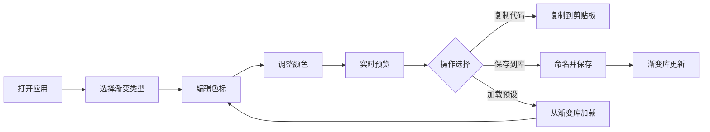

## 1. 产品概述

交互式CSS渐变编辑器是一款面向前端开发者和设计师的可视化工具，让用户无需编写代码即可创建、编辑和管理CSS渐变效果。通过直观的拖拽操作和实时预览，快速生成专业级的线性和径向渐变CSS代码。

- **目标用户**：前端开发者、UI/UX设计师、创意工作者
- **核心价值**：降低CSS渐变创作门槛，提高设计效率，统一管理渐变资源

## 2. 核心功能

### 2.1 功能模块

1. **渐变类型切换**：线性渐变 / 径向渐变两种模式
2. **色标编辑器**：色标添加、删除、拖拽排序、位置调整
3. **颜色选择器**：色相环 + 饱和度亮度面板的专业取色器
4. **实时预览区**：600x200px 渐变效果即时渲染
5. **CSS代码输出**：一键生成标准CSS渐变代码并支持复制
6. **渐变库管理**：本地保存、加载、搜索渐变预设（最多50条）
7. **参数控制**：角度滑块（线性）、形状切换与位置拖拽（径向）

### 2.2 页面详情

| 页面名称 | 模块名称 | 功能描述 |
|-----------|-------------|---------------------|
| 主界面 | 左侧渐变库 | 搜索框 + 渐变缩略图列表，支持点击加载 |
| 主界面 | 中央编辑区 | 预览区 + 色标轨道 + 类型/角度控制 |
| 主界面 | 右侧颜色面板 | 色相环 + 饱和度亮度面板，选中色标时显示 |
| 主界面 | 底部代码区 | CSS代码展示 + 一键复制按钮 |
| 主界面 | 顶部保存按钮 | 保存当前渐变到库，弹出命名对话框 |

## 3. 核心流程

用户打开应用 → 选择渐变类型 → 拖拽/添加/删除色标 → 通过颜色面板调整颜色 → 实时预览效果 → 复制CSS代码或保存到渐变库 → 从渐变库加载历史渐变继续编辑

## 4. 用户界面设计

### 4.1 设计风格

- **主题**：深色主题，专业编辑器风格
- **主背景色**：#1e1e2e
- **卡片背景色**：#2a2a3e
- **文本色**：#e0e0e0
- **强调色**：淡蓝色外发光（选中状态）
- **布局**：三栏布局（左库 + 中编辑 + 右颜色面板）
- **交互**：0.2s缓动过渡，悬停上浮效果，平滑拖拽动画

### 4.2 页面设计概览

| 页面名称 | 模块名称 | UI 元素 |
|-----------|-------------|-------------|
| 主界面 | 渐变库 | 280px宽侧栏，自定义滚动条，搜索框，缩略图卡片 |
| 主界面 | 预览区 | 600x200px圆角卡片，实时渐变渲染 |
| 主界面 | 色标轨道 | 水平轨道，16px圆形色标，选中放大1.2倍+发光 |
| 主界面 | 颜色选择器 | 60px半径色相环，150x150px饱和度亮度面板 |
| 主界面 | 控制按钮 | 复制/保存/删除按钮，悬停上浮+变色 |
| 主界面 | 代码展示 | 等宽字体CSS代码块，圆角容器 |

### 4.3 响应式

- **桌面优先**：针对 1920x1080 和 1440x900 分辨率优化
- **居中布局**：编辑器区域在各种分辨率下保持水平居中
- **触摸支持**：色标拖拽、颜色选取等交互在触摸屏上正常工作
- **可滚动区域**：渐变库列表支持垂直滚动（自定义滚动条样式）

### 4.4 动效设计

- 按钮悬停：`translateY(-2px)` + 背景色变化，0.2s缓动
- 色标选中：`scale(1.2)` + 淡蓝色外发光
- 色标拖拽：0.1s cubic-bezier 平滑过渡
- 复制成功状态：1.5秒后自动恢复
- 面板弹出/收起：平滑过渡动画

## 5. 性能要求

- 色标拖拽响应时间 ≤ 50ms
- 预览区重绘频率 ≥ 60fps
- 渐变库最多存储 50 条记录
- 使用 localStorage 持久化渐变库数据
- 颜色选取操作无卡顿
