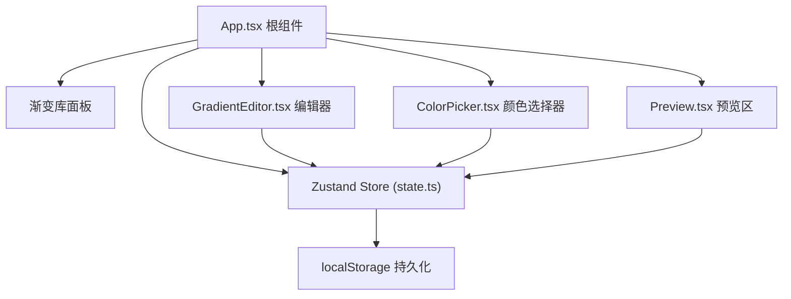

## 1. 架构设计



## 2. 技术描述

- **前端框架**：React 18 + TypeScript
- **构建工具**：Vite 5 + @vitejs/plugin-react
- **状态管理**：Zustand 4
- **唯一标识**：uuid
- **样式方案**：原生 CSS（CSS 变量 + 深色主题）
- **数据持久化**：localStorage
- **无后端**：纯前端应用，数据存储在浏览器本地

## 3. 项目文件结构

| 文件路径 | 作用 |
|----------|------|
| `package.json` | 项目依赖与脚本配置 |
| `index.html` | 应用入口 HTML |
| `vite.config.ts` | Vite 构建配置 |
| `tsconfig.json` | TypeScript 严格模式配置 |
| `src/main.tsx` | React 应用挂载入口 |
| `src/App.tsx` | 根组件，布局组织 + 渐变库逻辑 |
| `src/state.ts` | Zustand 状态管理，核心数据与操作 |
| `src/GradientEditor.tsx` | 核心编辑器组件（类型切换、色标轨道、角度/形状控制） |
| `src/ColorPicker.tsx` | 颜色选择器（色相环 + 饱和度亮度面板） |
| `src/Preview.tsx` | 渐变预览 + CSS代码展示 + 复制功能 |
| `src/index.css` | 全局样式与 CSS 变量 |

## 4. 数据模型

### 4.1 核心类型定义

```typescript
interface ColorStop {
  id: string;
  color: string; // hex color, e.g. "#ff5500"
  position: number; // 0-100
}

type GradientType = 'linear' | 'radial';
type RadialShape = 'circle' | 'ellipse';

interface GradientConfig {
  type: GradientType;
  stops: ColorStop[];
  angle: number; // 0-360, for linear
  shape: RadialShape; // for radial
  centerX: number; // 0-100, for radial
  centerY: number; // 0-100, for radial
  selectedStopId: string | null;
}

interface SavedGradient {
  id: string;
  name: string;
  config: GradientConfig;
  createdAt: number;
}

interface GradientStore {
  config: GradientConfig;
  library: SavedGradient[];
  searchQuery: string;
  // actions
  setType: (type: GradientType) => void;
  addStop: () => void;
  removeStop: (id: string) => void;
  updateStopColor: (id: string, color: string) => void;
  updateStopPosition: (id: string, position: number) => void;
  selectStop: (id: string | null) => void;
  setAngle: (angle: number) => void;
  setShape: (shape: RadialShape) => void;
  setCenter: (x: number, y: number) => void;
  saveToLibrary: (name: string) => void;
  loadFromLibrary: (id: string) => void;
  deleteFromLibrary: (id: string) => void;
  setSearchQuery: (query: string) => void;
}
```

## 5. 状态管理设计

使用 Zustand 单 store 管理：
- 渐变配置（类型、色标、角度、形状、中心点）
- 当前选中色标 ID
- 渐变库列表
- 搜索过滤词

状态更新原则：
- 色标位置/颜色更新使用直接 set，确保 60fps 流畅
- 渐变库操作自动同步到 localStorage
- 使用 useStore 的 selector 优化重渲染

## 6. 核心交互实现

### 6.1 色标拖拽
- 使用 pointerdown / pointermove / pointerup 事件
- 支持鼠标和触摸（Pointer Events API）
- 计算轨道上的百分比位置（0-100）
- 拖拽时使用 requestAnimationFrame 或直接 setState 保证流畅

### 6.2 颜色选择器
- 色相环：Canvas 或 CSS conic-gradient 渲染，极坐标计算色相值
- 饱和度/亮度面板：Canvas 2D 渐变填充，矩形坐标映射到 S/L 值
- HSL ↔ Hex 颜色转换工具函数

### 6.3 CSS 代码生成
- 根据类型生成 `linear-gradient()` 或 `radial-gradient()`
- 色标按位置排序后拼接
- 角度转成 `deg` 单位
- 径向渐变包含形状和位置参数

### 6.4 渐变库持久化
- localStorage key: `gradient-library`
- 最多存储 50 条，超出时移除最早的
- 应用初始化时从 localStorage 加载

## 7. 性能优化

- 使用 CSS `will-change` 优化预览区渐变重绘
- 色标拖拽使用 transform/left，避免 reflow
- Zustand selector 精确订阅，减少不必要重渲染
- 颜色面板使用 Canvas 保证取色效率
- 防抖/节流：搜索框输入防抖，色标拖拽不节流（需实时响应）
