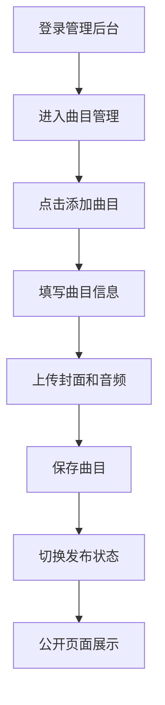
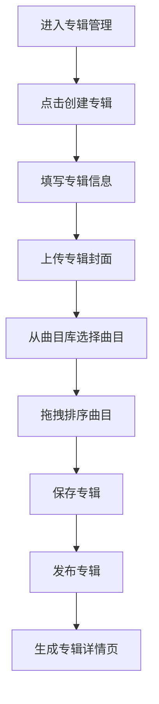
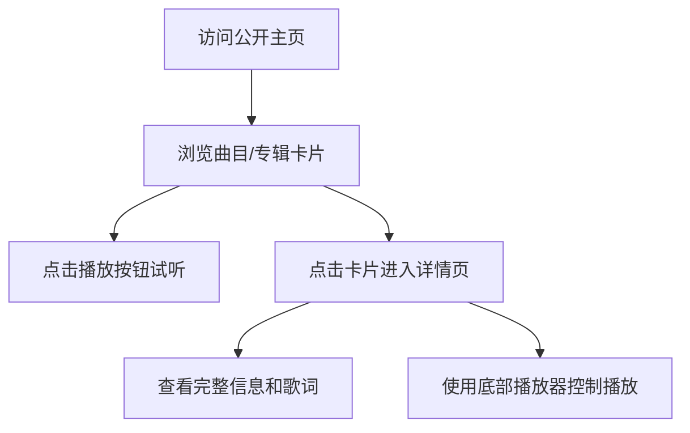

## 1. 产品概述

独立音乐人作品集管理与发布平台，解决个人网站搭建门槛高的问题，提供集曲目管理、封面上传、播放试听和发布状态控制于一体的轻量化工具。

- 面向独立音乐人，提供从曲目创作管理到公开展示的一站式解决方案
- 通过简单易用的管理后台和精美的公开页面，帮助音乐人快速建立个人品牌形象

## 2. 核心功能

### 2.1 用户角色

| 角色 | 登录方式 | 核心权限 |
|------|----------|----------|
| 音乐人 | 管理后台登录 | 曲目/专辑的增删改查、发布状态控制、文件上传、公开页面预览 |

### 2.2 功能模块

1. **管理后台 - 曲目管理**: 曲目列表、添加/编辑曲目、封面上传、音频上传、发布状态切换
2. **管理后台 - 专辑管理**: 专辑列表、创建/编辑专辑、曲目选择、拖拽排序、封面上传
3. **公开主页**: 已发布曲目和专辑的卡片网格展示、播放试听、搜索筛选
4. **公开详情页**: 曲目/专辑详情展示、完整歌词、专辑内曲目列表、播放器控制
5. **全局播放器**: 固定底部播放栏、播放/暂停、上一首/下一首、进度拖拽

### 2.3 页面详情

| 页面名称 | 模块名称 | 功能描述 |
|---------|----------|----------|
| 曲目管理页 | 曲目列表 | 展示所有曲目，左侧封面缩略图，右侧编辑和发布按钮 |
| 曲目管理页 | 添加曲目表单 | 曲名、艺人、专辑、时长、歌词输入，封面上传 |
| 专辑管理页 | 专辑列表 | 展示所有专辑及其包含曲目数量和发布状态 |
| 专辑管理页 | 创建专辑表单 | 专辑名称、发行日期、封面上传、曲目多选、拖拽排序 |
| 公开主页 | 卡片网格 | 3列响应式布局，展示已发布曲目和专辑，悬停动效 |
| 公开详情页 | 内容展示 | 封面大图、详细信息、歌词、播放控制 |
| 全局播放器 | 播放控制 | 进度条、音量、上下首切换 |

## 3. 核心流程

### 3.1 曲目管理流程

### 3.2 专辑创建流程

### 3.3 公开页面访问流程

## 4. 用户界面设计

### 4.1 设计风格

- **配色方案**: 深色主题，背景#0a0a1a，卡面#1a1a2e，文字#e0e0e0，强调色从#667eea渐变到#764ba2
- **按钮风格**: 圆形播放按钮(直径48px)，渐变背景，悬停缩放1.1倍，点击缩放0.95
- **字体**: 系统字体栈 -apple-system, BlinkMacSystemFont, 'Segoe UI', Roboto, 'Helvetica Neue', Arial, sans-serif
- **布局风格**: 管理后台侧边栏导航(260px宽)，公开页面卡片网格布局
- **动效风格**: 页面切换淡入淡出(0.2s)，侧栏滑出(0.3s cubic-bezier)，悬停上浮8px

### 4.2 页面设计概述

| 页面名称 | 模块名称 | UI 元素 |
|---------|----------|---------|
| 曲目管理页 | 侧栏导航 | 深色背景#1a1a2e，选中项#16213e，图标文字间距10px |
| 曲目管理页 | 表单输入 | 背景#16213e，边框#2a2a4a，聚焦时发光效果#667eea |
| 曲目管理页 | 列表项 | 封面64x64圆角8px，编辑和发布按钮 |
| 专辑管理页 | 拖拽排序 | 半透明预览卡片跟随鼠标，50fps流畅动画 |
| 公开主页 | 卡片网格 | 3列布局，最小宽320px，移动端1列，深色半透明背景rgba(30,30,60,0.85) |
| 公开主页 | 骨架屏 | 闪烁动画，渐变从#1a1a2e到#2a2a4a |
| 全局播放器 | 底部栏 | 高度80px，渐变背景从#0f0c29到#302b63，进度条4px高 |

### 4.3 响应式设计

- **桌面端(>768px)**: 管理后台侧栏固定260px，公开页面3列卡片网格
- **平板端(768px-1024px)**: 公开页面2列布局，管理后台侧栏可折叠
- **移动端(<768px)**: 管理后台顶部汉堡菜单，侧栏从左侧滑出，公开页面1列布局，导航栏折叠式
- **触摸优化**: 按钮最小触摸区域48x48px，拖拽手势支持

### 4.4 性能指标

- 曲目列表加载100条数据首屏渲染 ≤ 800ms
- 搜索输入防抖延迟 ≤ 300ms
- 拖拽排序帧率 ≥ 50fps
- 页面切换动画流畅度 60fps

## 5. 交互细节

### 5.1 微交互

- 按钮点击: transform: scale(0.95)，持续0.1s
- 卡片悬停: 上移8px，阴影扩散8px
- 输入聚焦: 边框变色+外发光
- 开关切换: 平滑过渡动画

### 5.2 页面过渡

- 路由切换: 透明度0→1，持续0.2s
- 列表项增删: 高度变化过渡
- 模态框弹出: 缩放+淡入

### 5.3 反馈机制

- 表单验证错误: 红色文字#ff6b6b提示
- 文件上传进度: 进度条显示
- 操作成功/失败: Toast提示
- 音频加载: 缓冲状态指示
