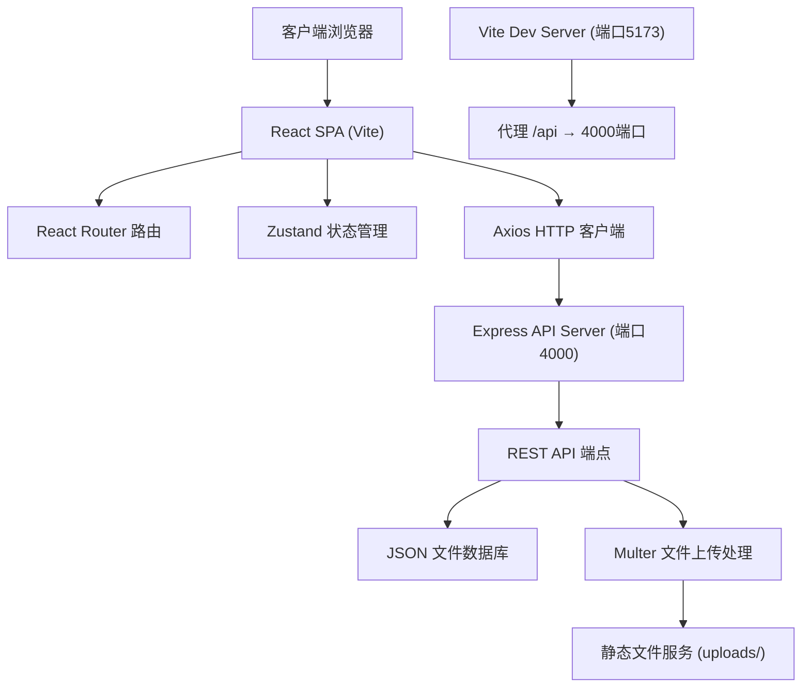
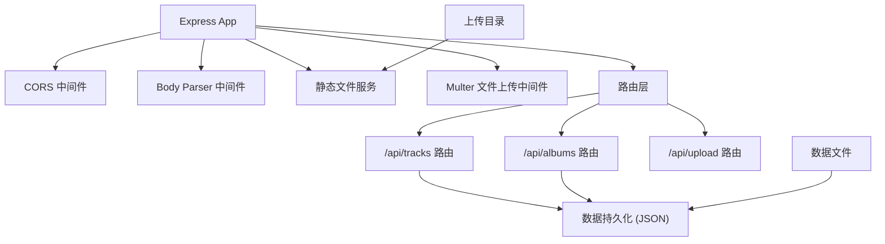

## 1. 架构设计



## 2. 技术栈描述

- **前端框架**: React 18 + TypeScript 5
- **构建工具**: Vite 5
- **路由**: React Router DOM 6
- **状态管理**: Zustand 4
- **HTTP 客户端**: Axios 1
- **拖拽组件**: react-beautiful-dnd 13
- **后端**: Node.js + Express 4
- **文件上传**: Multer 1
- **数据库**: JSON 文件模拟持久化
- **UI 样式**: CSS Modules + 全局 CSS 变量

## 3. 项目结构

```
project-root/
├── package.json
├── index.html
├── vite.config.ts
├── tsconfig.json
├── server/
│   └── index.ts          # Express API 服务
├── src/
│   ├── main.tsx          # React 入口
│   ├── App.tsx           # 主路由配置
│   ├── store/
│   │   └── useStore.ts   # Zustand 全局状态
│   ├── components/
│   │   ├── Player.tsx       # 底部播放器
│   │   ├── AdminLayout.tsx  # 管理后台布局
│   │   └── PublicLayout.tsx # 公开页面布局
│   └── pages/
│       ├── AdminTracks.tsx   # 曲目管理
│       ├── AdminAlbums.tsx   # 专辑管理
│       ├── PublicHome.tsx    # 公开主页
│       ├── PublicTrack.tsx   # 曲目详情
│       └── PublicAlbum.tsx   # 专辑详情
└── uploads/              # 上传文件目录
```

## 4. 路由定义

| 路由 | 页面组件 | 权限 | 说明 |
|------|----------|------|------|
| `/` | PublicHome | 公开 | 公开作品集主页 |
| `/public/track/:id` | PublicTrack | 公开 | 曲目详情页 |
| `/public/album/:id` | PublicAlbum | 公开 | 专辑详情页 |
| `/admin` | AdminTracks | 需登录 | 曲目管理页面 |
| `/admin/tracks` | AdminTracks | 需登录 | 曲目管理页面 |
| `/admin/albums` | AdminAlbums | 需登录 | 专辑管理页面 |

## 5. API 定义

### 5.1 类型定义

```typescript
interface Track {
  id: string;
  name: string;
  artist: string;
  albumId?: string;
  duration: string; // mm:ss
  lyrics: string;
  coverUrl: string;
  audioUrl: string;
  isPublished: boolean;
  createdAt: string;
}

interface Album {
  id: string;
  name: string;
  releaseDate: string;
  coverUrl: string;
  trackIds: string[];
  isPublished: boolean;
  createdAt: string;
}

interface PlayerState {
  currentTrack: Track | null;
  playlist: Track[];
  currentIndex: number;
  isPlaying: boolean;
  currentTime: number;
  duration: number;
}
```

### 5.2 REST API 端点

| 方法 | 路径 | 描述 | 请求体 | 响应 |
|------|------|------|--------|------|
| GET | `/api/tracks` | 获取所有曲目 | - | `Track[]` |
| GET | `/api/tracks/published` | 获取已发布曲目 | - | `Track[]` |
| GET | `/api/tracks/:id` | 获取单首曲目 | - | `Track` |
| POST | `/api/tracks` | 创建曲目 | `FormData` | `Track` |
| PUT | `/api/tracks/:id` | 更新曲目 | `FormData` | `Track` |
| PATCH | `/api/tracks/:id/publish` | 切换发布状态 | `{ isPublished: boolean }` | `Track` |
| DELETE | `/api/tracks/:id` | 删除曲目 | - | `{ success: boolean }` |
| GET | `/api/albums` | 获取所有专辑 | - | `Album[]` |
| GET | `/api/albums/published` | 获取已发布专辑 | - | `Album[]` |
| GET | `/api/albums/:id` | 获取单个专辑(含曲目) | - | `Album & { tracks: Track[] }` |
| POST | `/api/albums` | 创建专辑 | `FormData` | `Album` |
| PUT | `/api/albums/:id` | 更新专辑(含曲目排序) | `FormData` | `Album` |
| PATCH | `/api/albums/:id/publish` | 切换发布状态 | `{ isPublished: boolean }` | `Album` |
| DELETE | `/api/albums/:id` | 删除专辑 | - | `{ success: boolean }` |
| POST | `/api/upload/cover` | 上传封面图片 | `FormData (file)` | `{ url: string }` |
| POST | `/api/upload/audio` | 上传音频文件 | `FormData (file)` | `{ url: string }` |

### 5.3 文件上传规范

- **封面图片**: PNG/JPG 格式，最大 2MB，自动压缩至 400x400
- **音频文件**: MP3 格式，最大 10MB
- **存储路径**: `uploads/covers/` 和 `uploads/audio/`
- **访问路径**: `/uploads/covers/filename.ext`

## 6. 服务端架构



### 6.1 数据持久化

- 使用 JSON 文件存储数据，路径: `server/data/tracks.json` 和 `server/data/albums.json`
- 启动时加载数据到内存，修改后同步写入文件
- 使用 uuid 生成唯一 ID

### 6.2 图片处理

- 使用 `sharp` 库处理封面图片压缩
- 自动调整尺寸为 400x400
- 支持 JPG/PNG 格式转换

## 7. 前端状态管理 (Zustand)

```typescript
interface StoreState {
  // 数据
  tracks: Track[];
  albums: Album[];
  
  // 播放器状态
  player: {
    currentTrack: Track | null;
    playlist: Track[];
    currentIndex: number;
    isPlaying: boolean;
    currentTime: number;
    duration: number;
  };
  
  // UI 状态
  isLoading: boolean;
  sidebarOpen: boolean;
  
  // 认证
  isAuthenticated: boolean;
  
  // Actions
  fetchTracks: () => Promise<void>;
  fetchAlbums: () => Promise<void>;
  addTrack: (data: FormData) => Promise<void>;
  updateTrack: (id: string, data: FormData) => Promise<void>;
  toggleTrackPublish: (id: string) => Promise<void>;
  deleteTrack: (id: string) => Promise<void>;
  addAlbum: (data: FormData) => Promise<void>;
  updateAlbum: (id: string, data: FormData) => Promise<void>;
  toggleAlbumPublish: (id: string) => Promise<void>;
  deleteAlbum: (id: string) => Promise<void>;
  playTrack: (track: Track, playlist?: Track[]) => void;
  togglePlay: () => void;
  nextTrack: () => void;
  prevTrack: () => void;
  setCurrentTime: (time: number) => void;
  setDuration: (duration: number) => void;
  setSidebarOpen: (open: boolean) => void;
  login: () => void;
  logout: () => void;
}
```

## 8. 性能优化策略

### 8.1 列表性能
- 使用 `React.memo` 优化列表项渲染
- 搜索使用 `useMemo` + `useDebounce` (300ms) 防抖
- 100条数据虚拟滚动可选

### 8.2 拖拽性能
- 使用 `react-beautiful-dnd` 优化拖拽动画
- 拖拽时禁用不必要的重渲染
- 使用 CSS transform 实现位移

### 8.3 图片优化
- 封面图片预压缩至 400x400
- 列表使用缩略图，详情页使用原图
- 图片懒加载

### 8.4 代码分割
- 管理后台和公开页面路由级代码分割
- 播放器组件延迟加载
- 使用 `React.lazy` 和 `Suspense`

## 9. 开发与构建

### 9.1 启动脚本
```json
{
  "scripts": {
    "dev": "concurrently \"npm run server\" \"npm run client\"",
    "server": "ts-node server/index.ts",
    "client": "vite",
    "build": "tsc && vite build"
  }
}
```

### 9.2 Vite 配置要点
- 代理 `/api` 到 `http://localhost:4000`
- TypeScript 严格模式
- 热更新支持

### 9.3 TypeScript 配置
- `strict: true`
- `noImplicitAny: true`
- `strictNullChecks: true`
