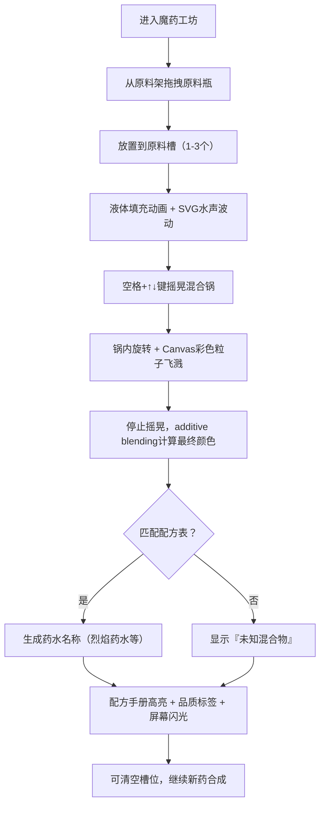

## 1. 产品概述

魔药工坊是一款蒸汽朋克风格的互动炼金体验应用，将炼金术元素与触觉反馈结合，玩家通过拖拽、摇晃和混合不同原料瓶，实时合成发光冒泡的奇幻药水。

- 核心目标：打造沉浸式、触感丰富的炼金合成体验，通过精致的视觉动画和交互反馈让玩家感受魔法合成的乐趣
- 目标用户：喜欢解谜、创意合成类游戏的玩家，以及蒸汽朋克/奇幻题材爱好者

## 2. 核心功能

### 2.1 功能模块

1. **木质实验台主界面**：俯视视角工作台，包含原料槽、混合锅、原料架、配方手册
2. **原料拖拽系统**：从右侧原料架拖拽原料瓶至原料槽，液体填充动画+水声波动
3. **摇晃混合系统**：空格键+上下方向键模拟摇晃，锅内旋转动画+彩色粒子飞溅
4. **药水合成引擎**：根据原料比例计算最终颜色，匹配配方表生成药水名称
5. **配方手册面板**：左侧羊皮纸风格面板，显示配方列表，合成成功高亮对应条目
6. **品质判定系统**：根据摇晃时长和粒子数量判定药水品质（普通/优秀/完美）
7. **视觉特效系统**：屏幕边缘闪光、锅沿发光、弹簧回弹等交互反馈

### 2.2 页面详情

| 页面名称 | 模块名称 | 功能描述 |
|---------|---------|---------|
| 主界面 | 木质实验台背景 | 径向渐变#8B5A2B→#5C4033模拟木纹，整体暗色调#2B1E14 |
| 主界面 | 原料槽×3 | 圆形凹陷直径120px，背景#3E2723，铜色铆钉#B87333装饰，接收拖拽放置 |
| 主界面 | 中央混合锅 | 圆形直径200px，金属拉丝#4E4E4E→#2C2C2C，锅沿#FFD700发光闪烁动画 |
| 主界面 | 右侧原料架 | 滚轮上下浏览，原料瓶列表排列，瓶子上方悬浮名称标签 |
| 主界面 | 左侧配方手册 | 宽240px，羊皮纸#FFF8DC背景，#D2B48C边框，圆角8px，配方列表展示 |
| 主界面 | 液体填充动画 | 从中心向外扩散填充300ms，radial-gradient+transition |
| 主界面 | 水声波动效果 | SVG波形动画模拟低沉水声 |
| 主界面 | 摇晃粒子系统 | Canvas实现，每粒子4-8px随机，颜色取原料混合值，透明度0.8→0.2，每次摇晃30个 |
| 主界面 | 品质浮动标签 | 锅下方显示品质（普通/优秀/完美），摇晃2秒+粒子50+为完美 |
| 主界面 | 屏幕边缘闪光 | CSS box-shadow inset动画，药水主色20%透明度，1.5秒扩散消失 |
| 主界面 | 拖拽反馈 | 拖起时放大1.2倍+发光描边（#FF6F00/#00BFFF/#FF1493），放置弹簧回弹300ms |

## 3. 核心流程

玩家进入主界面 → 从右侧原料架拖拽原料瓶到3个原料槽（任意组合）→ 槽内液体填充动画+水声波动 → 按住空格键+上下方向键摇晃混合锅（锅内旋转+粒子飞溅）→ 停止摇晃后颜色混合计算 → 匹配配方生成药水名称 → 配方手册高亮对应条目 → 显示药水品质标签 → 屏幕闪光特效 → 可继续合成新药

## 4. 用户界面设计

### 4.1 设计风格
- **主色**：深棕木质 #8B5A2B / #5C4033，背景 #2B1E14
- **金属色**：拉丝灰 #4E4E4E→#2C2C2C，铜色铆钉 #B87333，金色锅沿 #FFD700
- **原料色**：火焰橙 #FF6F00、冰蓝 #00BFFF、魔粉 #FF1493 等
- **羊皮纸**：#FFF8DC 背景，#D2B48C 边框，#FFA500 高亮
- **布局**：固定三栏布局，左配方手册、中实验台、右原料架
- **字体**：标题使用 Cinzel（古典衬线），正文使用 Crimson Pro（优雅衬线），营造蒸汽朋克古籍感
- **交互**：所有可交互元素 hover 有反馈，拖拽有发光+放大+弹簧回弹，过渡统一使用 cubic-bezier(0.68, -0.55, 0.27, 1.55)

### 4.2 页面设计概览

| 页面 | 模块 | UI元素 |
|-----|-----|-------|
| 主界面 | 实验台背景 | 径向渐变木纹，铜质镶边，微妙颗粒纹理 |
| 主界面 | 原料槽 | 凹陷阴影，6颗铜铆钉环绕，液体径向填充动画 |
| 主界面 | 混合锅 | 金属拉丝质感，锅沿脉冲金色发光，锅内液体旋转，粒子飞溅出口 |
| 主界面 | 原料架 | 卷轴样式容器，玻璃瓶（渐变色液体+瓶塞+高光），名称悬浮标签 |
| 主界面 | 配方手册 | 羊皮纸卷边效果，条目左右对齐，合成时#FFA500背景高亮闪烁2秒 |
| 主界面 | 药水名称 | 锅上方浮动，古典字体，颜色取药水主色带发光描边 |
| 主界面 | 品质标签 | 锅下方飘带样式，普通/优秀/完美对应灰/蓝/金色 |
| 主界面 | 屏幕闪光 | inset box-shadow从内向外扩散1.5秒消失 |

### 4.3 响应式
- 桌面优先设计，最小宽度1024px
- 原料架和配方手册固定宽度，实验台区域自适应
- 移动端降级为单列滚动布局
- 触摸设备支持长按拖拽+滑动手势代替键盘摇晃

### 4.4 性能优化
- CSS动画优先使用transform/opacity（GPU加速）
- 粒子系统限制≤200个，每帧更新≤5ms
- requestAnimationFrame统一驱动所有动画
- Canvas粒子使用离屏缓冲（如需要）
