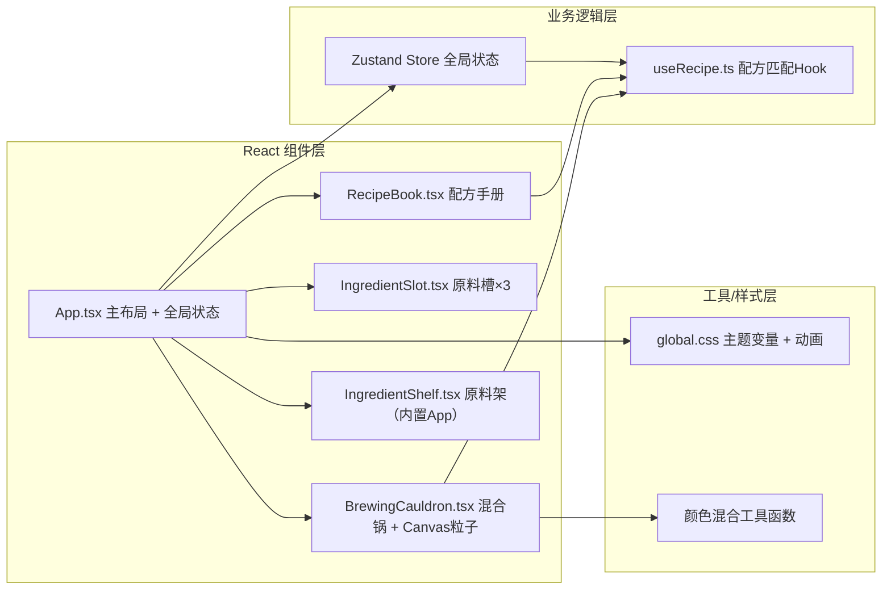

## 1. 架构设计



## 2. 技术说明
- **前端框架**：React 18 + TypeScript
- **构建工具**：Vite 5.x + @vitejs/plugin-react
- **状态管理**：Zustand 4.x（轻量全局状态：原料槽、合成结果、摇晃状态）
- **样式**：原生CSS + CSS Variables（蒸汽朋克主题），无UI库
- **粒子系统**：HTML5 Canvas 2D API + requestAnimationFrame
- **动画**：CSS transition/animation（液体填充、发光、回弹），Canvas（粒子）
- **ID生成**：uuid
- **初始数据**：前端预定义配方表和原料数据（mock）

## 3. 目录结构
```
auto32/
├── .trae/documents/
│   ├── PRD-魔药工坊.md
│   └── TECH-魔药工坊.md
├── index.html
├── package.json
├── vite.config.ts
├── tsconfig.json
└── src/
    ├── App.tsx                    # 主布局、原料架、状态管理组合
    ├── styles/
    │   └── global.css             # 主题CSS变量、全局样式、关键帧动画
    ├── components/
    │   ├── BrewingCauldron.tsx    # 混合锅：锅体渲染、摇晃旋转、Canvas粒子、颜色混合、药水名称
    │   ├── IngredientSlot.tsx     # 原料槽：拖拽接收、液体径向填充、SVG水声波纹
    │   └── RecipeBook.tsx         # 配方手册：羊皮纸面板、配方列表、高亮条目
    └── hooks/
        └── useRecipe.ts           # 配方匹配Hook：原料组合→药水名称+品质
```

## 4. 数据模型

### 4.1 核心类型定义
```typescript
// 原料
interface Ingredient {
  id: string;
  name: string;        // 中文名
  color: string;       // 主色 hex
  glow: string;        // 描边发光色 hex
  rgb: [number, number, number]; // RGB 0-255
}

// 原料槽状态
type SlotState = Ingredient | null;
type Slots = [SlotState, SlotState, SlotState];

// 药水品质
type PotionQuality = '普通' | '优秀' | '完美';

// 合成结果
interface BrewResult {
  name: string;        // 药水名称 or "未知混合物"
  color: string;       // 混合后颜色 hex
  rgb: [number, number, number];
  quality: PotionQuality;
  isMatch: boolean;    // 是否匹配到配方
}

// 配方
interface Recipe {
  id: string;
  name: string;
  ingredientIds: [string, string?, string?]; // 1-3种原料
  resultColor: string;
  description: string;
}

// 摇晃状态
interface ShakeState {
  isShaking: boolean;
  durationMs: number;   // 累计摇晃时长
  particleCount: number; // 累计粒子数
}

// 粒子
interface Particle {
  x: number; y: number;
  vx: number; vy: number;
  size: number;
  color: string;
  alpha: number;
  life: number; maxLife: number;
}
```

### 4.2 Zustand Store
```typescript
interface PotionStore {
  slots: Slots;
  setSlot: (idx: 0|1|2, ing: Ingredient|null) => void;
  clearSlots: () => void;
  shakeState: ShakeState;
  setShaking: (v: boolean) => void;
  addShakeDuration: (ms: number) => void;
  addParticleCount: (n: number) => void;
  resetShake: () => void;
  lastResult: BrewResult | null;
  setLastResult: (r: BrewResult|null) => void;
  highlightedRecipeId: string | null;
  setHighlighted: (id: string|null, ttlMs?: number) => void;
}
```

## 5. 关键算法

### 5.1 Additive Blending 颜色混合
```
最终RGB = clamp((R1+R2+R3)/N, 0, 255)
其中 N = 已填充槽位数（1-3）
某槽空则忽略（不对该通道贡献）
```

### 5.2 配方匹配策略
- 将槽内原料ID排序后拼接为签名 key
- 预定义配方表：有序/无序匹配均支持（默认无序，排列组合视为同一配方）
- 匹配优先级：3原料 > 2原料 > 1原料

### 5.3 品质判定
```
摇晃时长 ≥ 2s 且 粒子累计 ≥ 50 → 完美
摇晃时长 ≥ 1s 或 粒子 ≥ 25   → 优秀
否则 → 普通
```

### 5.4 粒子系统（Canvas）
- 每次摇晃事件生成30个粒子，总量上限200（超出覆盖最旧）
- 粒子颜色从槽内原料RGB中按概率采样（或混合值）
- 速度：锅边缘初速度方向随机向外，大小 2-6 px/帧
- 重力：0.15 px/帧²，落地反弹 0.6
- 透明度：life从1→0线性映射到alpha 0.8→0.2
- 每帧更新：位置、速度、life；性能目标 ≤5ms/帧

## 6. 交互事件流
1. **拖拽**：`IngredientShelf` 原料瓶 → `draggable=true` → `onDragStart` 携带 `ingredientId`
2. **放置**：`IngredientSlot` `onDrop` → 读取 dataTransfer → `setSlot(idx, ingredient)`
3. **液体填充**：slot 变化 → CSS class切换 → radial-gradient + transition 300ms
4. **水声波动**：drop后触发 SVG `<animate>` 波形1.2秒
5. **摇晃检测**：App层监听 keydown/keyup → `Space` 按下 且 `ArrowUp/Down` 按下 → `setShaking(true)`
6. **旋转动画**：锅体CSS `@keyframes rotate`，duration与摇晃时长绑定（max 3s）
7. **粒子生成**：shaking=true 时，每100ms向Canvas粒子池push 30个
8. **停止摇晃**：keyup → setShaking(false) → 3s后旋转停止 → 触发useRecipe匹配
9. **合成结果**：setLastResult → 锅上方名称渲染 → RecipeBook高亮 → setTimeout 2s取消高亮 → 屏幕边缘inset闪光1.5s → 锅下方品质标签

## 7. 性能与安全
- 所有键盘监听在组件挂载时addEventListener、卸载时removeEventListener
- Canvas尺寸固定400×400（锅直径200 + 溢出区域），避免重排
- 使用 `will-change: transform` 提示GPU合成层
- 拖拽图片使用自定义ghost（原料瓶放大1.2倍），通过setDragImage实现
- Zustand action使用不可变更新，保持引用稳定
