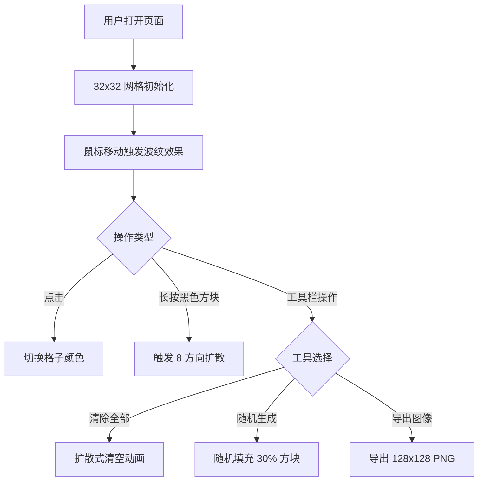

## 1. 产品概述

动态网格盘是一款交互式数字创作工具，用户通过点击、长按和拖拽操作在 32x32 网格上生成黑白方块图案，并伴随鼠标移动产生水波涟漪般的动态视觉效果。

- **核心用途**：创意像素画创作、动态视觉艺术生成、休闲娱乐
- **目标用户**：创意工作者、像素艺术爱好者、休闲用户
- **产品价值**：提供流畅的网格交互体验，将静态像素艺术与动态波纹效果结合，带来独特的视觉创作乐趣

## 2. 核心功能

### 2.1 功能模块

1. **网格画布**：32x32 像素网格，支持鼠标交互和动态波纹效果
2. **交互操作**：点击切换、长按扩散、鼠标波纹
3. **工具栏**：清除全部、随机生成、导出图像

### 2.2 功能详情

| 模块名称 | 功能描述 |
|---------|---------|
| 网格画布 | 32x32 格子，每格 24px，浅灰网格线 #e0e0e0，纯白背景 #ffffff |
| 鼠标波纹 | 鼠标悬停时以当前格子为中心半径 5 格内产生波动动画，波峰最亮 #000000，向外过渡到 #aaaaaa，离开后 1.5 秒衰减消失 |
| 点击切换 | 点击格子切换黑白状态，0.2 秒淡入淡出过渡 |
| 长按扩散 | 长按黑色方块 500ms 后向 8 方向曼哈顿距离扩散，遇边界或白色方块停止，新方块 0.8→1.0 缩放动画（0.3 秒） |
| 清除全部 | 清空所有黑色方块，从中心向外扩散的清除动画（0.8 秒） |
| 随机生成 | 30% 概率填充黑色方块，每格延迟 0.05 秒依次出现 |
| 导出图像 | 将当前网格导出为 128x128 PNG 图片 |
| 性能保障 | 60 FPS 流畅度，快速移动鼠标时波纹平滑过渡 |

## 3. 核心流程

## 4. 用户界面设计

### 4.1 设计风格

- **主色调**：纯白背景 #ffffff，深黑方块 #000000，中灰过渡 #aaaaaa，浅灰网格线 #e0e0e0
- **工具栏**：深色背景 #1a1a2e，高度 56px，固定底部
- **动画风格**：流畅自然，缓动函数 cubic-bezier(0.25, 0.46, 0.45, 0.94)
- **整体感觉**：极简现代，干净清爽，动态效果带来生命力

### 4.2 页面设计

| 区域 | 模块 | UI 元素 |
|-----|------|---------|
| 主区域 | 网格画布 | CSS Grid 布局的 32x32 格子，每格 24px，动态内联样式控制颜色和变换 |
| 底部 | 工具栏 | 深色背景横条，三个功能按钮（清除全部、随机生成、导出图像） |

### 4.3 响应式

- **桌面端优先**：固定尺寸网格（32×24px = 768px）居中显示
- **移动端适配**：等比缩小小屏设备，保持网格可见
- **触摸优化**：支持触屏点击和长按操作

### 4.4 动效设计

- **波纹扩散**：以鼠标为中心的径向渐变动画，模拟水面涟漪
- **状态切换**：淡入淡出 0.2 秒平滑过渡
- **长按扩散**：曼哈顿距离逐格延伸，缩放出现动画
- **清除动画**：从中心向外环形扩散消失
- **随机生成**：逐格延迟出现，错落有致
