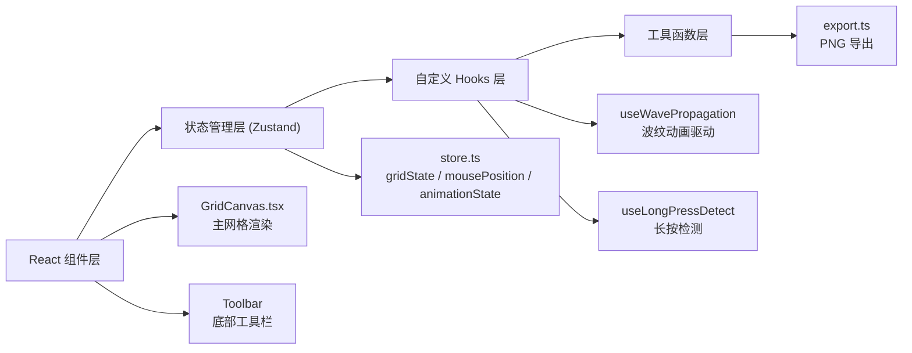

## 1. 架构设计



## 2. 技术描述

- **前端框架**：React@18 + TypeScript@5
- **构建工具**：Vite@5 + @vitejs/plugin-react
- **状态管理**：zustand@4
- **图像导出**：html-to-image
- **目标标准**：ES2020，严格模式
- **路径别名**：@ 指向 src 目录

## 3. 项目结构

| 文件/目录 | 说明 |
|----------|------|
| package.json | 项目依赖和脚本 |
| index.html | 入口 HTML |
| vite.config.ts | Vite 配置（react 插件 + 路径别名） |
| tsconfig.json | TypeScript 配置（严格模式 + ES2020） |
| src/main.tsx | React 入口 |
| src/App.tsx | 根组件 |
| src/GridCanvas.tsx | 主网格渲染组件 |
| src/store.ts | Zustand 状态管理 |
| src/hooks.ts | 自定义 Hooks |
| src/export.ts | 导出工具函数 |
| src/index.css | 全局样式 |

## 4. 数据模型

### 4.1 状态定义

```typescript
// 格子状态：0=白色，1=动画中灰色，2=黑色
type CellState = 0 | 1 | 2;

// 网格状态：32x32 二维数组
type GridState = CellState[][];

// 鼠标位置
interface MousePosition {
  x: number;
  y: number;
}

// Store
interface GridStore {
  gridState: GridState;
  mousePosition: MousePosition;
  animationState: AnimationState;
  toggleCell: (x: number, y: number) => void;
  clearGrid: () => void;
  randomFill: () => void;
  startWave: (x: number, y: number) => void;
  propagateFrom: (x: number, y: number) => void;
}
```

## 5. 核心算法

### 5.1 波纹传播算法
- 基于 requestAnimationFrame 逐帧更新
- 计算每个格子与鼠标的曼哈顿/欧几里得距离
- 根据距离和时间衰减计算动画强度值
- 缓动函数：cubic-bezier(0.25, 0.46, 0.45, 0.94)

### 5.2 长按扩散算法
- 检测长按 500ms 阈值
- 8 方向 BFS 扩散（上、下、左、右、4 对角线）
- 曼哈顿距离层级延伸
- 遇边界或白色方块停止

### 5.3 性能优化
- 使用 CSS 内联样式 + transform 实现 GPU 加速
- requestAnimationFrame 同步刷新
- 节流鼠标移动事件（每秒 30 格以上速度仍平滑）
- 只更新可视范围内的格子状态
