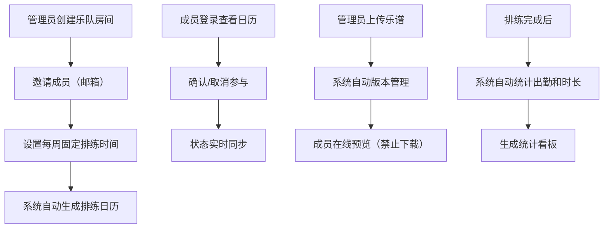

## 1. 产品概述

乐队排练管理系统是一款专为小型乐队和音乐社团设计的在线协作平台，解决成员间排练时间冲突、乐谱版本混乱、以及缺乏出勤和排练时长自动追踪的问题。通过统一的日历管理、乐谱共享和数据统计，帮助乐队高效组织排练活动。

## 2. 核心功能

### 2.1 用户角色

| 角色 | 注册方式 | 核心权限 |
|------|----------|----------|
| 管理员 | 系统预置 | 创建乐队房间、邀请成员、上传乐谱、编辑排练信息、查看统计 |
| 成员 | 邮箱邀请加入 | 查看排练日历、确认/取消参与、在线查看乐谱、查看个人统计 |

### 2.2 功能模块

1. **乐队房间管理**：多房间创建、成员邀请、固定排练时间设置
2. **排练日历视图**：按日期排列排练事件、参与状态实时更新、地点编辑
3. **乐谱管理**：PDF上传、版本管理、在线预览、标注功能
4. **统计看板**：排练次数、出勤率、排练时长可视化统计

### 2.3 页面详情

| 页面名称 | 模块名称 | 功能描述 |
|---------|----------|----------|
| 主页面 | 左侧导航栏 | 乐队房间列表、创建房间按钮、毛玻璃半透明效果 |
| 主页面 | 日历视图 | 月份切换、排练卡片展示、确认/取消按钮、成员头像列表 |
| 主页面 | 乐谱面板 | PDF预览器、版本列表、标注显示 |
| 主页面 | 统计看板 | 柱状图展示、月份筛选、数据汇总 |

## 3. 核心流程

## 4. 用户界面设计

### 4.1 设计风格

- **主色调**：深蓝灰 #1e2a3a
- **辅助色**：活力橙 #ff7f50
- **渐变色**：#4caf50（高）→ #ff5722（低）用于统计图表
- **卡片背景**：#2a3a4a
- **导航栏背景**：rgba(30,42,58,0.85) 半透明毛玻璃效果
- **字体**：无衬线体
- **按钮样式**：圆角、点击缩放反馈（0.2s ease）
- **卡片圆角**：排练卡片 12px，统计卡片 16px

### 4.2 页面设计概述

| 页面名称 | 模块名称 | UI元素 |
|---------|----------|--------|
| 主页面 | 导航栏 | 固定左侧240px、毛玻璃效果、房间列表、创建按钮 |
| 主页面 | 日历视图 | 月份切换按钮、日期网格、排练卡片（时间/地点/成员头像/确认按钮） |
| 主页面 | 统计看板 | 卡片式布局、SVG柱状图、月份筛选下拉框、数据标签 |
| 主页面 | PDF预览 | 嵌入式预览器、标注覆盖层、懒加载 |

### 4.3 响应式设计

- **桌面端**（≥768px）：左侧固定导航栏 + 主内容区双栏布局
- **移动端**（<768px）：导航栏折叠为顶部汉堡菜单，日历卡片单列全宽显示，触控优化

### 4.4 交互动效

- 卡片悬停：平移 -4px，阴影扩散至 12px
- 按钮点击：缩放反馈动画 0.2s ease
- 页面加载： staggered 渐进式显示
- 状态更新：平滑过渡动画

## 5. 性能要求

- 初次加载时间 < 1.5秒
- 日历数据 localStorage 缓存（5分钟失效）
- PDF预览懒加载（点击查看时才加载）
- 响应式图片优化
