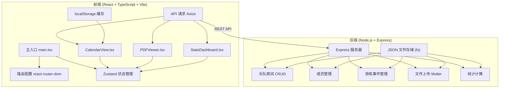
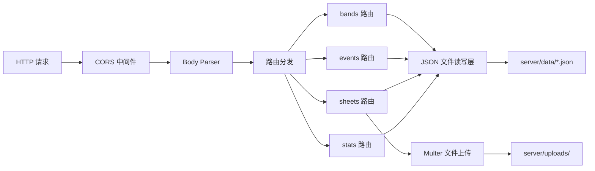
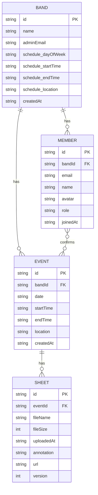

## 1. 架构设计



## 2. 技术描述

- **前端**：React@18 + TypeScript@5 + Vite@5 + Zustand@4 + react-router-dom@6 + axios@1 + react-pdf@7
- **后端**：Node.js + Express@4 + cors@2 + uuid@9 + body-parser@1.20 + multer@1.4
- **数据存储**：JSON 文件（通过 fs 模块读写）
- **构建工具**：Vite
- **状态管理**：Zustand
- **HTTP 客户端**：Axios

## 3. 目录结构

```
auto36/
├── .trae/documents/
│   ├── PRD.md
│   └── TechnicalArchitecture.md
├── server/
│   ├── data/
│   │   ├── bands.json
│   │   ├── events.json
│   │   ├── members.json
│   │   └── sheets.json
│   ├── uploads/
│   └── server.js
├── src/
│   ├── components/
│   │   ├── CalendarView.tsx
│   │   ├── PDFViewer.tsx
│   │   └── StatsDashboard.tsx
│   ├── store/
│   │   └── appStore.ts
│   ├── main.tsx
│   └── index.css
├── index.html
├── vite.config.ts
├── tsconfig.json
└── package.json
```

## 4. 路由定义

| 前端路由 | 页面/组件 | 功能说明 |
|---------|----------|----------|
| / | CalendarView + StatsDashboard | 主页面，显示日历和统计看板 |
| /band/:bandId | CalendarView | 指定乐队房间视图 |

## 5. API 定义

### 5.1 乐队房间管理

```typescript
// GET /api/bands - 获取所有乐队
interface Band {
  id: string;
  name: string;
  adminEmail: string;
  members: Member[];
  schedule: WeeklySchedule;
  createdAt: string;
}

interface WeeklySchedule {
  dayOfWeek: number; // 0-6, 0=周日
  startTime: string; // "19:00"
  endTime: string; // "21:00"
  location: string;
}

// POST /api/bands - 创建乐队
// 请求体: { name, adminEmail, schedule }

// PUT /api/bands/:id - 更新乐队信息
// DELETE /api/bands/:id - 删除乐队
```

### 5.2 成员管理

```typescript
// GET /api/bands/:bandId/members - 获取成员列表
interface Member {
  id: string;
  email: string;
  name: string;
  avatar: string;
  role: 'admin' | 'member';
  joinedAt: string;
}

// POST /api/bands/:bandId/members - 邀请成员
// 请求体: { email, name }
```

### 5.3 排练事件管理

```typescript
// GET /api/bands/:bandId/events?month=YYYY-MM - 获取月度排练事件
interface RehearsalEvent {
  id: string;
  bandId: string;
  date: string; // "2024-01-15"
  startTime: string;
  endTime: string;
  location: string;
  confirmedMembers: string[]; // member ids
  sheets: Sheet[];
  createdAt: string;
}

// PUT /api/events/:id/confirm - 确认/取消参与
// 请求体: { memberId, confirmed: boolean }

// PUT /api/events/:id - 更新事件（地点等）
// 请求体: { location }
```

### 5.4 乐谱管理

```typescript
// POST /api/events/:eventId/sheets - 上传乐谱
// multipart/form-data: file, annotation

interface Sheet {
  id: string;
  eventId: string;
  fileName: string;
  fileSize: number;
  uploadedAt: string;
  annotation: string;
  url: string;
  version: number;
}

// GET /api/sheets/:id - 获取乐谱（用于预览，禁止下载）
```

### 5.5 统计接口

```typescript
// GET /api/bands/:bandId/stats?month=YYYY-MM - 获取统计数据
interface BandStats {
  totalRehearsals: number;
  averageAttendanceRate: number;
  memberStats: MemberStat[];
}

interface MemberStat {
  memberId: string;
  memberName: string;
  totalHours: number;
  attendanceCount: number;
  attendanceRate: number;
}
```

## 6. 服务器架构



## 7. 数据模型

### 7.1 ER 图



### 7.2 缓存策略

- **日历数据缓存**：key = `calendar_${bandId}_${month}`，有效期 5 分钟
- **缓存检查时机**：切换月份时先检查 localStorage，未过期则直接使用
- **PDF懒加载**：用户点击"查看乐谱"按钮时才初始化 PDFViewer 并加载文件

## 8. 性能优化措施

1. 组件级代码分割 + 懒加载
2. localStorage 缓存日历数据（5分钟 TTL）
3. PDF 预览器按需加载
4. 防抖处理月份切换
5. 图片资源优化（使用 SVG 图标）
6. CSS 变量 + 批量样式更新
