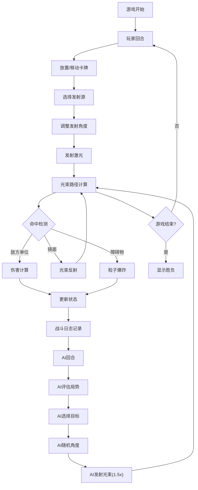

## 1. 产品概述

"光痕对决"是一款结合卡牌战斗与光束反射物理机制的策略对战游戏。玩家在8x8棋盘上放置和移动英雄卡牌，通过调整光束发射器角度发射激光，利用镜面反射攻击对手单位和基地，体验策略深度与视觉冲击力兼具的对战乐趣。

- 核心玩法：卡牌放置移动 + 光束角度调节 + 反射物理计算
- 目标用户：策略游戏爱好者、卡牌对战玩家
- 市场价值：创新融合物理机制的卡牌对战，提供独特的策略体验

## 2. 核心功能

### 2.1 用户角色
| 角色 | 注册方式 | 核心权限 |
|------|----------|----------|
| 玩家 | 本地启动 | 放置卡牌、移动单位、发射光束、对战AI |
| AI对手 | 内置 | 自动评估局势、选择目标、随机角度发射 |

### 2.2 功能模块
1. **棋盘系统**：8x8等距视角棋盘、格子交替配色、金色发光边框、基地模型
2. **卡牌系统**：英雄卡牌数据、全息头像渲染、拖拽移动、拖尾光效
3. **战斗系统**：光束发射、角度选择器、反射计算、伤害计算、粒子爆炸
4. **AI系统**：局势评估、目标选择、角度决策、1.5倍速动画
5. **状态面板**：回合信息、卡牌列表、血条能量条、战斗日志

### 2.3 页面详情
| 页面名称 | 模块名称 | 功能描述 |
|----------|----------|----------|
| 主游戏界面 | 棋盘渲染 | 8x8等距棋盘、格子交替、金色边框动画、基地模型 |
| 主游戏界面 | 卡牌交互 | 点击放置、拖拽移动、全息头像、呼吸光晕、拖尾特效 |
| 主游戏界面 | 光束战斗 | 扇形角度选择器、激光发射、镜面反射、粒子爆炸 |
| 主游戏界面 | 状态面板 | 回合显示、双方卡牌列表、血条能量条、战斗日志滚动 |
| 主游戏界面 | AI对战 | 自动决策、优先攻击低血量单位、1.5倍速动画 |

## 3. 核心流程

玩家与AI轮流进行回合，每回合可执行一次移动和一次攻击。攻击时选择发射源，调整角度后发射激光，光束沿路径传播，遇敌方单位造成伤害，遇镜面卡牌反射，遇障碍物消失。

## 4. 用户界面设计

### 4.1 设计风格
- **主色调**：深灰 #2c3e50、浅灰 #34495e、金色 #f1c40f、蓝色 #3498db、红色 #e74c3c、亮蓝 #00d4ff
- **视觉风格**：科技感、全息投影、光束特效、粒子效果
- **字体**：使用科幻感字体搭配清晰易读的正文
- **布局**：左侧棋盘为主区域，右侧240px状态面板
- **动画**：呼吸光晕、光束辉光、粒子爆炸、边框发光、拖尾效果

### 4.2 页面设计概述
| 页面名称 | 模块名称 | UI元素 |
|----------|----------|--------|
| 主游戏界面 | 棋盘区域 | 8x8等距格子、深/浅灰交替、金色发光边框、悬浮基地模型 |
| 主游戏界面 | 卡牌组件 | 半透明全息头像、0.8单位大小、阵营配色、呼吸光晕动画 |
| 主游戏界面 | 角度选择器 | 半透明扇形、0-360度、5度步长、确认按钮 |
| 主游戏界面 | 激光效果 | 2px宽度 #00d4ff、3px辉光模糊、反射变细变淡 |
| 主游戏界面 | 状态面板 | 240px宽度、半透明黑 #000000 0.7、圆角12px |
| 主游戏界面 | 血条系统 | 绿色血条、低于30%红色闪烁、蓝色能量条 |
| 主游戏界面 | 战斗日志 | 0.75rem字体、#bdc3c7颜色、时间戳、死亡记录高亮 |

### 4.3 响应式
- 桌面端优先设计，保持固定棋盘尺寸
- 状态面板固定右侧，不随窗口缩放变形
- 最小窗口尺寸支持1024x768

### 4.4 3D场景指引
- **环境**：深色科技感背景，棋盘悬浮感
- **光照**：光束自发光效果，卡牌边缘发光
- **相机**：等距视角(45度)，固定距离
- **后处理**：辉光效果、轻微泛光
- **性能预算**：维持30FPS以上，光束和粒子动画优化
