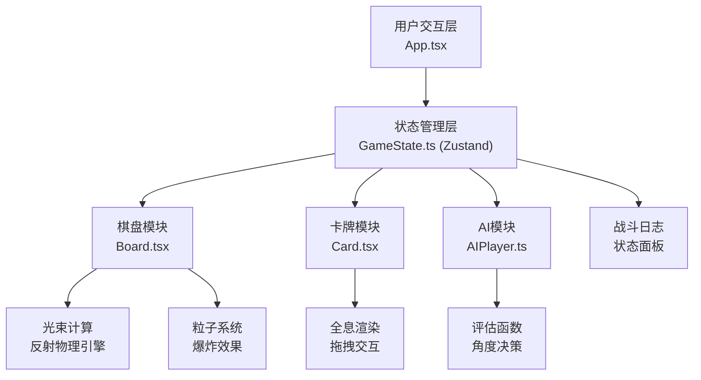

## 1. 架构设计



## 2. 技术描述

- **前端框架**：React@18 + TypeScript + Vite
- **状态管理**：Zustand
- **样式方案**：CSS Modules + 内联样式动画
- **图标库**：lucide-react
- **唯一ID**：uuid
- **2D渲染**：Canvas API / SVG (光束和粒子效果)
- **动画**：requestAnimationFrame + CSS Keyframes

## 3. 目录结构

```
src/
├── App.tsx              # 主组件，整合所有模块
├── Board.tsx            # 棋盘模块：8x8棋盘、光束计算、反射模拟
├── Card.tsx             # 卡牌模块：数据结构、全息渲染、拖拽
├── AIPlayer.ts          # AI模块：评估函数、角度决策
├── GameState.ts         # 状态管理：Zustand store
├── main.tsx             # 入口文件
└── index.css            # 全局样式
```

## 4. 数据模型

### 4.1 核心类型定义

```typescript
// 阵营
type Faction = 'player' | 'enemy';

// 卡牌类型
type CardType = 'hero' | 'mirror' | 'obstacle' | 'base';

// 位置
interface Position {
  x: number; // 0-7
  y: number; // 0-7
}

// 卡牌数据
interface Card {
  id: string;
  type: CardType;
  faction: Faction;
  position: Position;
  hp: number;
  maxHp: number;
  attack: number; // 1-3
  defense: number;
  energy: number;
  maxEnergy: number;
  name: string;
  avatar: string; // emoji 或颜色标识
  isMirror?: boolean;
}

// 光束路径点
interface BeamPoint {
  x: number;
  y: number;
  reflectionCount: number;
}

// 光束记录
interface BeamRecord {
  id: string;
  sourceId: string;
  path: BeamPoint[];
  angle: number;
  timestamp: number;
  hits: string[]; // 命中的卡牌ID
}

// 战斗日志
interface LogEntry {
  id: string;
  timestamp: string;
  message: string;
  type: 'info' | 'damage' | 'death' | 'turn';
  isDeleted?: boolean;
}

// 游戏状态
interface GameState {
  turn: number;
  currentPlayer: Faction;
  phase: 'place' | 'move' | 'attack' | 'aim' | 'ai' | 'gameover';
  cards: Card[];
  selectedCardId: string | null;
  beamRecords: BeamRecord[];
  logs: LogEntry[];
  hasMoved: boolean;
  hasAttacked: boolean;
  aimAngle: number;
  winner: Faction | null;
}
```

### 4.2 状态管理 (Zustand)

```typescript
import { create } from 'zustand';
import { v4 as uuidv4 } from 'uuid';

const useGameStore = create<GameState & Actions>((set, get) => ({
  // 初始状态...
  // Actions: placeCard, moveCard, attack, calculateBeamPath, 
  // nextTurn, addLog, selectCard, setAimAngle, etc.
}));
```

## 5. 核心算法

### 5.1 光束反射计算

```
输入：发射位置(x,y)、角度(0-360度)、当前棋盘状态
输出：光束路径点数组、命中卡牌列表

算法：
1. 将角度转换为方向向量 (dx, dy)
2. 初始化当前位置为发射位置
3. 循环最多8步（棋盘对角线距离）：
   a. 沿方向步进一个单位
   b. 检查是否超出棋盘边界 → 终止
   c. 检查当前位置卡牌：
      - 敌方单位 → 记录命中，造成伤害，终止
      - 镜面卡牌 → 计算反射方向（法线反射），反射次数+1，超过3次则终止
      - 障碍物 → 终止，产生粒子爆炸
      - 己方单位 → 穿过（不造成伤害）
4. 返回路径和命中列表
```

### 5.2 伤害计算

```
伤害 = 攻击力(1-3) - 防御力
最小伤害 = 1
```

### 5.3 AI 决策

```
评估函数：
1. 找出所有己方卡牌和基地
2. 找出所有敌方单位，按血量升序排序
3. 优先选择血量最低的敌方单位作为目标
4. 计算从发射源到目标的直线角度
5. 有30%概率故意偏移15-45度制造反射机会
6. 随机选择一个己方发射源（卡牌或基地）
```

## 6. 性能优化

- **帧率控制**：requestAnimationFrame 循环，目标 60FPS，最低保证 30FPS
- **光束计算**：使用向量数学，避免复杂碰撞检测
- **粒子系统**：对象池复用，最大粒子数限制为 50
- **重绘优化**：仅在光束和动画期间重绘 Canvas，静态元素使用 DOM
- **AI 决策**：限制计算时间 < 1秒，使用 setTimeout 异步执行

## 7. 配置文件

### package.json
- react, react-dom, typescript, vite, @vitejs/plugin-react, zustand, uuid, lucide-react

### vite.config.ts
- React 插件
- 端口 5173

### tsconfig.json
- 严格模式
- JSX: react-jsx
- 目标 ES2020
