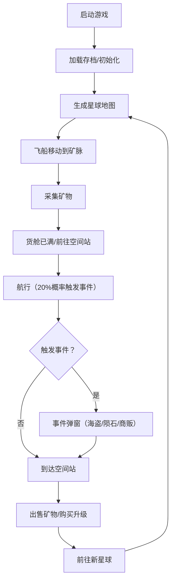

## 1. 产品概述
星轨矿脉是一款2D太空资源采集与贸易模拟游戏，玩家驾驶飞船在不同星球间航行、采集矿物、升级飞船部件，并在空间站进行贸易，同时应对随机遭遇的太空海盗和陨石风暴事件。

- **主要目标**：提供沉浸式的太空探索与资源管理游戏体验，结合策略性贸易和随机事件元素
- **目标用户**：喜欢模拟经营、资源管理和太空探索题材的休闲/核心玩家
- **产品价值**：融合采集、升级、贸易、随机事件等多种玩法，创造丰富的游戏循环和重玩价值

## 2. 核心功能

### 2.1 功能模块
1. **星球探索模块**：随机生成星球地图（地形、矿物分布、天气），管理矿脉刷新
2. **飞船管理模块**：管理引擎、货舱、护盾属性，处理航行燃料消耗
3. **贸易系统模块**：空间站商品价格波动（供需模型），交易结算逻辑
4. **事件系统模块**：随机事件生成（海盗、陨石、商贩），触发战斗/救援交互
5. **UI渲染模块**：游戏主画布、HUD面板、交易界面、事件弹窗
6. **持久化模块**：localStorage自动保存与加载

### 2.2 页面详情
| 页面名称 | 模块名称 | 功能描述 |
|-----------|-------------|---------------------|
| 游戏主界面 | 游戏画布 | 渲染星球地图、飞船位置、矿脉点、动画效果 |
| 游戏主界面 | HUD面板 | 显示飞船状态（耐久/燃料/护盾）、矿物背包、航行时间 |
| 游戏主界面 | 交易弹窗 | 空间站交易界面，物品列表与玩家背包，买卖操作 |
| 游戏主界面 | 事件弹窗 | 随机事件弹窗，玩家选择处理方式 |
| 游戏主界面 | 升级界面 | 飞船部件升级，消耗特定矿物 |

## 3. 核心流程
玩家开始游戏 → 生成初始星球 → 驾驶飞船前往矿脉采集矿物 → 航行至空间站出售矿物获取金币 → 使用金币/矿物升级飞船部件 → 航行至新星球探索 → 随机遭遇事件并处理 → 循环游戏

## 4. 用户界面设计

### 4.1 设计风格
- **整体风格**：暗色科幻风格，深空主题
- **主背景**：深空蓝黑渐变（#0a0e27到#1a1a2e），星空粒子缓慢飘动
- **主色调**：深空蓝 #0a0e27、金属灰 #2c3e50、科技蓝 #00ccff
- **强调色**：铁矿红 #ff4444、铜矿金 #ffaa00、钛冰蓝 #00ccff
- **毛玻璃效果**：面板使用 rgba(255,255,255,0.05) 背景配合 backdrop-filter
- **按钮样式**：圆角边框，悬停缩放效果，脉冲光效
- **字体**：Orbitron（标题/数字）+ Noto Sans SC（正文）
- **图标**：Lucide React 图标库

### 4.2 页面设计概述
| 页面名称 | 模块名称 | UI元素 |
|-----------|-------------|-------------|
| 游戏主界面 | 游戏画布 | 星球地形渲染（山脉#2c3e50/平原#d4a76a/冰原#e0f7fa），矿脉发光点，飞船位置，粒子动画 |
| 游戏主界面 | HUD面板 | 左上角悬浮，耐久条、燃料条、护盾条、矿物图标（铁/铜/钛冰）、航行时间 |
| 游戏主界面 | 交易弹窗 | 左侧商品价格列表，右侧玩家背包，买卖按钮，飞船升级选项 |
| 游戏主界面 | 事件弹窗 | 居中显示，背景模糊，事件图标（海盗红轮廓/商贩金轮廓），选项按钮脉冲效果 |

### 4.3 响应性
- 桌面端优先，Canvas自适应窗口大小
- HUD面板使用固定定位，确保在各种分辨率下可见
- 弹窗使用相对视口居中定位

### 4.4 性能要求
- 游戏循环稳定60fps
- 矿物采集粒子动画每帧渲染时间≤0.5ms
- 事件触发逻辑执行时间≤5ms
- 页面首次加载时间≤2秒
- 所有交互响应时间≤100ms

## 5. 游戏核心规则

### 5.1 矿物系统
- **矿物类型**：铁矿（红色#ff4444）、铜矿（金色#ffaa00）、钛冰（蓝色#00ccff）
- **矿脉分布**：受地形影响，山脉多铁矿、平原多铜矿、冰原多钛冰
- **矿脉数量**：每个星球3-5个矿脉刷新点
- **采集规则**：只能采集距离飞船最近的矿脉

### 5.2 飞船升级系统
- **引擎升级**：提升航行速度，降低燃料消耗速率
- **货舱升级**：提升容量上限，可装备扩容模块
- **护盾升级**：提升防御值，持续10秒，冷却30秒
- **升级消耗**：特定数量的矿物 + 金币

### 5.3 贸易系统
- **价格波动**：基于供需模型，第一次运输某种矿物价格最高
- **价格衰减**：每次运输后价格逐步下降，最多降40%
- **交易地点**：空间站，金属质感建筑（#7f8c8d到#bdc3c7渐变）

### 5.4 事件系统
- **触发概率**：每次航行20%
- **海盗袭击**：要求交出50%矿物，可拒绝开战（护盾减半），燃料>30%可逃跑
- **陨石风暴**：所有部件耐久下降5%
- **星际商贩**：稀有矿物1:3兑换普通矿物

### 5.5 持久化系统
- **保存时机**：每5分钟自动保存
- **保存内容**：当前星球、飞船状态、矿物背包、事件记录
- **加载时机**：游戏启动时自动加载
