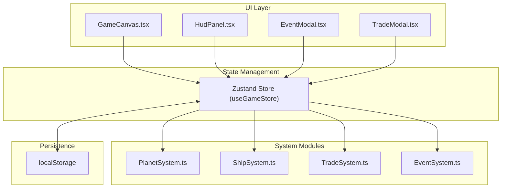
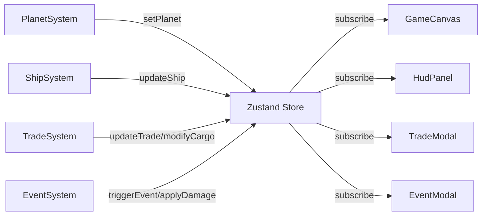

## 1. 架构设计



## 2. 技术栈说明

- **前端框架**：React 18 + TypeScript 5
- **构建工具**：Vite 5
- **状态管理**：Zustand 4
- **唯一ID生成**：uuid 9
- **图标库**：lucide-react
- **样式方案**：TailwindCSS 3 + CSS Variables
- **渲染方案**：HTML5 Canvas API

## 3. 项目结构

```
e:\solo\SoloAutoDemo\tasks\auto40/
├── package.json
├── index.html
├── vite.config.ts
├── tsconfig.json
├── tailwind.config.js
├── postcss.config.js
└── src/
    ├── main.tsx                 # 应用入口
    ├── App.tsx                  # 根组件
    ├── index.css                # 全局样式
    ├── store/
    │   └── useGameStore.ts      # Zustand全局状态管理
    ├── types/
    │   └── game.ts              # 类型定义
    ├── planet/
    │   └── PlanetSystem.ts      # 星球生成与矿脉管理
    ├── ship/
    │   └── ShipSystem.ts        # 飞船属性管理
    ├── trade/
    │   └── TradeSystem.ts       # 贸易系统
    ├── events/
    │   └── EventSystem.ts       # 事件系统
    ├── components/
    │   ├── GameCanvas.tsx       # 游戏主画布
    │   ├── HudPanel.tsx         # HUD面板
    │   ├── TradeModal.tsx       # 交易弹窗
    │   ├── EventModal.tsx       # 事件弹窗
    │   └── UpgradePanel.tsx     # 升级面板
    └── utils/
        └── persistence.ts       # 持久化工具
```

## 4. 数据模型

### 4.1 核心类型定义

```typescript
// 矿物类型
type MineralType = 'iron' | 'copper' | 'titaniumIce';

// 地形类型
type TerrainType = 'mountain' | 'plain' | 'iceField';

// 矿脉接口
interface MineralVein {
  id: string;
  type: MineralType;
  x: number;
  y: number;
  amount: number;
  maxAmount: number;
  respawnTime: number;
}

// 星球接口
interface Planet {
  id: string;
  name: string;
  terrain: TerrainType;
  veins: MineralVein[];
  weather: string;
  width: number;
  height: number;
}

// 飞船部件接口
interface ShipPart {
  level: number;
  maxLevel: number;
  upgradeCost: { minerals: Record<MineralType, number>; credits: number };
}

// 飞船接口
interface Ship {
  x: number;
  y: number;
  speed: number;
  hull: number;
  maxHull: number;
  fuel: number;
  maxFuel: number;
  shield: number;
  maxShield: number;
  shieldActive: boolean;
  shieldCooldown: number;
  shieldDuration: number;
  cargo: Record<MineralType, number>;
  cargoCapacity: number;
  parts: {
    engine: ShipPart;
    cargo: ShipPart;
    shield: ShipPart;
  };
}

// 贸易记录
interface TradeRecord {
  mineralType: MineralType;
  sellCount: number;
  basePrice: number;
  currentPriceMultiplier: number;
}

// 事件类型
type EventType = 'pirate' | 'meteor' | 'trader';

// 游戏事件接口
interface GameEvent {
  id: string;
  type: EventType;
  title: string;
  description: string;
  options: EventOption[];
}

interface EventOption {
  id: string;
  label: string;
  action: () => void;
}

// 游戏状态
interface GameState {
  planet: Planet | null;
  ship: Ship;
  credits: number;
  tradeRecords: TradeRecord[];
  currentEvent: GameEvent | null;
  showTradeModal: boolean;
  showUpgradeModal: boolean;
  travelTime: number;
  isPaused: boolean;
  isAtStation: boolean;
}
```

### 4.2 状态管理数据流



## 5. 模块接口定义

### 5.1 PlanetSystem
```typescript
// 生成随机星球
generatePlanet(): Planet;

// 刷新矿脉
refreshVeins(planet: Planet): MineralVein[];

// 获取距离飞船最近的矿脉
getNearestVein(planet: Planet, shipX: number, shipY: number): MineralVein | null;

// 采集矿物
mineVein(vein: MineralVein, amount: number): { success: boolean; mined: number };
```

### 5.2 ShipSystem
```typescript
// 移动飞船
moveShip(ship: Ship, targetX: number, targetY: number, deltaTime: number): Ship;

// 添加货物
addCargo(ship: Ship, type: MineralType, amount: number): Ship;

// 移除货物
removeCargo(ship: Ship, type: MineralType, amount: number): Ship;

// 计算货物总量
getTotalCargo(cargo: Record<MineralType, number>): number;

// 应用伤害
applyDamage(ship: Ship, damage: number): Ship;

// 消耗燃料
consumeFuel(ship: Ship, amount: number): Ship;

// 激活护盾
activateShield(ship: Ship): Ship;

// 升级部件
upgradePart(ship: Ship, part: 'engine' | 'cargo' | 'shield'): Ship;
```

### 5.3 TradeSystem
```typescript
// 计算当前价格
calculatePrice(mineralType: MineralType, tradeRecords: TradeRecord[]): number;

// 出售矿物
sellMineral(
  mineralType: MineralType,
  amount: number,
  tradeRecords: TradeRecord[]
): { credits: number; updatedRecords: TradeRecord[] };

// 购买升级
purchaseUpgrade(
  partType: 'engine' | 'cargo' | 'shield',
  currentLevel: number,
  credits: number,
  cargo: Record<MineralType, number>
): { success: boolean; remainingCredits: number; remainingCargo: Record<MineralType, number> };
```

### 5.4 EventSystem
```typescript
// 检查是否触发事件
shouldTriggerEvent(probability: number): boolean;

// 生成随机事件
generateEvent(ship: Ship): GameEvent;

// 处理海盗事件
handlePirateEvent(ship: Ship, option: 'surrender' | 'fight' | 'flee'): { ship: Ship; message: string };

// 处理陨石事件
handleMeteorEvent(ship: Ship): Ship;

// 处理商贩事件
handleTraderEvent(
  ship: Ship,
  giveType: MineralType,
  receiveType: MineralType,
  amount: number
): { ship: Ship; success: boolean };
```

## 6. 性能优化策略

1. **Canvas渲染优化**：
   - 使用 requestAnimationFrame 实现60fps游戏循环
   - 离屏Canvas预渲染静态元素（地形、背景）
   - 粒子系统对象池复用，避免频繁GC

2. **状态更新优化**：
   - Zustand 选择器订阅，避免不必要的重渲染
   - 使用 Immer 进行不可变状态更新
   - 节流/防抖处理高频操作

3. **资源加载优化**：
   - 字体预加载
   - 按需加载非核心模块
   - 图片资源使用WebP格式

4. **持久化优化**：
   - 防抖保存，避免频繁IO
   - 增量保存，只更新变化的字段
   - 压缩存储数据

## 7. 性能指标

| 指标 | 目标值 |
|------|--------|
| 游戏循环帧率 | 60fps |
| 单帧渲染时间 | ≤16ms |
| 粒子动画每帧耗时 | ≤0.5ms |
| 事件处理时间 | ≤5ms |
| 首屏加载时间 | ≤2s |
| 交互响应时间 | ≤100ms |
| Bundle体积 | ≤500KB gzipped |
