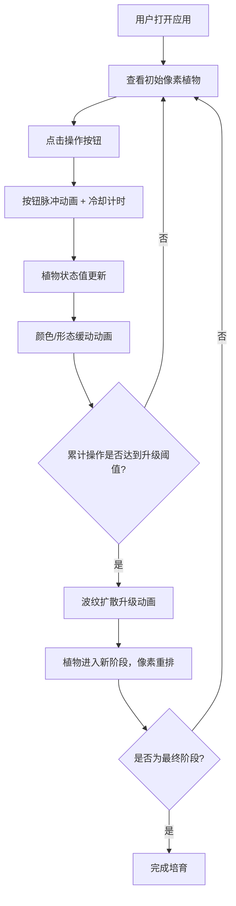

## 1. 产品概述

光合精灵是一款将植物生长模拟与交互式像素艺术相结合的数字盆栽应用。用户通过浇水、光照、施肥等操作，在数字花盆中培育出形态和颜色实时变化的像素风植物。

- 核心价值：提供治愈系的交互体验，让用户在像素艺术的美学中感受虚拟植物生长的乐趣
- 目标用户：喜欢像素艺术、治愈系游戏和轻交互应用的年轻用户群体

## 2. 核心功能

### 2.1 功能模块

1. **主页面**：像素植物展示区、生长进度条、阶段名称标签、状态面板、操作控制区

### 2.2 页面详情

| 页面名称 | 模块名称 | 功能描述 |
|-----------|-------------|---------------------|
| 主页面 | 像素植物网格 | 24x24像素网格展示植物，根部埋在棕色土壤区，茎叶根据状态动态变化形态和颜色，所有变化有0.8秒缓动动画 |
| 主页面 | 生长进度条 | 左上角200px宽度进度条，渐变填充，实时显示当前阶段进度 |
| 主页面 | 阶段名称标签 | 植物当前阶段名称，16px字体，居中显示 |
| 主页面 | 状态面板 | 右侧显示水分、光照、肥料数值，进度条样式，各自对应蓝黄绿配色 |
| 主页面 | 操作控制区 | 底部三个操作按钮（浇水/光照/施肥），带冷却进度条和脉冲动画 |

## 3. 核心流程

用户打开应用 → 查看初始阶段的像素植物 → 点击操作按钮（浇水/光照/施肥）→ 按钮触发脉冲动画并进入冷却 → 植物状态（水分/光照/肥料）更新 → 植物颜色/形态实时变化并播放缓动动画 → 累计操作达到升级阈值 → 播放波纹扩散升级动画 → 植物进入新阶段，像素阵列重新排列 → 循环培育直至最终阶段

## 4. 用户界面设计

### 4.1 设计风格
- **主色调**：柔和渐变背景 #a8e6cf → #dcedc1，土壤棕 #8B4513，植物绿 #7ec850/#4caf50
- **按钮配色**：浇水蓝 #2196F3、光照橙 #FF9800、施肥绿 #4CAF50
- **状态进度条**：水分蓝 #4fc3f7、光照黄 #fff176、肥料绿 #81c784
- **按钮样式**：圆角12px，带圆形冷却进度条，脉冲缩放动画
- **字体**：现代无衬线字体，16px阶段标签
- **动画风格**：cubic-bezier(0.4, 0, 0.2, 1) 缓动曲线，0.8秒状态变化，0.2秒按钮脉冲，0.6秒升级波纹

### 4.2 页面设计概述

| 页面名称 | 模块名称 | UI元素 |
|-----------|-------------|-------------|
| 主页面 | 像素植物区 | 24x24网格，16px像素格，SVG/Canvas渲染，柔和渐变背景，棕色土壤带，植物动画 |
| 主页面 | 进度条区 | 200px×12px渐变进度条，阶段名称居中 |
| 主页面 | 状态面板 | 三条16px高进度条（圆角4px），水分/光照/肥料标签和数值 |
| 主页面 | 控制按钮区 | 三个带图标的圆角按钮，冷却圆形进度条，脉冲缩放动画 |

### 4.3 响应式设计
- **移动端优先**，320px宽度断点
- 移动端：按钮竖向排列，状态面板隐藏为可滑动抽拉层，像素格缩小至12px
- 桌面端：按钮横向排列，状态面板常驻显示，像素格16px
- 所有动画保持 ≥30fps 流畅度
