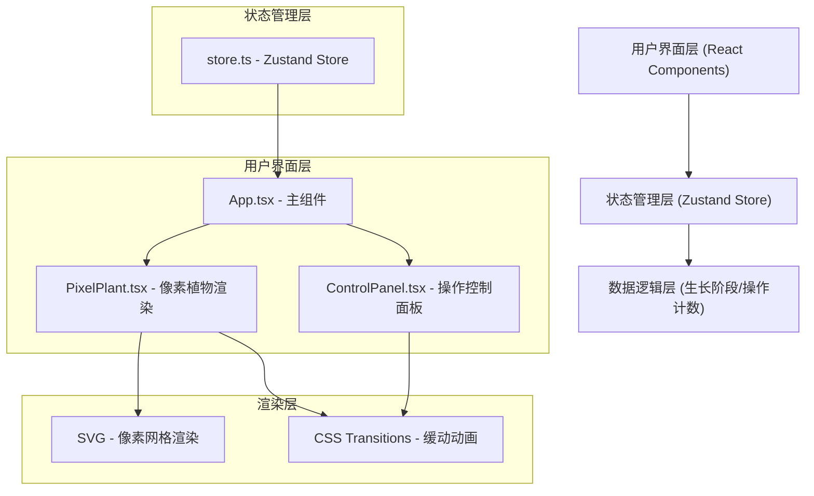

## 1. 架构设计



## 2. 技术说明

- **前端框架**：React 18 + TypeScript 5
- **构建工具**：Vite 5 + @vitejs/plugin-react
- **状态管理**：Zustand 4
- **渲染方案**：SVG（像素网格渲染）+ CSS Transitions（动画）
- **样式方案**：原生 CSS（CSS Modules/内联样式）
- **响应式**：CSS Media Queries，移动端优先（320px 断点）

## 3. 文件结构

```
├── package.json          # 项目依赖与脚本
├── index.html            # 入口 HTML
├── vite.config.ts        # Vite 构建配置
├── tsconfig.json         # TypeScript 配置（严格模式）
└── src/
    ├── App.tsx           # 主组件，组合所有子组件
    ├── PixelPlant.tsx    # 像素植物网格渲染组件
    ├── ControlPanel.tsx  # 底部操作按钮组件
    └── store.ts          # Zustand 状态管理
```

## 4. 数据模型

### 4.1 生长阶段定义

| 阶段 | 名称 | 所需操作次数 | 形态特征 |
|------|------|-------------|---------|
| 1 | 种子萌芽 | 3 | 土壤中露出小芽尖 |
| 2 | 嫩苗初长 | 6 | 两片嫩叶伸展 |
| 3 | 茎叶茁壮 | 10 | 多片叶子，茎干变粗 |
| 4 | 含苞待放 | 15 | 出现花蕾 |
| 5 | 繁花盛开 | 20 | 多朵花朵绽放 |
| 6 | 硕果累累 | 25 | 花朵+果实完全形态 |

### 4.2 状态类型定义

```typescript
type OperationType = 'water' | 'light' | 'fertilizer';

interface PlantState {
  stage: number;           // 当前生长阶段 1-6
  operations: number;      // 当前阶段累计操作次数
  water: number;           // 水分值 0-100
  light: number;           // 光照值 0-100
  fertilizer: number;      // 肥料值 0-100
  cooldowns: {             // 冷却时间戳
    water: number;
    light: number;
    fertilizer: number;
  };
  isUpgrading: boolean;    // 是否正在播放升级动画
}

interface StoreActions {
  performOperation: (type: OperationType) => void;
  isOnCooldown: (type: OperationType) => boolean;
  getCooldownProgress: (type: OperationType) => number;
}
```

## 5. 核心逻辑说明

### 5.1 操作逻辑
- 每个操作（浇水/光照/施肥）将对应属性值增加 20（上限 100）
- 每次操作计数 +1，操作计数达到阶段阈值时触发升级
- 操作后按钮进入 3 秒冷却，冷却期间 opacity 0.5 并显示圆形进度条

### 5.2 植物渲染逻辑
- 24x24 像素网格，每格默认透明
- 根据 stage 生成对应形态的像素数据（位置+基础色）
- 根据 water/light/fertilizer 数值动态调整像素颜色
- 0.8 秒缓动动画（cubic-bezier(0.4, 0, 0.2, 1)）

### 5.3 动画系统
- 状态变化：CSS transition，0.8s，cubic-bezier(0.4, 0, 0.2, 1)
- 按钮点击：脉冲缩放动画，0.2s（scale 1→1.1→1）
- 升级动画：从中心向外的波纹扩散，0.6s
- 冷却进度：圆形进度条，3 秒倒计时
