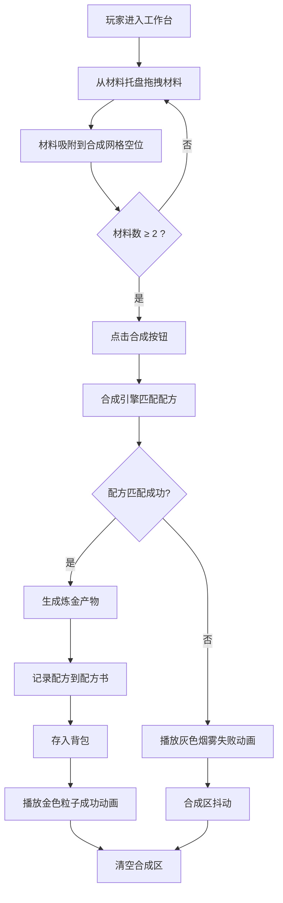

## 1. 产品概述

炼金合成工作台是一款手游核心玩法模块，玩家通过拖拽材料到3x3合成网格，发现和解锁炼金配方，合成各种炼金产物。该模块旨在提供沉浸式的炼金术体验，核心价值在于探索发现的乐趣与策略组合的深度。

- 主要目的：实现材料合成、配方发现与记录、背包管理的完整游戏循环
- 目标用户：手游玩家，喜欢探索、收集和合成类游戏的用户
- 市场价值：作为炼金题材手游的核心玩法支撑，提升游戏可玩性和留存率

## 2. 核心功能

### 2.1 用户角色
| 角色 | 注册方式 | 核心权限 |
|------|---------|---------|
| 玩家 | 游戏内账号 | 进行合成操作、浏览配方书、管理背包 |

### 2.2 功能模块
1. **工作台主界面**：材料托盘、3x3合成网格、合成按钮、动画反馈
2. **配方书模块**：已解锁配方展示、配方详情预览、一键载入材料
3. **背包模块**：物品存储、堆叠管理、物品丢弃、产物入库
4. **合成引擎**：配方匹配算法、材料消耗、产物生成

### 2.3 页面详情
| 页面名称 | 模块名称 | 功能描述 |
|---------|---------|---------|
| 炼金工作台 | 材料托盘 | 展示20种基础材料，支持拖拽操作 |
| 炼金工作台 | 合成区 | 3x3网格接收拖拽材料，吸附动画，合成按钮 |
| 炼金工作台 | 配方书标签页 | 卡片网格展示已解锁配方，点击预览，一键载入 |
| 炼金工作台 | 背包标签页 | 4列网格展示物品，支持堆叠、悬停提示、丢弃 |
| 合成反馈 | 成功动画 | 金色粒子特效，屏幕边缘光晕闪烁三次 |
| 合成反馈 | 失败动画 | 灰色烟雾爆炸，合成区抖动 |

## 3. 核心流程

玩家从左侧材料托盘拖拽材料到中央3x3合成网格，材料自动吸附到最近空位。当放入至少2份材料后，点击合成按钮触发合成引擎。引擎根据材料类型和数量进行配方匹配：匹配成功则生成产物并记录配方，播放金色粒子成功动画；匹配失败则播放灰色烟雾失败动画，材料消失。所有合成产物自动存入背包，玩家可通过配方书查看已发现配方并一键载入材料。

## 4. 用户界面设计

### 4.1 设计风格
- 主背景色：#1a1a2e（深蓝紫暗色）
- 辅助背景：#16213e（深蓝色）
- 强调色1：#e94560（炼金红）
- 强调色2：#ffd700（炼金金）
- 卡片背景：#2e2e2e（深灰）
- 字体：Cinzel（标题装饰字体）+ Noto Sans SC（正文）
- 按钮风格：圆角8px，金色边框渐变，悬停发光效果
- 布局：三栏式桌面布局，小屏自动堆叠
- 图标风格：炼金术符号emoji + 渐变圆形背景

### 4.2 页面设计概述
| 页面名称 | 模块名称 | UI元素 |
|---------|---------|--------|
| 炼金工作台 | 材料托盘 | 宽度220px，56x56px圆形图标，类型渐变背景，拖拽阴影 |
| 炼金工作台 | 合成区 | 640x480px，3x3暗色网格，格子线#444，交叉点微光呼吸 |
| 炼金工作台 | 右侧面板 | 宽度280px，标签页切换（配方书/背包） |
| 配方书卡片 | 卡片样式 | 200x260px，圆角12px，背景#2e2e2e，边缘发光#ffd700 |
| 背包格子 | 格子样式 | 每行4个，60x60px，圆角8px，悬停显示名称数量 |
| 合成按钮 | 交互样式 | 金色渐变背景，悬停发光，点击涟漪效果 |

### 4.3 响应式设计
- 桌面端（≥1280x720）：三栏并排布局（220px + 弹性中间 + 280px）
- 中屏（800x600 ~ 1280x720）：保持三栏，元素等比例缩小
- 小屏（<800x600）：三栏自动堆叠为上下布局，材料托盘在上，合成区居中，右侧面板在下

### 4.4 动画与反馈
- 材料吸附动画：200ms ease-out
- 材料拖拽：半透明阴影跟随（模糊8px），放置高亮0.2s
- 合成成功：金色粒子1秒，屏幕边缘光晕闪烁3次（每次0.5s）
- 合成失败：灰色烟雾扩散0.8秒，合成区抖动3次（位移3px，每次0.1s）
- 配方卡片一键载入：0.5秒材料填充动画
- 通用缓动曲线：cubic-bezier(0.4, 0, 0.2, 1)，最长不超过0.6s
