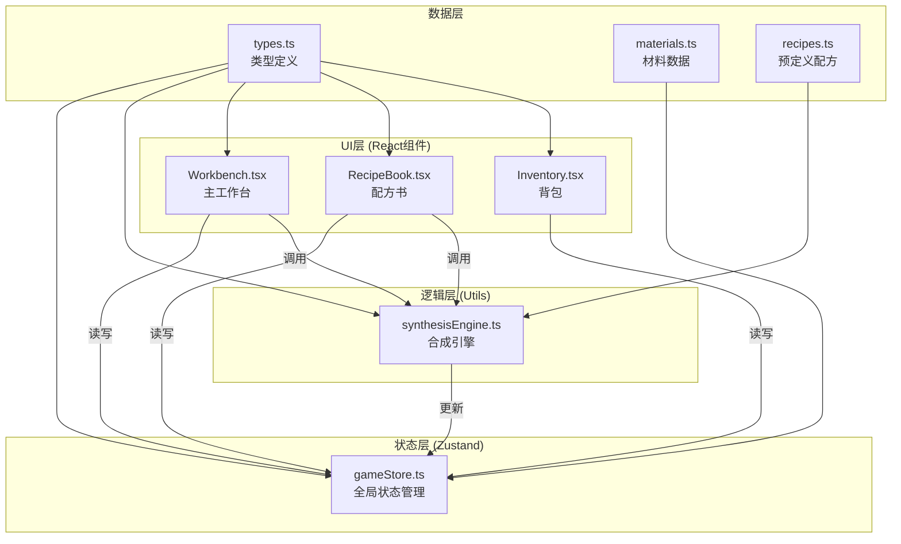
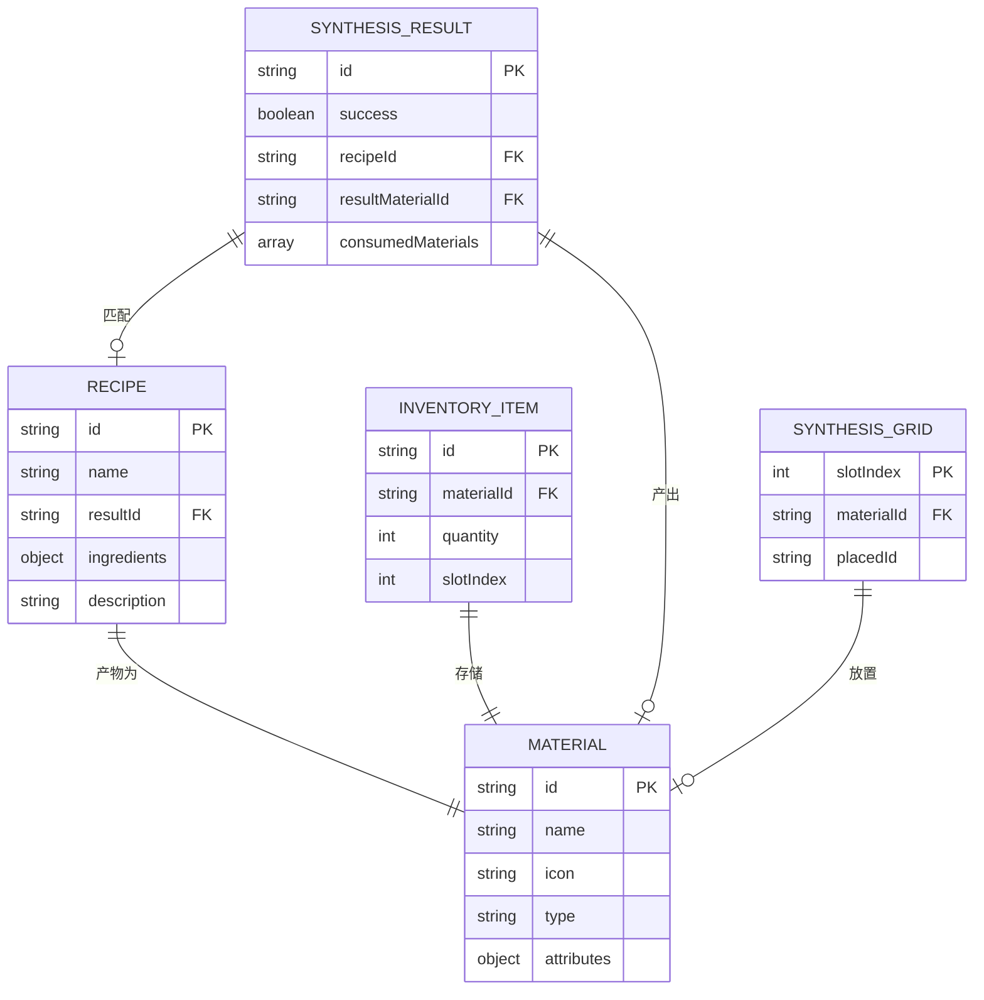

## 1. 架构设计



**文件间调用关系与数据流向：**
1. types.ts → 定义核心类型（Material/Recipe/SynthesisResult），被所有模块引用
2. materials.ts → 预定义20种材料数据，注入gameStore初始状态
3. gameStore.ts → 管理材料清单、合成区、配方、背包库存，所有组件读写
4. synthesisEngine.ts → 从gameStore读取合成区材料，匹配配方后写回状态
5. Workbench.tsx → 读取gameStore渲染UI，调用合成引擎，监听结果更新
6. RecipeBook.tsx → 读取已发现配方，一键载入材料到gameStore合成区
7. Inventory.tsx → 读取背包数据，处理物品丢弃和堆叠管理

## 2. 技术描述
- **前端框架**：React 18 + TypeScript 5 + Vite 5
- **构建工具**：Vite 5 + @vitejs/plugin-react
- **状态管理**：Zustand 4（轻量、高性能的全局状态管理）
- **唯一ID生成**：uuid（生成合成实例、背包物品ID）
- **样式方案**：原生CSS Modules + CSS变量（动画性能最优）
- **初始化方式**：Vite React-TS 模板手动配置

## 3. 模块文件清单
| 文件路径 | 职责 | 依赖 |
|---------|------|------|
| package.json | 项目依赖与脚本配置 | - |
| index.html | Vite入口HTML | - |
| vite.config.ts | Vite构建配置 | - |
| tsconfig.json | TypeScript严格模式配置 | - |
| src/types.ts | Material/Recipe/SynthesisResult类型定义 | - |
| src/data/materials.ts | 20种基础材料预定义数据 | src/types.ts |
| src/data/recipes.ts | 预定义炼金配方数据 | src/types.ts |
| src/store/gameStore.ts | Zustand全局状态（材料/合成区/配方/背包） | src/types.ts, src/data/* |
| src/utils/synthesisEngine.ts | 配方匹配引擎、材料消耗、产物生成 | src/types.ts, src/store/gameStore.ts |
| src/components/Workbench.tsx | 主工作台组件（材料托盘+合成区） | src/store, src/utils |
| src/components/RecipeBook.tsx | 配方书组件 | src/store |
| src/components/Inventory.tsx | 背包组件 | src/store |
| src/components/SynthesisEffects.tsx | 合成成功/失败动画效果组件 | - |
| src/App.tsx | 应用根组件，组合所有模块 | src/components/* |
| src/main.tsx | React入口 | src/App.tsx |
| src/index.css | 全局样式与CSS变量 | - |

## 4. 数据模型

### 4.1 ER图


### 4.2 核心类型定义（TypeScript）

```typescript
// 材料类型
type MaterialType = 'element' | 'plant' | 'mineral' | 'essence' | 'metal';

interface Material {
  id: string;
  name: string;
  icon: string;
  type: MaterialType;
  attributes: Record<string, number>;
  rarity: 'common' | 'rare' | 'epic' | 'legendary';
}

// 配方材料需求（材料ID -> 数量）
interface RecipeIngredient {
  materialId: string;
  count: number;
}

// 配方定义
interface Recipe {
  id: string;
  name: string;
  ingredients: RecipeIngredient[];
  resultId: string;
  resultQuantity: number;
  description: string;
  discovered: boolean;
}

// 合成区格子
interface GridSlot {
  index: number;
  materialId: string | null;
  placedId: string | null;
}

// 背包物品
interface InventoryItem {
  id: string;
  materialId: string;
  quantity: number;
  slotIndex: number;
}

// 合成结果
interface SynthesisResult {
  id: string;
  success: boolean;
  recipeId: string | null;
  resultMaterialId: string | null;
  resultQuantity: number;
  consumedMaterials: { materialId: string; count: number }[];
  timestamp: number;
}

// 全局游戏状态
interface GameState {
  materials: Material[];
  recipes: Recipe[];
  synthesisGrid: GridSlot[];
  inventory: InventoryItem[];
  lastResult: SynthesisResult | null;
  animatingSuccess: boolean;
  animatingFailure: boolean;
}
```

## 5. 合成引擎算法说明

### 5.1 配方匹配策略
1. **输入归一化**：将合成区9个格子转换为 `Map<materialId, count>` 的计数映射
2. **精确匹配优先**：遍历所有配方，比较材料ID集合和数量是否完全一致
3. **类型兼容匹配**：若精确匹配失败，按材料类型聚合后进行类型级匹配（用于通用配方）
4. **性能优化**：预构建索引 `Map<signature, recipe[]>`，signature为排序后的 `(materialId:count)` 字符串，匹配复杂度 O(1)

### 5.2 性能约束保证
- 材料数 ≤ 9 份时，匹配时间 < 2ms（使用预计算哈希索引）
- 拖拽交互使用 requestAnimationFrame 保证 60FPS（每帧 < 16ms）
- 状态更新使用 Zustand 浅比较避免不必要重渲染

## 6. 动画实现方案

| 动画效果 | 实现方式 | 性能说明 |
|---------|---------|---------|
| 材料吸附 | CSS transform transition (200ms ease-out) | GPU加速，不触发重排 |
| 拖拽阴影跟随 | 原生HTML5拖拽 + CSS filter: blur(8px) | 原生实现，无额外JS开销 |
| 放置高亮 | CSS box-shadow 过渡 (0.2s) | CSS过渡，GPU合成 |
| 金色粒子特效 | Canvas粒子系统 + requestAnimationFrame | 1秒60帧，粒子数≤50 |
| 屏幕光晕闪烁 | CSS box-shadow inset + animation迭代3次 | CSS动画，GPU层 |
| 烟雾爆炸 | Canvas径向扩散粒子 | 0.8秒，粒子数≤30 |
| 合成区抖动 | CSS transform translate 动画3次 | CSS关键帧，无JS |
| 网格交叉点呼吸 | CSS opacity 随机0.3-0.6s | 纯CSS，无计算开销 |
