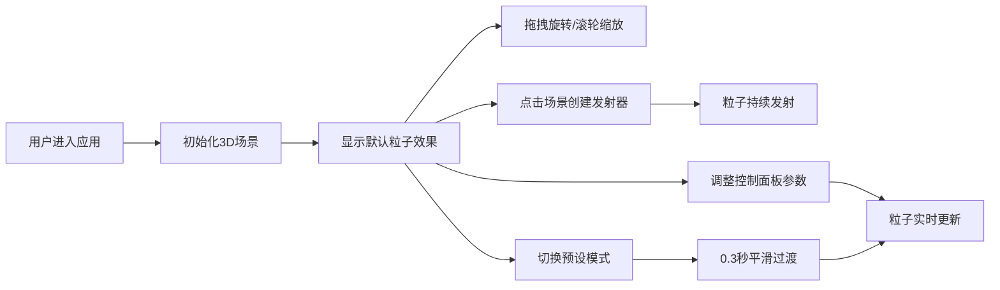

## 1. 产品概述

3D粒子系统可视化编辑器是一款面向游戏特效设计师和教学演示场景的交互式工具，允许用户在三维空间中实时模拟烟雾、火焰、粉尘等粒子特效，并通过直观的控制面板调整各项参数，解决了传统粒子系统工具配置复杂、即开即用体验差的问题。

- **核心价值**：提供轻量级、可自由调参的3D粒子系统，支持实时预览和参数调整
- **目标用户**：游戏特效设计师、计算机图形学教师、3D可视化爱好者
- **产品定位**：即开即用的Web端3D粒子特效设计与演示工具

## 2. 核心功能

### 2.1 用户角色

| 角色 | 注册方式 | 核心权限 |
|------|----------|----------|
| 普通用户 | 无需注册，直接访问 | 使用全部粒子编辑和预览功能，导出参数配置 |

### 2.2 功能模块

1. **3D场景画布**：可旋转缩放的三维视图，粒子实时渲染，暗色渐变背景
2. **粒子发射器**：点击场景创建发射点，支持球壳扩散发射模式
3. **参数控制面板**：粒子参数调节、颜色设置、预设模式切换
4. **预设模式系统**：火焰、烟雾、粉尘爆炸三种内置粒子行为模式
5. **视觉特效系统**：粒子光晕、运动拖尾、大小变化曲线

### 2.3 页面详情

| 页面名称 | 模块名称 | 功能描述 |
|----------|----------|----------|
| 主编辑页 | 3D场景画布 | 支持鼠标拖拽旋转视角、滚轮缩放，点击创建发射器，实时渲染5000+粒子 |
| 主编辑页 | 粒子参数面板 | 调节发射速率(10-200/秒)、初始速度(0.5-5)、生命周期(1-8秒)、拖尾长度(0-10帧) |
| 主编辑页 | 颜色设置面板 | 起始/结束颜色选择器，圆形色盘，脉冲动画边框 |
| 主编辑页 | 预设模式面板 | 火焰/烟雾/粉尘三种模式切换，图标+文字标注，弹簧点击动画 |
| 主编辑页 | 大小曲线选择 | 线性缩小、先大后小、先小后大三种预设曲线 |

## 3. 核心流程

用户打开应用后，默认进入3D场景视图，可通过鼠标拖拽旋转场景、滚轮缩放视角。点击场景任意位置创建粒子发射器，粒子从该点持续发射。左侧控制面板可实时调整各项参数，切换预设模式时粒子系统平滑过渡到新状态。

## 4. 用户界面设计

### 4.1 设计风格

- **主色调**：深空蓝渐变背景(#1a1a2e → #16213e)，粒子暖色(#FF6B35 → #FFD700)
- **强调色**：控制滑块渐变蓝(#2196F3 → #64B5F6)，选中按钮橙(#FF6B35)
- **字体**：使用Space Grotesk或Orbitron等具有科技感的字体
- **布局**：左侧固定控制面板 + 右侧全屏3D画布
- **视觉效果**：深色毛玻璃面板(背景rgba(20,20,40,0.75)，圆角12px，边框1px solid rgba(255,255,255,0.1))

### 4.2 页面设计概述

| 页面名称 | 模块名称 | UI元素 |
|----------|----------|--------|
| 主编辑页 | 3D场景画布 | 暗色渐变背景、半透明网格地面、可交互粒子、动态相机 |
| 主编辑页 | 控制面板 | 折叠式分区、渐变滑块、圆形色盘、图标按钮、弹簧动画、拖拽定位 |
| 主编辑页 | 粒子渲染 | 球体粒子、发光光晕(2倍半径，透明度0.2)、运动拖尾(渐隐线段) |

### 4.3 响应性

- **桌面端优先**：左侧控制面板固定宽度320px，右侧自适应3D画布
- **触控优化**：支持双指旋转缩放，长按创建发射器
- **边界限制**：控制面板拖拽不可超出屏幕边界

### 4.4 3D场景指引

- **环境**：暗色渐变背景(#1a1a2e到#16213e)，无HDRI，营造深空科技感
- **光照**：环境光(强度0.3) + 点光源(跟随粒子颜色)，粒子自发光
- **相机**：PerspectiveCamera，fov 60度，初始位置[0, 2, 5]，OrbitControls控制
- **构图**：网格地面居中，发射器位于用户点击位置，粒子向四周扩散
- **交互**：点击创建发射器，拖拽旋转，滚轮缩放，控制面板实时调节
- **后处理**：Bloom效果增强粒子光晕，FXAA抗锯齿
- **性能**：使用InstancedMesh渲染，5000粒子保持30fps以上

## 5. 非功能需求

### 5.1 性能要求

- 粒子数量达到5000时，帧率不低于30fps
- 参数调整响应延迟 < 100ms
- 模式切换过渡动画平滑度 > 60fps

### 5.2 兼容性要求

- 支持Chrome 90+、Firefox 88+、Safari 14+
- 支持WebGL 2.0
