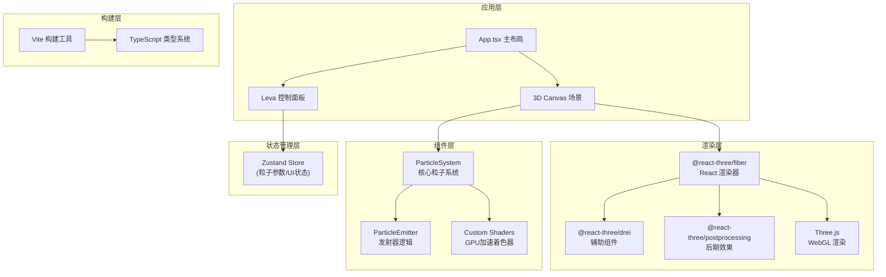

## 1. 架构设计



## 2. 技术描述

- **前端框架**：React 18 + TypeScript 5
- **构建工具**：Vite 5 + @vitejs/plugin-react
- **3D渲染**：Three.js 0.160 + @react-three/fiber 8 + @react-three/drei 9
- **后期处理**：@react-three/postprocessing 2
- **状态管理**：Zustand 4
- **控制面板**：Leva 0.9
- **性能优化**：InstancedMesh + 自定义GLSL着色器 + 时间片更新

## 3. 核心模块结构

```
src/
├── main.tsx              # 应用入口
├── App.tsx               # 主布局组件
├── store/
│   └── useParticleStore.ts  # Zustand状态管理
├── components/
│   ├── ParticleSystem.tsx   # 粒子系统核心
│   ├── ParticleEmitter.tsx  # 发射器组件
│   └── Scene.tsx            # 3D场景组件
├── shaders/
│   ├── particleVertex.glsl  # 粒子顶点着色器
│   └── particleFragment.glsl # 片元着色器
├── hooks/
│   └── useParticlePhysics.ts # 物理计算Hook
├── types/
│   └── index.ts             # 类型定义
└── utils/
    └── presets.ts           # 预设模式配置
```

## 4. 数据模型

### 4.1 粒子参数类型定义

```typescript
// 粒子生命周期阶段
type ParticleState = 'alive' | 'dying' | 'dead';

// 大小变化曲线类型
type SizeCurve = 'linear' | 'growShrink' | 'shrinkGrow';

// 预设模式类型
type PresetMode = 'default' | 'fire' | 'smoke' | 'dust';

// 粒子单个实例数据
interface ParticleData {
  id: number;
  position: THREE.Vector3;
  velocity: THREE.Vector3;
  color: THREE.Color;
  startColor: THREE.Color;
  endColor: THREE.Color;
  size: number;
  startSize: number;
  endSize: number;
  life: number;
  maxLife: number;
  state: ParticleState;
  trail: THREE.Vector3[];
  rotation: number;
  rotationSpeed: number;
}

// 发射器配置
interface EmitterConfig {
  position: THREE.Vector3;
  emissionRate: number;      // 10-200 个/秒
  initialSpeed: number;      // 0.5-5 单位/秒
  lifetime: number;          // 1-8 秒
  startColor: string;        // #FF6B35
  endColor: string;          // #FFD700
  sizeCurve: SizeCurve;      // 大小变化曲线
  trailLength: number;       // 0-10 帧
  particleRadius: number;    // 默认0.05
}

// 预设模式配置
interface PresetConfig {
  name: string;
  icon: string;
  config: Partial<EmitterConfig>;
  behavior: {
    gravity?: number;
    upwardForce?: number;
    spin?: boolean;
    colorStops?: { position: number; color: string }[];
  };
}

// 全局UI状态
interface UIState {
  panelPosition: { x: number; y: number };
  collapsedSections: {
    particleParams: boolean;
    colorSettings: boolean;
    presets: boolean;
  };
  currentMode: PresetMode;
  isTransitioning: boolean;
}
```

## 5. 核心算法

### 5.1 粒子发射算法

```
每秒发射粒子数 = emissionRate
每帧发射概率 = emissionRate / 60
累计时间 >= 1/emissionRate 时发射一个粒子

发射方向：球壳随机分布
  theta = random(0, 2π)
  phi = arccos(random(-1, 1))
  x = sin(phi) * cos(theta)
  y = sin(phi) * sin(theta)
  z = cos(phi)
```

### 5.2 大小变化曲线计算

```typescript
function calculateSize(normalizedAge: number, curve: SizeCurve, startSize: number, endSize: number): number {
  switch (curve) {
    case 'linear':
      return startSize + (endSize - startSize) * normalizedAge;
    case 'growShrink': {
      const peak = 0.3;
      if (normalizedAge < peak) {
        const t = normalizedAge / peak;
        return startSize + (endSize * 1.5 - startSize) * t;
      } else {
        const t = (normalizedAge - peak) / (1 - peak);
        return endSize * 1.5 * (1 - t) + endSize * t;
      }
    }
    case 'shrinkGrow': {
      const valley = 0.5;
      if (normalizedAge < valley) {
        const t = normalizedAge / valley;
        return startSize * (1 - t * 0.5);
      } else {
        const t = (normalizedAge - valley) / (1 - valley);
        return startSize * 0.5 + (endSize - startSize * 0.5) * t;
      }
    }
  }
}
```

### 5.3 性能优化策略

1. **实例化渲染**：使用THREE.InstancedMesh，单个Draw Call渲染所有粒子
2. **GPU着色器计算**：粒子颜色插值、大小计算在顶点着色器中完成
3. **时间片更新**：每帧更新最多N个粒子的物理状态，避免主线程阻塞
4. **对象池**：复用粒子对象，避免频繁GC
5. **增量更新**：只更新变化的InstanceMatrix元素

## 6. 预设模式配置

### 6.1 火焰模式

```typescript
{
  emissionRate: 100,
  initialSpeed: 1.5,
  lifetime: 2,
  startColor: '#FF4500',
  endColor: '#FF0000',
  sizeCurve: 'growShrink',
  behavior: {
    upwardForce: 2.0,
    colorStops: [
      { position: 0, color: '#FF4500' },
      { position: 0.5, color: '#FFD700' },
      { position: 1, color: '#FF0000' }
    ]
  }
}
```

### 6.2 烟雾模式

```typescript
{
  emissionRate: 30,
  initialSpeed: 0.8,
  lifetime: 5,
  startColor: '#555555',
  endColor: '#999999',
  sizeCurve: 'growShrink',
  behavior: {
    gravity: -0.1,
    spin: true
  }
}
```

### 6.3 粉尘爆炸模式

```typescript
{
  emissionRate: 200,
  initialSpeed: 4.0,
  lifetime: 1.5,
  startColor: '#E8E8E8',
  endColor: '#FFD700',
  sizeCurve: 'linear',
  behavior: {
    gravity: 0.5
  }
}
```
