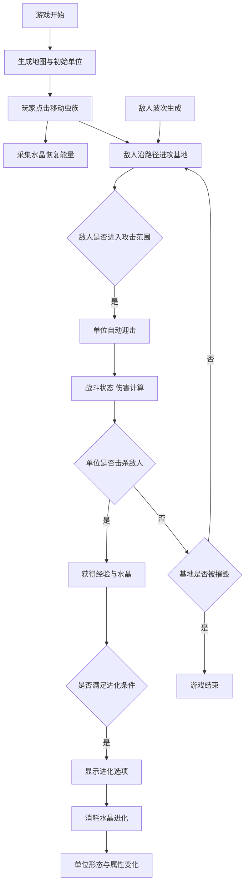

## 1. 产品概述

像素虫族是一款2D塔防与进化模拟游戏，玩家控制虫族单位在六边形网格地图上采集资源、进化形态并抵御机械入侵者。融合策略塔防、资源管理和生物进化元素，提供紧张刺激的战斗体验和丰富的进化选择。

- **核心玩法**：控制虫族单位移动采集水晶，击杀敌人获取经验进化，防御基地抵御机械入侵
- **目标用户**：策略游戏爱好者、塔防游戏玩家、模拟经营类游戏玩家
- **产品价值**：融合进化养成与塔防策略，提供独特的"虫族 vs 机械"科幻主题体验

## 2. 核心功能

### 2.1 功能模块

1. **地图系统**：30x30六边形网格、地形系统、资源点分布、A*寻路移动
2. **进化系统**：四大进化分支、形态树解锁、技能效果、资源消耗
3. **战斗系统**：敌人生成、路径移动、攻击判定、伤害计算、防御机制
4. **状态管理**：全局游戏状态、资源数值、单位属性、波次控制

### 2.2 页面详情

| 页面名称 | 模块名称 | 功能描述 |
|----------|----------|----------|
| 游戏主界面 | 地图渲染 | 六边形网格渲染、地形显示、单位动画 |
| 游戏主界面 | 资源栏 | 水晶、能量、波数、基地生命值实时显示 |
| 游戏主界面 | 进化面板 | 四个进化分支卡片、解锁条件、进化操作 |
| 游戏主界面 | 战斗日志 | 关键事件记录、滚动显示 |
| 游戏主界面 | 虫族单位 | 移动控制、攻击动画、外观变化、光晕效果 |
| 游戏主界面 | 机械敌人 | 波次生成、路径移动、血条显示、战斗状态 |

## 3. 核心流程

玩家进入游戏后，地图中央生成基础虫族单位，周边随机分布水晶资源和敌人巢穴。玩家点击地图移动单位采集水晶，每15秒一波敌人从巢穴出发进攻基地。击杀敌人获得经验和水晶，单位达到条件后可选择进化分支提升能力。敌人进入基地范围时单位自动迎击，基地被攻击时显示受伤效果。

## 4. 用户界面设计

### 4.1 设计风格

- **主题**：暗色科幻风格，虫族vs机械的对立主题
- **主色调**：深灰色背景#1a1a2e，虫族绿色系，机械红色系
- **辅助色**：水晶蓝#42a5f5、能量绿#66bb6a、波数橙#ff7043
- **卡片样式**：120x60px圆角卡片，边框#4a148c，悬停上浮+阴影
- **字体**：等宽科技感字体，数字使用更醒目的显示字体
- **动画风格**：平滑过渡(cubic-bezier)、脉冲光效、震动反馈

### 4.2 页面设计概述

| 页面名称 | 模块名称 | UI元素 |
|----------|----------|--------|
| 游戏主界面 | 地图区域 | 75%屏幕占比，30x30六边形网格，半透明白色网格线 |
| 游戏主界面 | 资源面板 | 左侧200px，背景#16213e，圆角12px，图标+数值 |
| 游戏主界面 | 进化面板 | 底部中央横向排列四卡片，选中金色边框+浮动动画 |
| 游戏主界面 | 战斗日志 | 右侧200px，背景#263238，白色12px字体 |
| 游戏主界面 | 虫族单位 | 六边形轮廓+圆点，进化后变色+光晕脉冲 |
| 游戏主界面 | 机械敌人 | 红色六边形+四边形，血条显示，攻击震动闪光 |

### 4.3 响应性

- **桌面优先**：主布局针对1920x1080优化，使用固定比例布局
- **缩放适配**：地图区域使用viewBox自适应，保持六边形网格比例
- **触摸优化**：点击目标适当放大，确保移动端可操作

### 4.4 视觉特效

- **水晶资源**：蓝色菱形#42a5f5，缓慢闪烁动画
- **能量图标**：绿色闪电#66bb6a，能量增加时发光
- **敌人巢穴**：红色脉冲点，生成敌人时扩散波纹
- **攻击效果**：触角前伸动画，绿色伤害数字弹出淡出
- **受伤效果**：0.05秒震动+白色闪光，基地红色渐变闪烁
- **进化动画**：光晕扩散+颜色渐变过渡
