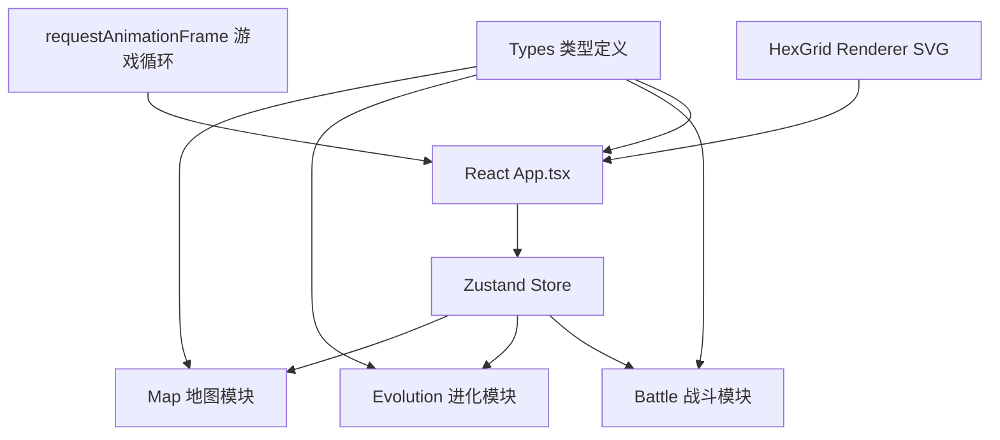
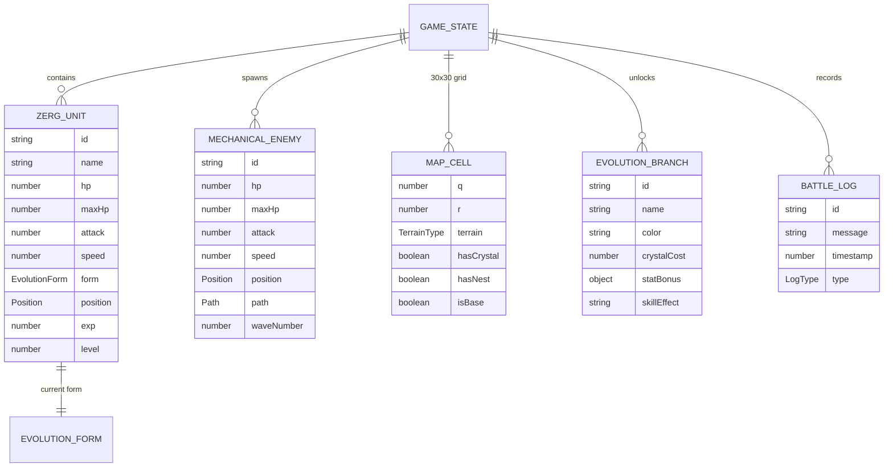

## 1. 架构设计



## 2. 技术描述

- **前端框架**：React 18 + TypeScript 5
- **构建工具**：Vite 5 + @vitejs/plugin-react
- **状态管理**：Zustand 4 + subscribeWithSelector
- **唯一ID**：uuid 9
- **渲染技术**：SVG 六边形网格 + CSS动画 + requestAnimationFrame
- **性能优化**：lerp平滑插值、subscribeWithSelector按需重渲染、requestAnimationFrame游戏循环

## 3. 核心模块架构

| 模块 | 文件 | 职责 | 关键算法 |
|------|------|------|----------|
| 类型定义 | src/types.ts | 虫族形态、机械敌人、地图格子、游戏状态接口 | - |
| 地图模块 | src/map.ts | 30x30六边形网格生成、地形分布、A*寻路算法、单位位置管理 | 六边形坐标转换、A*最短路径 |
| 进化模块 | src/evolution.ts | 形态树管理、进化分支解锁、属性加成计算、资源消耗校验 | 状态机转换、属性计算 |
| 战斗模块 | src/battle.ts | 敌人生成波次、路径移动、攻击判定、伤害计算、眩晕效果 | 碰撞检测、伤害公式 |
| 主组件 | src/App.tsx | Zustand全局状态、SVG地图渲染、动画编排、UI面板 | requestAnimationFrame循环、lerp插值 |

## 4. 数据模型

### 4.1 数据模型定义



### 4.2 核心类型定义

```typescript
// 坐标系统 - 轴向坐标系(axial coordinates)
interface Position {
  q: number;  // 列
  r: number;  // 行
}

// 地形类型
type TerrainType = 'grass' | 'rock' | 'crystal';

// 进化形态
type EvolutionForm = 'basic' | 'beetle' | 'scorpion' | 'worker' | 'pupa';

// 虫族单位
interface ZergUnit {
  id: string;
  form: EvolutionForm;
  hp: number;
  maxHp: number;
  attack: number;
  speed: number;  // 格子/秒
  position: Position;
  targetPosition: Position | null;
  path: Position[];
  exp: number;
  level: number;
  moveProgress: number;  // 0-1 当前格子移动进度
  isAttacking: boolean;
  attackCooldown: number;
  stunDuration: number;
  healTimer: number;
}

// 机械敌人
interface MechanicalEnemy {
  id: string;
  hp: number;
  maxHp: number;
  attack: number;
  speed: number;
  position: Position;
  path: Position[];
  pathIndex: number;
  waveNumber: number;
  moveProgress: number;
  isAttacking: boolean;
  attackCooldown: number;
  stunDuration: number;
  hitFlash: number;  // 受伤闪光计时
  hitShake: number;  // 受伤震动计时
}

// 地图格子
interface MapCell {
  q: number;
  r: number;
  terrain: TerrainType;
  hasCrystal: boolean;
  hasNest: boolean;
  isBase: boolean;
  crystalAmount: number;
  energyRegen: number;
}

// 进化分支
interface EvolutionBranch {
  id: EvolutionForm;
  name: string;
  description: string;
  color: string;
  crystalCost: number;
  requiredExp: number;
  statBonus: {
    maxHp?: number;
    attack?: number;
    speed?: number;
    resourceMultiplier?: number;
    healPer5s?: number;
    stunOnHit?: number;
  };
}

// 游戏状态
interface GameState {
  map: MapCell[][];
  zergUnit: ZergUnit;
  enemies: MechanicalEnemy[];
  crystals: number;
  energy: number;
  wave: number;
  baseHp: number;
  baseMaxHp: number;
  baseFlashTimer: number;
  selectedEvolution: EvolutionForm | null;
  battleLogs: BattleLogEntry[];
  gameTime: number;
  nextWaveTimer: number;
  isPaused: boolean;
  gameOver: boolean;
  damagePopups: DamagePopup[];
}

// 伤害弹出
interface DamagePopup {
  id: string;
  value: number;
  position: Position;
  color: string;
  life: number;  // 剩余生命 0-1
  maxLife: number;
}

// 战斗日志
interface BattleLogEntry {
  id: string;
  message: string;
  timestamp: number;
  type: 'info' | 'combat' | 'evolution' | 'warning';
}
```

## 5. 性能优化方案

### 5.1 渲染性能

- **SVG优化**：使用`<g>`元素分组，避免不必要的DOM操作
- **路径预览**：仅在hover时计算和渲染，使用`<polyline>`虚线
- **单位动画**：使用transform属性而非top/left，启用GPU加速
- **lerp插值**：每帧使用0.05因子平滑位置过渡，避免抖动

### 5.2 计算性能

- **A*缓存**：路径计算结果缓存，仅当地形或目标变化时重算
- **碰撞检测**：使用六边形距离公式，O(1)复杂度
- **订阅优化**：使用Zustand的subscribeWithSelector，仅订阅必要状态
- **帧预算**：每帧计算控制在10ms以内，超过则拆分到下一帧

### 5.3 内存管理

- **对象池**：复用伤害弹出和敌人对象，避免频繁GC
- **日志限制**：战斗日志最多保留100条，超出自动清理
- **动画清理**：组件卸载时取消requestAnimationFrame，清理定时器

## 6. 动画系统

### 6.1 游戏循环

```
requestAnimationFrame(deltaTime)
  ↓
更新能量恢复 (每秒+0.1)
  ↓
更新单位移动 (lerp插值到下一格)
  ↓
更新敌人移动 (沿路径前进)
  ↓
战斗判定 (距离检测 → 攻击 → 伤害计算)
  ↓
波次计时 (15秒一波)
  ↓
效果更新 (眩晕、治疗、闪光、震动)
  ↓
渲染 (SVG属性更新)
```

### 6.2 关键动画实现

| 动画 | 实现方式 | 时长/参数 |
|------|----------|-----------|
| 单位移动 | cubic-bezier(0.4, 0, 0.2, 1) + transform | 0.3秒/格 |
| 攻击动画 | CSS @keyframes 触角前伸 | 0.2秒 |
| 伤害数字 | translateY + opacity淡出 | 0.5秒 |
| 受伤震动 | translate随机偏移2px | 0.05秒 |
| 受伤闪光 | opacity 0→0.8→0 | 0.1秒 |
| 光晕脉冲 | scale 1.0→1.5 + opacity 0.3→0.6 | 2秒循环 |
| 进化浮动 | translateY 0→-3px→0 | 2秒循环 |
| 水晶闪烁 | opacity 0.6→1.0→0.6 | 1秒循环 |
| 巢穴脉冲 | scale + opacity | 1.5秒循环 |
| 基地受伤 | 背景色渐变闪烁 | 0.3秒 |
